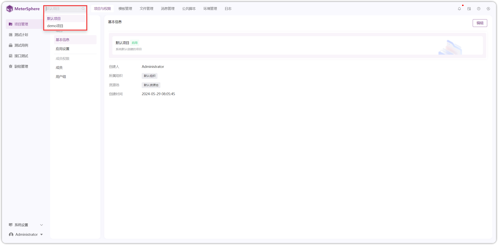
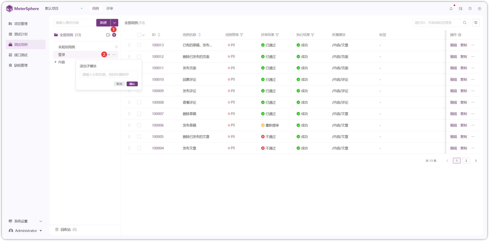
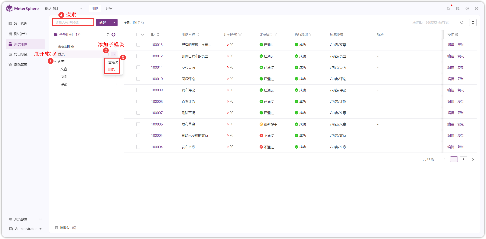
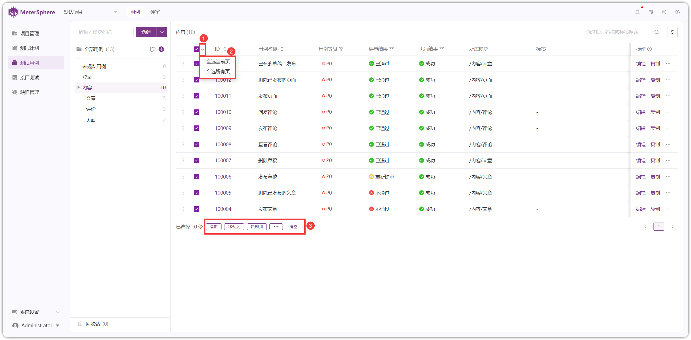
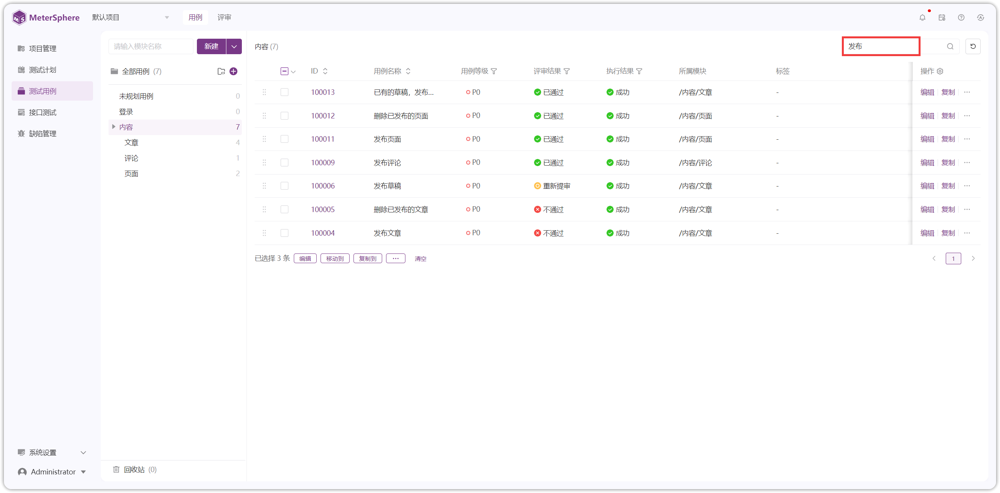
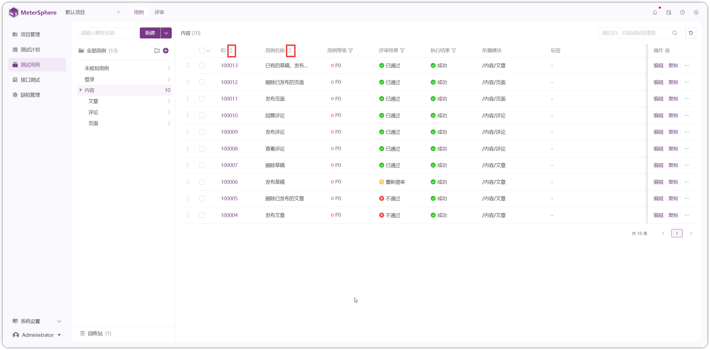
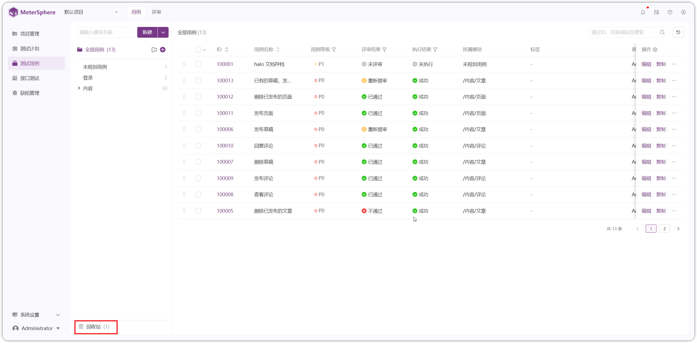
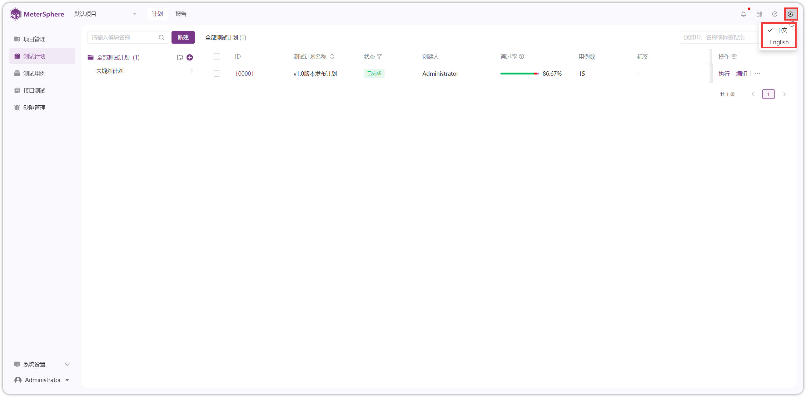
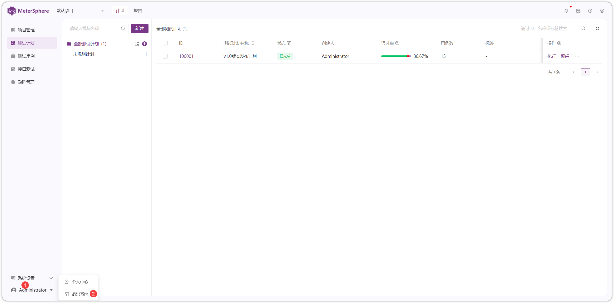

## 1 切换项目
!!! ms-abstract ""
    如下图，点击左上方的项目下拉菜单，下拉选择某个项目进行切换。

!!! ms-abstract "说明"
    系统中的缺陷管理、用例管理、接口测试、UI测试（X-Pack）、性能测试（X-Pack）等资源均使用项目进行隔离。

{ width="900px" }

## 2 模块树管理

!!! ms-abstract "说明"
    系统默认模块【未规划用例】不允许创建子模块。

### 2.1 添加子模块

!!! ms-abstract ""
    - 序号1：在根目录下添加子模块。 
    - 序号2：在当前目录下添加子模块。
{ width="900px" }

### 2.2 模块操作

{ width="900px" }
    
!!! ms-abstract "操作说明"
    - 【重命名】点击模块名称右侧【...】按钮，下拉点击【重命名】，输入新名称后点击确认。
    - 【删除】点击模块名称右侧【...】按钮，可删除该模块和其所有子模块。删除后，此节点下的所有资源都会被删除。
    - 【收起/展开】当模块下存在子模块时出现，可点击【收起/展开】该模块下的所有子模块。
    - 【添加子模块】鼠标悬停在要操作的模块，出现【+】号后，点击添加子模块。
    - 【模块搜索】在【全部用例】下方搜索框中输入模块名称进行模糊搜索。

!!! ms-abstract ""
    模块树还支持鼠标拖拽操作，用户可以根据需求调整模块顺序及其层级关系。

{ width="900px" }

## 3 列表页操作

### 3.1 批量操作
!!! ms-abstract ""
    勾选复选框，如下图进行批量操作。
{ width="900px" }

### 3.2 全选操作
!!! ms-abstract ""
    点击列表表头行复选框右侧【V】，选择【全选当前页】或【全选所有页】进行批量操作。
{ width="900px" }

### 3.3 查询操作
{ width="900px" }

### 3.4 表格设置
!!! ms-abstract "说明"
    表格设置跟随个人账号持久化。

!!! ms-abstract ""
    - 模式设置：设置详情页展开方式。
        - 抽屉：以抽屉形式打开新页面
        - 新窗口：以新开网页打开新页面
    - 每页显示数量：设置每页展示条数。
    - 表头设置：
        - 设置是否展示在列表。
        - 调整列表字段展示顺序。
{ width="900px" }

### 3.5 表头快捷排序
!!! ms-abstract ""
{ width="900px" }

### 3.6 列表排序
!!! ms-abstract ""
    鼠标按住列表行左侧【∷】图标，在列表行上下拖动完成自定义排序。
{ width="900px" }

### 3.7 表头快捷筛选
!!! ms-abstract ""
    点击列表某表头字段右侧【V】下拉完成表头快捷筛选。
{ width="900px" }

### 3.8 列表内快捷修改
!!! ms-abstract ""
    鼠标在列表字段悬停可显示【✎】按钮或【下拉选项】，完成列表内快捷修改。
{ width="900px" }

### 3.9 调整列表宽度
!!! ms-abstract ""
    鼠标悬停在表头字段左侧空白处，出现【┤├】按钮，左右拖动调整列表宽度。
{ width="900px" }

## 4 回收站
!!! ms-abstract ""
    用例被删除后，系统默认放置回收站，在回收站内进行数据恢复和彻底删除。

{ width="900px" }

{ width="900px" }

## 5 消息通知
!!! ms-abstract ""
    点击右上角【消息通知】图标，查看近 3 个月内的站内消息，可标记状态为【已读】。
{ width="900px" }

## 6 任务中心（有bug待细化）

### 6.1 实时任务
!!! ms-abstract ""
    XXX
{ width="900px" }

### 6.2 定时任务
!!! ms-abstract ""
    XXX
{ width="900px" }

## 7 帮助中心
!!! ms-abstract ""
{ width="900px" }

## 8 切换语言
!!! ms-abstract "" 
{ width="900px" }

## 9 退出系统
!!! ms-abstract "" 
{ width="900px" }