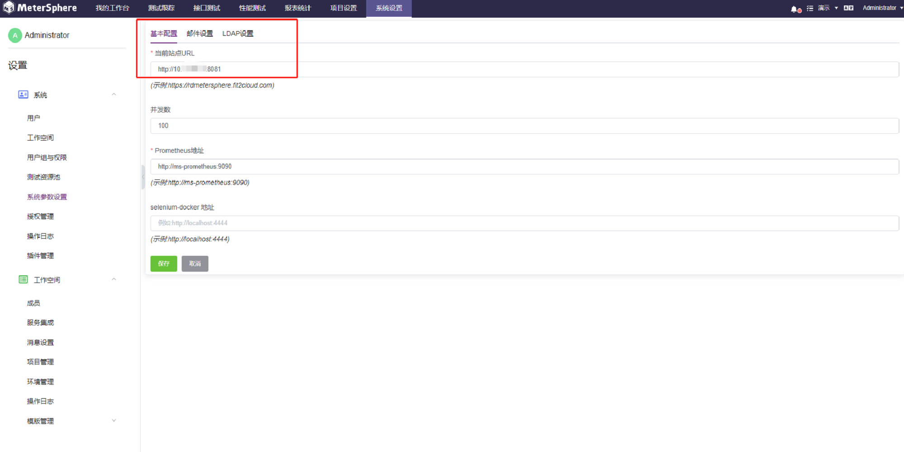

MeterSphere 性能测试模块支持用户通过已有的接口测试创建或直接上传 JMX 脚本来创建性能测试，并按需调整并发用户数等压力参数。

## 1 创建测试资源池
通过安装包安装 MeterSphere 后，系统默认使用当前节点创建了名为【LOCAL】测试资源池。关于测试资源池的作用请参考 [FAQ](../../faq/load_test.md#_1)。

如果需要创建新的测试资源池，或向已有资源池中添加节点，请参考 [如何向测试资源池中添加节点？](../../faq/load_test.md#_2)

## 2 修改当前站点 URL
性能测试执行过程中 node-controller 节点需要通过配置的【当前站点URL】下载 JMX 等测试资源文件。在执行性能测试前需要配置并检查测试资源池中的节点可以正常访问到该 URL，URL 值一般为通过浏览器访问 MeterSphere 的地址。

## 3 创建性能测试
进入【性能测试-测试】页面，可选择版本管理 (X-Pack)

 
点击【创建测试】进入性能测试用例创建页面，或点击【编辑】进入性能测试详情页，其界面包含多个页签：【场景配置】、【压力配置】、【高级配置】等。

## 4 场景配置
【场景配置】性能测试基本信息管理，需要填写内容包括测试名称、上传测试脚本或引用接口自动化场景、上传其他性能测试辅助文件（jar 包、cvs、excel、word、pdf 等文件）。

性能测试脚本支持导入 JMeter JMX测试计划，还支持基于接口测试用例脚本和接口自动化场景一键转性能测试。

- 加载性能测试脚本

  在【场景列表】中点击【引用接口自动化场景】，将已有的接口自动化场景添加到性能测试中，或者点击【加载JMX文件】将JMeter脚本直接导入到性能中。

- 线程组

支持两种模式。ThreadGroup 和 ConcurrencyThreadGroup。

从发压模式来讲 ConcurrencyThreadGroup 是阶梯加压，ThreadGroup 直线指线性加压。

- 加载资源文件

如果测试中有使用 CSV 参数化或者自定义 jar 包，可点击【加载文件】将 CSV 文件或者 jar 添加到平台。

## 5 压力配置
每一个性能测试场景脚本都可以各自分别进行性能测试压力设置：并发数量、压测时长、RPS 上限（指的是同一时刻最高的并发数量）等配置，同时右侧统计图会根据左侧的设置实时显示每个场景配置走势图。

点击【压力配置】设置压测基本的测试数据。资源、组合场景发压策略设定等信息。
     
- 资源池

资源池：指定测试的测试资源池，系统支持独立主机和 K8s 资源池配置，其可用资源池依据系统的资源池配置。

参数说明：

- 执行顺序

场景是否顺序执行：因为系统支持多场景组合压测，对于有些场景是有顺序要求的，此需要把开关打开，可以避免脚本 1 没跑完，脚本 2 就启动了。

- 自动停止开关

【自动停止开启】：设置此开关开启时，需要指定压测多久后，强制停止测试

- 并发数

模拟一定数量用户操作的一个配置

- 取样器错误后续执行动作

		取样器错误后，提供多种处理方式。每种方式作用介绍如下：

		1)【继续】：忽略错误，继续执行。

		2)【启动下一次循环】：忽略错误，线程当前循环终止，执行下一个循环。

		3)【停止线程】：当前线程停止执行，不影响其他线程正常执行。

		4)【停止测试】：整个测试会在所有当前正在执行的线程执行完毕后停止。

		5)【立即停止测试】：整个测试会立即停止执行，当前正在执行的取样器可能会被中断。

- 执行方式

如果设置本次压测需要持续执行多长时间，压测运行时长达到设定的时间就停止压力测试。目前系统提供按小时、分钟、秒来设置。设置本次压测执行的次数，并且设置运行时间，压测运行次数达到设定的次数或者到达设置运行的时间，就停止压力测试。

	【按持续时间】:设置本次压测需要持续执行多长时间，压测运行时长达到设定的时间就停止压力测试。目前系统提供按小时、分钟、秒来设置。
	【按迭代次数】:设置本次压测执行的次数，并且设置运行时间，压测运行次数达到设定的次数或者到达设置运行的时间，就停止压力测试。

- RPS设置

设置 RPS 时，需要先打开 RPS 开关才可以，RPS（Requests per second）：每秒请求数。 如果设置了 RPS 上限，则发压达到这个值后，就不会再继续加压。

- Ramp-Up设置

Ramp-Up 是并发用户数到达指定个数所花费的时间，Step 是分几步达到。

- 分配策略

针对有多个节点的资源池，MeterSphere 支持用户自定义设置不同的分配策略。目前分配策略支持自动分配、固定节点、以及自定义。

- 自动分配

系统默认为【自动分配】，其核心逻辑是按资源池节点最大并发数占比比例分配,比如【测试资源池】设置如下。

- 固定节点

允许用户指定压测仅仅在某一个节点上执行。

- 自定义

支持用户根据需要自定义每个节点执行分配占比的情况。

## 6 高级配置
进入性能测试脚本编辑页面，选择【高级配置】，进入性能测试高级配置页面。高级设置分为多部分：常规、域名绑定、CSVDataSet、自定义变量、JMeter Properties、System Properties、监控等。

参数说明

- 常规

进入【高级配置】页面，最上面的设置可理解为常规信息设置部分，此包含设置测试脚本的连接超时时间和 HTTP 响应码等信息。下面介绍部分参数信息。

- 超时配置

连接超时是连接时超过设置的时间就不在连接，响应超时是等待响应时超过设置的时间就不在等待响应。

- 聚合时间

表示报告采集时间也叫打点时间，是指测试报告刷新数据时间。把鼠标放在【聚合时间】后的【i】按钮上，可以看到系统默认提供信息说明。

- 自定义响应

表示指在这里设置的响应码，就不统计为失败的接口。系统支持添加多个响应码，按逗号分割。

- 域名绑定

使用 JMeter 的时候会涉及到使用域名的情况，为了使脚本更具有通用性，以及发送给其他人时，脚本一样可以直接运行，故需要在运行脚本中添加 hosts 内容，直接从 JMeter 中获取。

- CSVDataSet

性能测试时所需要的参数数据文件，如果所有场景使用一个统一的参数文件，为了避免相同的参数被不同的场景引用造成流程异常。系统会根据压测策略自动来分割 CSV 数据文件里的参数，把不同的参数分配给不同的业务场景。

- 自定义变量

系统支持用户自定义性能测试脚本里所需的变量。不使用时，可以关闭启用开关。

- JMeter Properties

系统支持用户自定义需要关注或使用的任何 JMeter Properties 信息。

- System Properties

如果性能测试有用到证书，除了要在资源文件里添加外，还要在 System_Properties 里进行配置。

- 监控

系统支持用户自定义配置需要关注任何发压端和被测服务的测试实时监控，目前对于被监控系统需要安装 Prometheus 的监控插件 node_export 并启动服务。

- 监控配置

点击【高级配置-监控-添加】，可以指定要监控的服务器或压测节点，设置要监控系统的相关信息。点击【确认】完成设置。

## 7 性能测试维护管理
- 保存& 执行

完成性能测试以上的相关配置，点击【保存】完成性能测试用例的创建,点击【保存并执行】系统会在保存后，直接运行该性能测试。

- 性能列表功能

在性能测试用例列表中可查看到创建的性能测试用例，点击【执行】、【编辑】、【复制】和【删除】可对性能测试用例进行相应的操作。

- 编辑

点击【编辑】性能测试，可进行性能测试的信息修改及执行。同时也可设置执行性能测试的定时任务，设置任务通知可通过钉钉、邮箱和企业微信将性能测试通知到相关人员。

- 定时任务

点击【定时任务】可设置执行性能测试的定时任务。

配置定时任务

配置定时任务通知

- 性能测试执行

点击【保存并执行】进行性能测试的执行，执行完成后可实时查看测试报告,在测试报告中可点击【立即停止】终止性能测试，可点击【再次执行】、【导出报告】和【下载JTL】等操作功能，对性能测试用例和报告进行相应的操作。

- 变更记录

在性能测试脚本中也可以查看【变更记录】。

- 版本管理 (X-Pack)

性能测试脚本中也可以进行【版本管理】。

