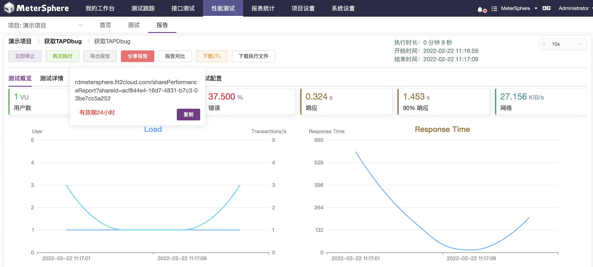
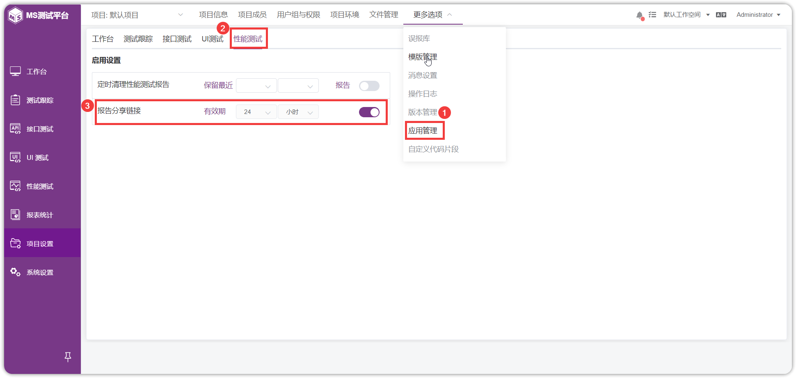
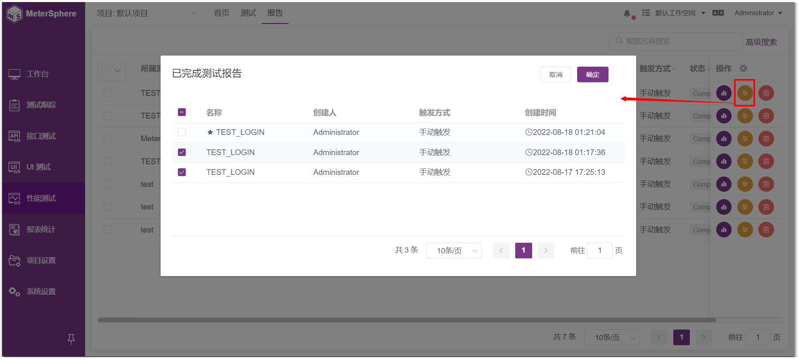

## 1 报告
!!! ms-abstract ""
	对于性能测试提供了不同的管理功能，如： 
    -   【立即停止】：对进行中的性能测试，可以手动进行停止执行。 
    -   【再次执行】：再次执行该性能测试。 
    -   【导出报告】：可将报告进行导出成 PDF。 
    -   【报告对比】：可对近几次测试报告进行比对。 
    -   【下载 JTL】：可下载 JTL 文件。 
    -   【下载执行文件】：可下载执行文件(包括 JMX 脚本、Jar包、CSV文件)。 

!!! ms-abstract ""

    - **查看报告**:点击性能测试配置页面的【保存并执行】按钮，系统自动进入性能测试测试报告页面。当收到测试结果数据后，报告页面将自动更新。
{ width="900px" }

!!! ms-abstract ""

    - **测试概览**:认进入测试报告，即为测试概览页面，可看到不同指标下的测试数据汇总情况。

{ width="900px" }

!!! ms-abstract ""

    - **测试详情**:系统支持用户自定义各种测试指标，并且根据用户自定义的指标动态实时生成测试报表。

{ width="900px" }

!!! ms-abstract ""

    - **请求统计**:性能测试所有请求情况的统计和分析。

{ width="900px" }

!!! ms-abstract ""

    - **错误记录**:对性能测试过程中发生的所有的错误记录的统计及分析。

{ width="900px" }

!!! ms-abstract ""

    - **日志详情**:每次执行性能测试时，都会记录和保存本次执行过程中所有的日志情况，方便技术人员问题的查阅和定位。同时可以下载完整的日志信息。
{ width="900px" }

!!! ms-abstract ""

    - **监控详情**:对性能测试执行时，设置的所有监控信息的监控数据。同时支持用户自定义选择监控指标，根据不同的指标，系统会实时动态生成监控报告。

{ width="900px" }

!!! ms-abstract ""

    - **测试配置**:查看此报告对应的每个场景对应的压力配置情况。点选每个场景可以查看各自的压力配置。

{ width="900px" }

!!! ms-abstract ""

    - **停止测试**:点击【立即停止】按钮，可手动停止测试。

{ width="900px" }

!!! ms-abstract ""

    - **再次执行**:点击【再次执行】按钮，可再次执行测试。

{ width="900px" }

!!! ms-abstract ""

    - **导出报告**:点击【导出报告】按钮，可将本次测试报告导出 PDF 文件。

{ width="900px" }

!!! ms-abstract ""

    - **分享报告**:点击【分享报告】按钮，系统即会生成该报告对应的链接。接下来，点击【复制】按钮就可以分享给需要查看报告的用户。

{ width="900px" }

!!! ms-abstract ""
    性能测试报告的链接有效时长默认为 24 小时，用户可以选择【项目设置-更多选项-应用管理-性能测试】，根据需要自定义该链接的有效时长。

{ width="900px" }

!!! ms-abstract ""

    - **报告对比**：点击【报告对比】，勾选要对比的报告，点击【确定】按钮即可。

{ width="900px" }

!!! ms-abstract ""

    - **下载JTL文件**：点击【下载JTL】，可下载测试结果文件，支持导出 JTL 文件用以生成 JMeter 自定义报表。

{ width="900px" }

!!! ms-abstract ""

     - **下载执行文件**：点击【下载执行文件】，可下载测试 JMX 脚本配置文件(包括 Jar包、CSV文件等)。

{ width="900px" }

## 2 测试报告管理
!!! ms-abstract ""
    点击【报告】可进入测试报告列表，可查看、对比、删除报告。

{ width="900px" }

!!! ms-abstract ""

    - **报告详情**：点击【报告详情】可查看报告。

{ width="900px" }

!!! ms-abstract ""

    - **对比**：点击【对比】可进行多报告数据对比。

{ width="900px" }
{ width="900px" }

!!! ms-abstract ""

    - **删除**：点击【删除】可删除报告。

{ width="900px" }

!!! ms-abstract ""
    
    - **批量删除**：选中多份报告，点击【批量删除报告】可删除报告。
{ width="900px" }