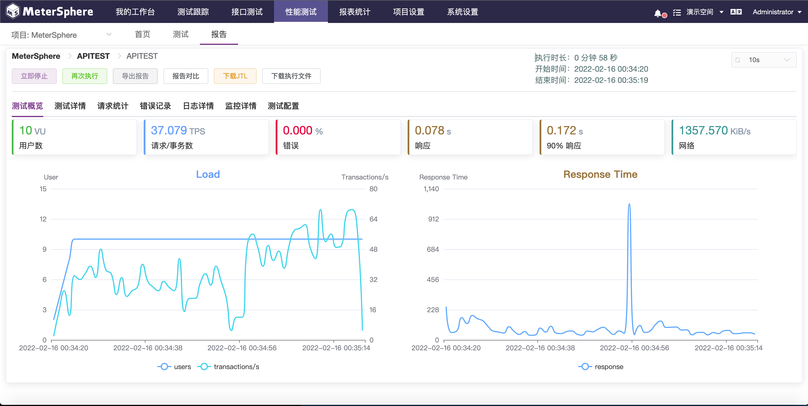
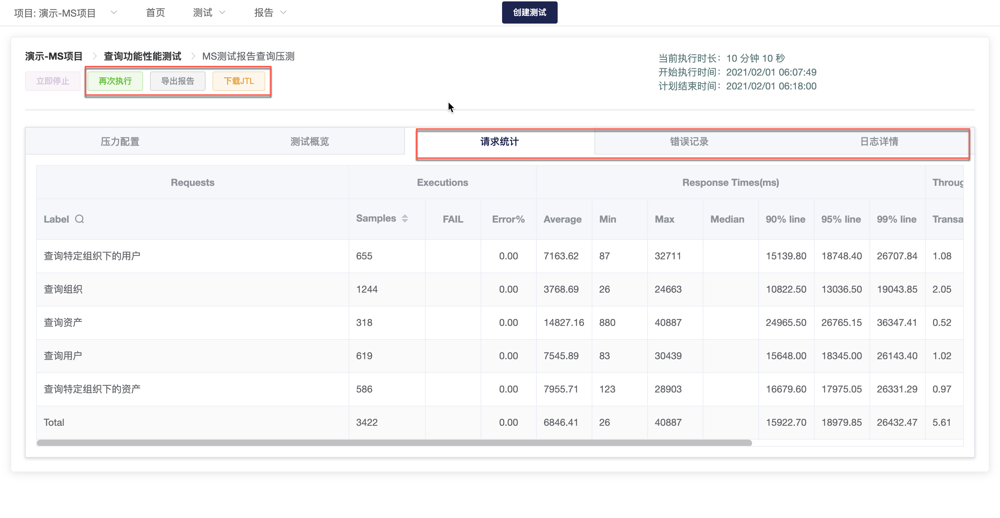

## 执行并查看报告

点击性能测试配置页面的 `保存并执行` 按钮，系统自动进入性能测试测试报告页面。当收到测试结果数据后，报告页面将自动更新。

点击标签栏`请求统计`、`错误纪录`、`日志详情`分别查看本次测试分线程请求统计、错误纪录及日志。

点击`再次执行`运行本次测试，运行中可点击`立即停止`中止运行。支持导出 PDF 格式测试报告至本地查看或分享；支持导出 JTL 文件用以生成 JMeter 自定义报表。

