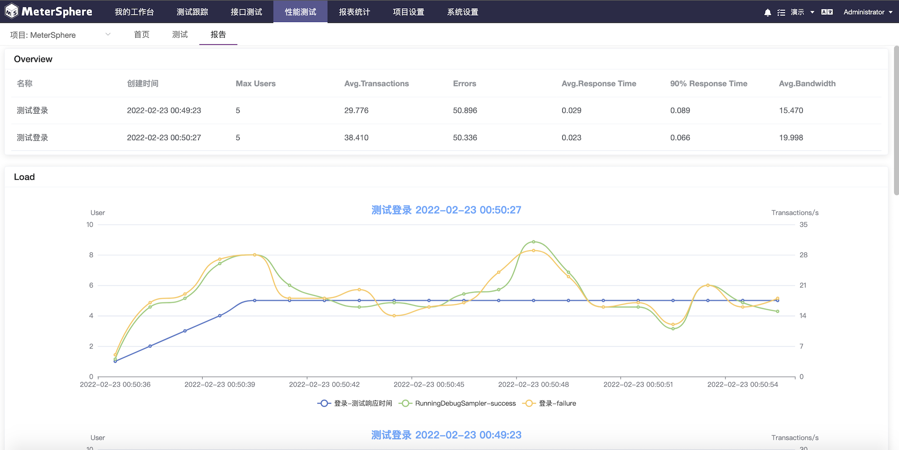

## 报告

- 查看报告

点击性能测试配置页面的 `保存并执行` 按钮，系统自动进入性能测试测试报告页面。当收到测试结果数据后，报告页面将自动更新。

	对于性能测试提供了不同的管理功能，如：
		1） 立即停止：对进行中的性能测试，可以手动进行停止执行
		2） 再次执行
		3） 导出报告
		4） 报告对比
		5） 下载 JTL
		6） 下载执行文件

- 测试概览 

不同指标下的测试数据汇总

- 测试详情 

系统支持用户自定义各种测试指标，并且根据用户自定义的指标动态实时生成测试报表

- 请求统计 

性能测试所有请求情况的统计和分析

- 错误记录 

对性能测试过程中发生的所有的错误记录的统计及分析

- 日志详情 

每次执行性能测试时，都会记录和保存本次执行过程中所有的日志情况，方便技术人员问题的查阅和定位。同时可以下载完整的日志信息

- 监控详情 

对性能测试执行时，设置的所有监控信息的监控数据。同时支持用户自定义选择监控指标，根据不同的指标，系统会实时动态生成监控报告

- 测试配置 

查看此报告对应的每个场景对应的压力配置情况。点选每个场景可以查看各自的压力配置

- 停止测试 

点击`立即停止`按钮，可手动停止测试

- 再次执行 

点击`再次执行`按钮，可再次执行测试

- 导出报告 

点击`导出报告`按钮，可将本次测试报告导出PDF文件

- 报告对比 

点击“对比”，可进行多报告数据对比

- 下载JTL文件 

点击“下载JTL”，可下载测试结果文件,支持导出 JTL 文件用以生成 JMeter 自定义报表

- 下载执行文件 

点击“下载执行文件”，可下载测试脚本配置文件

##  测试报告管理

点击`报告`可进入测试报告列表，可查看、编辑、删除报告 

- 编辑报告

点击`编辑`可对报告重命名 

- 报告详情

点击`报告详情`可查看报告 

- 对比

点击`对比`可进行多报告数据对比

- 删除

点击`删除`可删除报告

- 批量删除

选中多份报告，点击`批量删除报告`可删除报告

