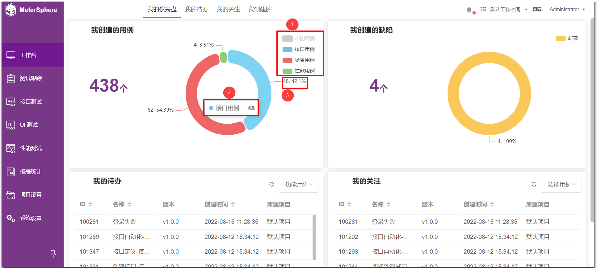
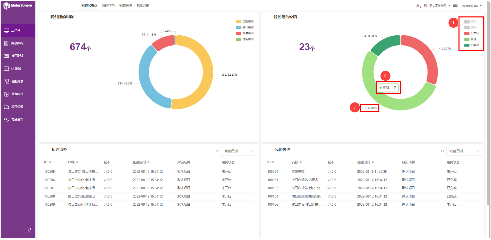

## 1 我创建的用例
鼠标悬浮在各类用例上，会显示该类用例的个数，以及在总用例中的占比情况。

鼠标点击右侧的各类用例进行取消展示，饼图中只会显示未取消的类型用例，之后鼠标悬浮在用例上，会显示该类用例的个数，以及在饼图中展示总用例的占比情况。

## 2 我创建的缺陷
鼠标悬浮在各缺陷状态上，会显示该状态的缺陷个数，以及在总缺陷个数中的占比。

鼠标点击右侧的各缺陷状态可以取消展示，饼图中只会显示未取消的缺陷状态，之后鼠标悬浮在缺陷状态上，会显示该状态的缺陷个数，以及在饼图中展示缺陷的占比情况。

## 3 我的待办
当前待办类型默认显示“功能用例”，可以点击框选择其他待办类型，选中待办列表中的数据，会跳至相应的页面

点击刷新按钮，即可刷新当前待办类型的待办列表

## 4 我的关注
当前关注类型默认显示“功能用例”，可以点击框选择其他待办类型，选中关注列表中的数据，会跳至相应的页面

点击刷新按钮，即可刷新当前关注类型的关注列表

