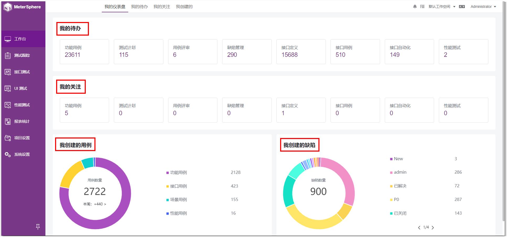
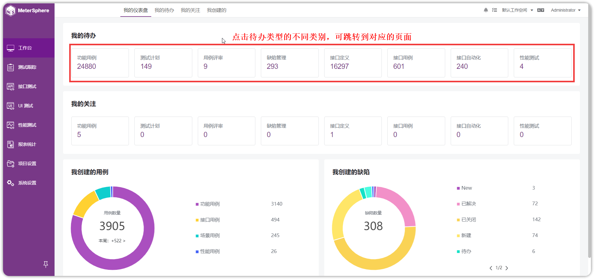
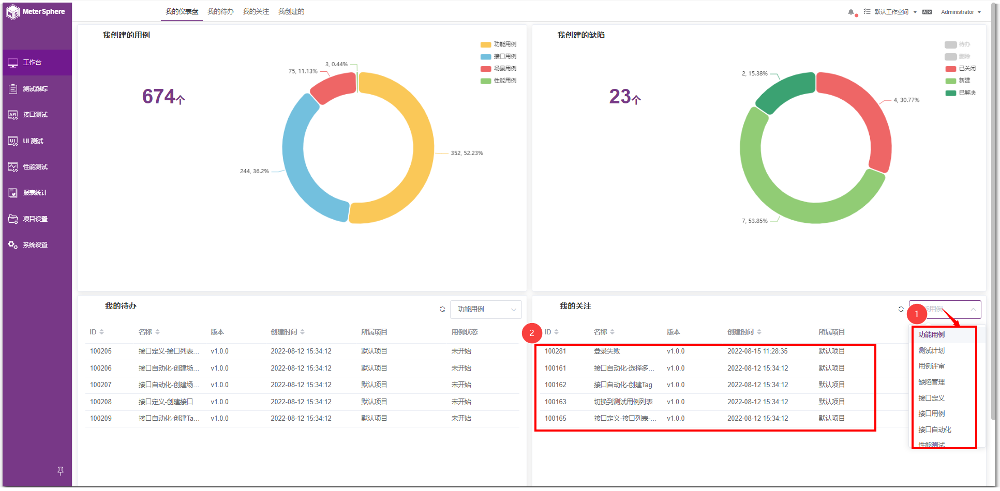
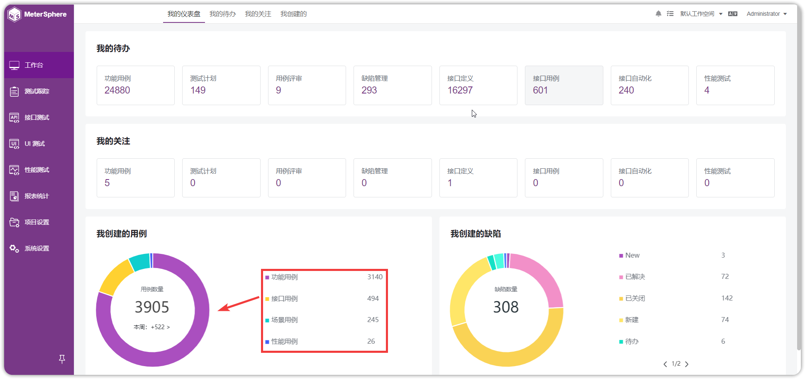
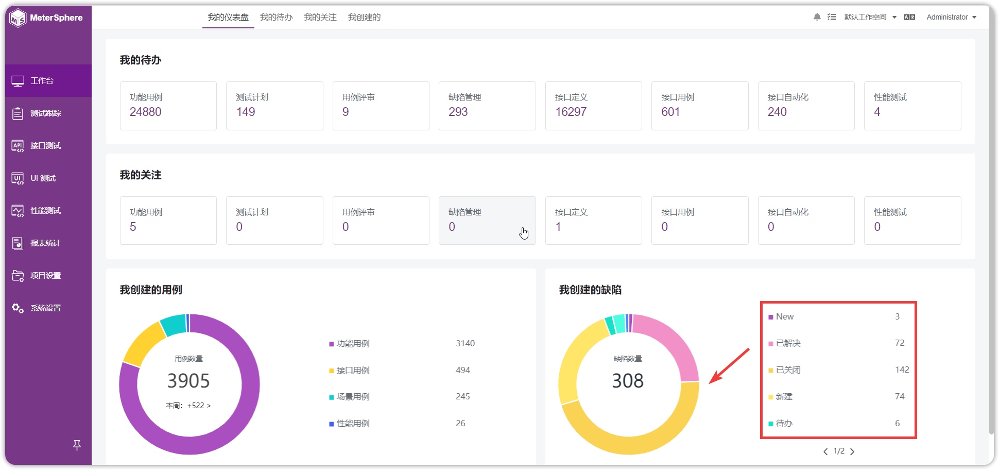

!!! ms-abstract ""
    页面主要展示【我的待办】、【我的关注】、【我创建的用例】、【我创建的缺陷】模块的统计数据。
{ width="900px" }

## 1 我的待办
!!! ms-abstract ""
    展示不同类别的待办数据，如功能用例、测试计划、用例评审、缺陷管理、接口定义、接口用例、接口自动化、性能测试等，点击待办列表中的不同类别，会跳至相应的页面。
{ width="900px" }

## 2 我的关注
!!! ms-abstract ""
    展示不同类别的关注，如功能用例、测试计划、用例评审、缺陷管理、接口定义、接口用例、接口自动化、性能测试等，点击关注列表中的不同类别，会跳至相应的页面。
{ width="900px" }

## 3 我创建的用例
!!! ms-abstract ""
    饼图展示各类用例的数量，鼠标悬浮在各类用例上，会显示该类用例的个数。
{ width="900px" }

## 4 我创建的缺陷
!!! ms-abstract ""
    饼图展示各类缺陷的个数，鼠标悬浮在各类缺陷上，会显示该类缺陷的个数。
{ width="900px" }
