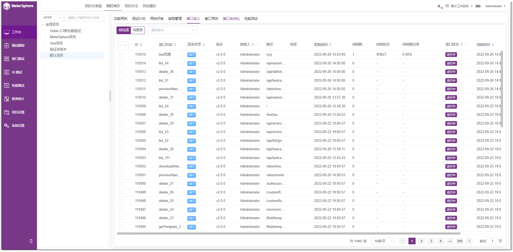
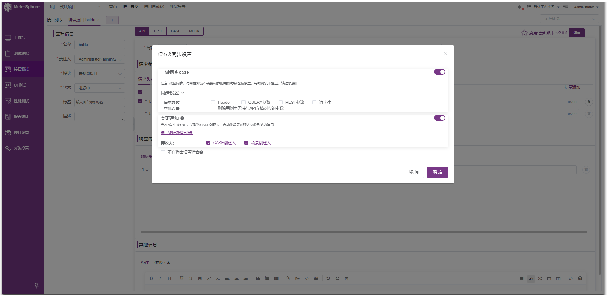
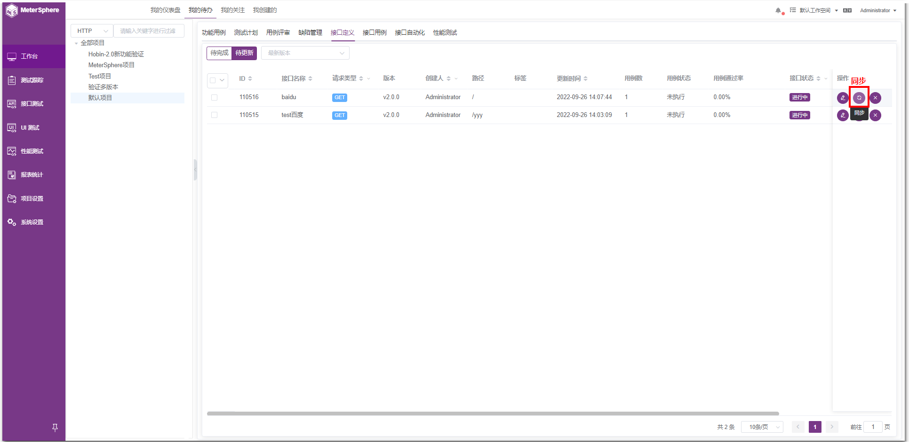

!!! ms-abstract ""
    可切换到任意菜单，下方列表就显示对应内容。默认【功能用例】，选择当前版本号，点击列表任一数据，会跳转到对应的页面查看详细情况。 
{ width="900px" }

## 1 待完成
!!! ms-abstract ""
    在【接口定义】、【接口用例】、【接口自动化】Tab 下可以展示所有【待完成】的接口或者用例列表。
{ width="900px" }

## 2 待更新
!!! ms-abstract ""
    已存在的接口，修改地址、请求头、请求体等信息，点击保存后，未进行【同步设置】操作。
!!! ms-abstract "同步设置"
    即在 API 接口发生变更并点击保存后，可勾选同步设置 Header、QUERY参数、REST参数等选项，勾选后，会同步更新该 API 对应的 CASE 和引用该 API 的场景。
{ width="900px" }

!!! ms-abstract ""
    可在【待更新】页面列表中进行【同步】或【忽略】操作。
{ width="900px" }

{ width="900px" }