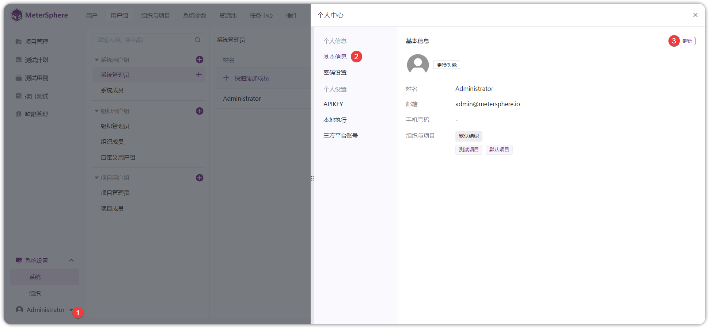
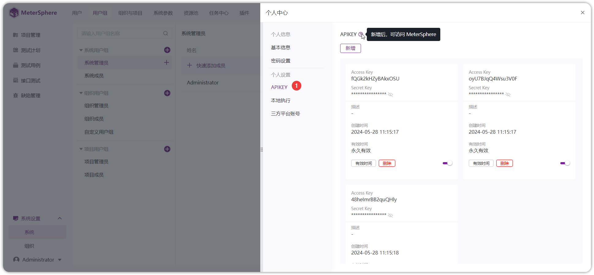
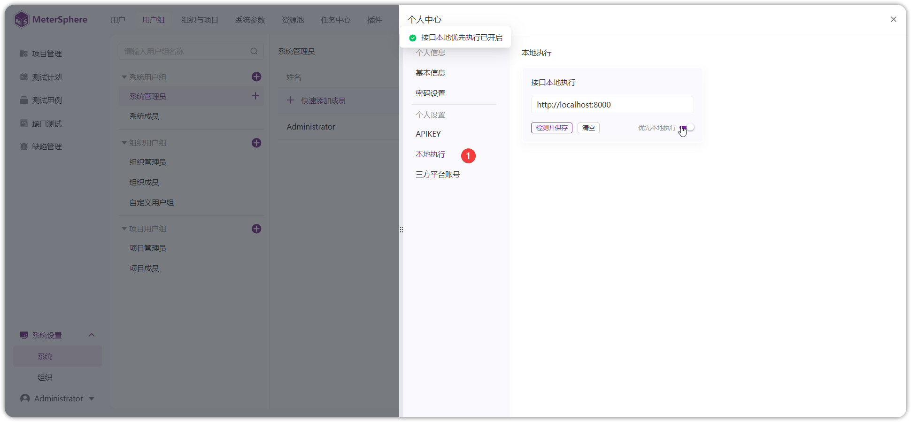

## 1 基本信息
!!! ms-abstract ""
    进入【个人信息-基本信息】管理界面，更新头像、修改用户名称、邮箱、手机号码。
{ width="900px" }

## 2 密码设置
!!! ms-abstract ""
    进入【个人信息-密码设置】管理界面，修改当前用户的登录密码。
{ width="900px" }

## 3 APIKEY
!!! ms-abstract ""
    进入【个人信息-APIKEY】管理界面，创建 MeterSphere 平台的 Access Key、Secret Key 用于第三方调用接口做身份验证使用、Jenkins 插件、接口同步 Idea 插件等。最多可添加 5 条APIKEY。
{ width="900px" }

## 4 本地执行
!!! ms-abstract ""
    配置接口测试本地执行策略，点击【检测】地址是否可联通，检测通过了才能开启，配置【优先本地执行】。
{ width="900px" }

!!! ms-abstract "说明"
    本地执行：用于本地调试执行，需要本地电脑部署 task-runner ，安装参考 [部署  task-runner ](../../installation/task_runner.md)。 

    本地调试具有多个优势： 

    - 实时反馈：在本地调试时，可以立即看到代码的执行结果，快速发现和解决问题。 
    - 快速迭代：本地调试可快速进对代码修改和测试，从而加快开发迭代的速度。 
    - 隔离环境：本地调试是在一个受控的环境中进行开发和测试，不受外部环境的影响，有助于排除外部因素导致的问题。 

## 5  三方平台账号
!!! ms-abstract ""
    绑定第三方缺陷管理平台账号。如：配置了禅道、JIRA、TAPD、飞书等平台时，在个人中心绑定对应三方平台的账号，MeterSphere将使用此处的账号作为缺陷创建人。
{ width="900px" }