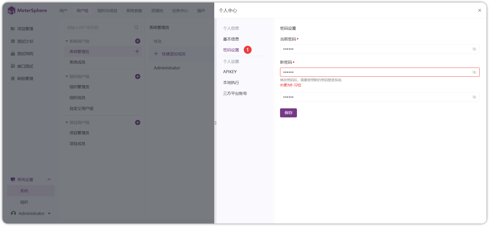

!!! ms-abstract ""
     **个人信息**：对当前登录账号信息进行管理，包含基本信息、密码、APIKEY、本地执行、三方平台账号信息等配置内容 。
{ width="900px" }

## 1 基本信息
!!! ms-abstract ""
    进入【个人信息-基本信息】管理界面，支持【更新】【更换头像】操作。可以修改用户名称、邮箱、手机号码。
{ width="900px" }
{ width="900px" }

## 2 密码设置
!!! ms-abstract ""
    进入【个人信息-密码设置】管理界面，支持修改当前用户的登录密码。
{ width="900px" }

## 3 APIKEY
!!! ms-abstract ""
    进入【个人信息-APIKEY】管理界面，支持创建 MeterSphere 平台的Access Key、Secret Key，可以用于第三方接口调用身份验证使用。支持设置【有效时间】、【删除】操作。
{ width="900px" }

## 4 本地执行
!!! ms-abstract ""
    可以配置接口测试本地执行策略，支持做【检测】【优先本地执行】。
{ width="900px" }

## 5  三方平台账号
!!! ms-abstract ""
    当组织配置了权限第三方平台，如：配置了禅道、JIRA、TAPD、飞书等平台时，可在个人中心绑定对应三方平台的账号，MeterSphere将使用此处的账号作为缺陷创建人。
{ width="900px" }