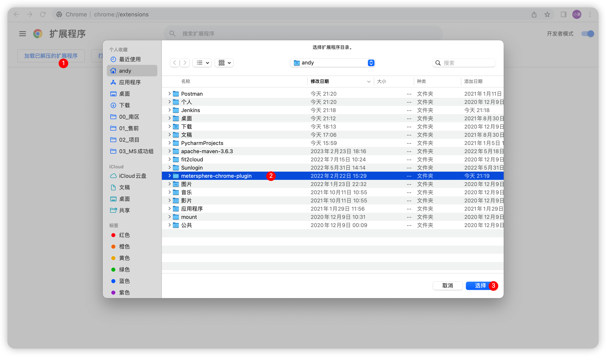
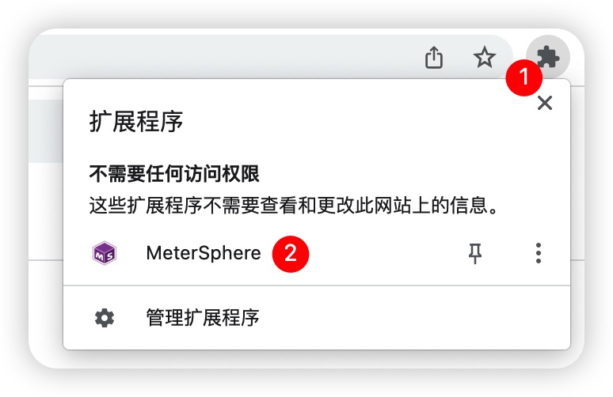
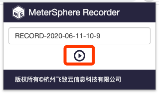
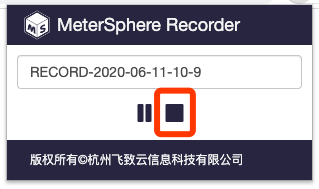
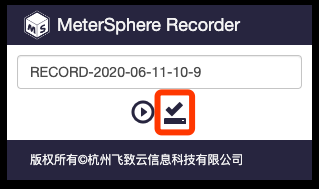
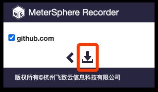
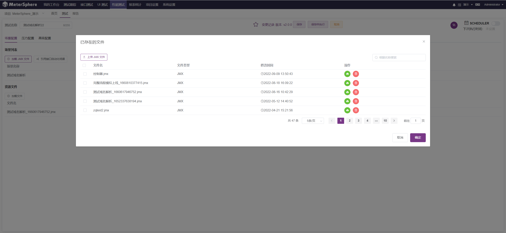

!!! ms-abstract ""
     该插件为 MeterSphere 配套的浏览器录制插件，该插件可将用户在 chrome 浏览器操作时的所有 HTTP 请求记录下来并生成 
     JMX 文件（JMeter 脚本文件），导入 MeterSphere 后进行接口测试或性能测试。

## 1 插件安装
!!! ms-abstract ""
     在 [MeterSphere chrome-extensions](https://github.com/metersphere/chrome-extensions/releases/tag/v1.2.4) 项目中下载最新的发布版本，下载完成后进行解压，然后在谷歌浏览器输入 chrome://extensions/ 进入扩展程序安装界面，
     选择【加载已解压的扩展程序】，选择插件解压后的目录进行安装。

{ width="900px" }

## 2 使用说明
!!! ms-abstract ""
     在 Chrome 浏览器中点击扩展程序按钮，并选择MeterSphere 录制插件图标，点击开始录制按钮。

!!! ms-abstract ""
     访问需要进行录制的站点，进行正常使用操作，浏览器中的所有网络请求均会被记录下来。当操作完成后，点击停止按钮停止录制。

!!! ms-abstract ""
     录制结束后，点击保存按钮进行保存。 

!!! ms-abstract ""
     插件弹出所有记录到请求的站点列表，勾选需要保留的站点请求点击下载按钮，下载 JMX 脚本至本地。

!!! ms-abstract ""
     在 MeterSphere 中创建性能测试任务， 上传刚刚录制的 JMX 脚本，然后设置并发参数，进行性能测试。
{ width="900px" }