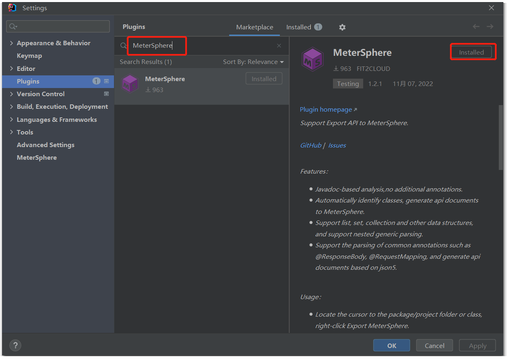
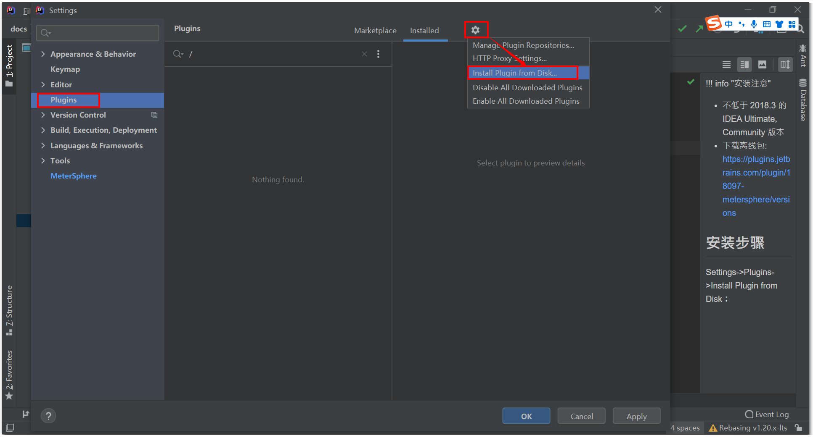
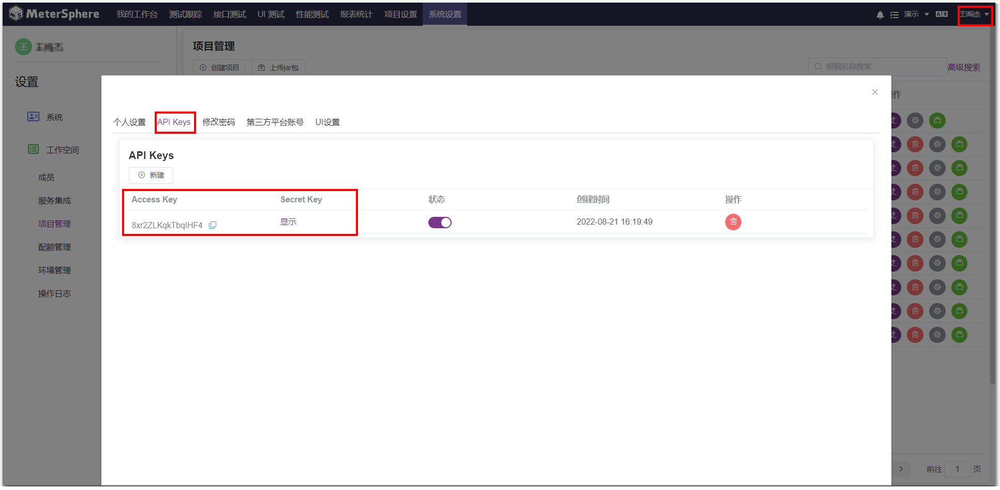
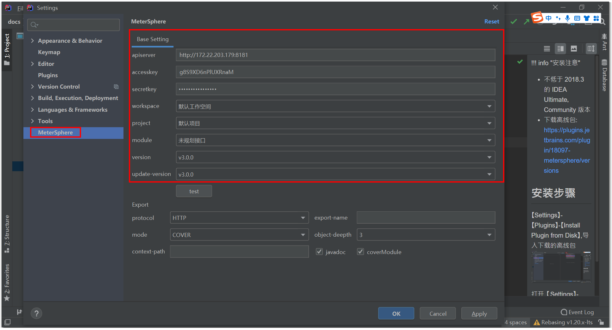
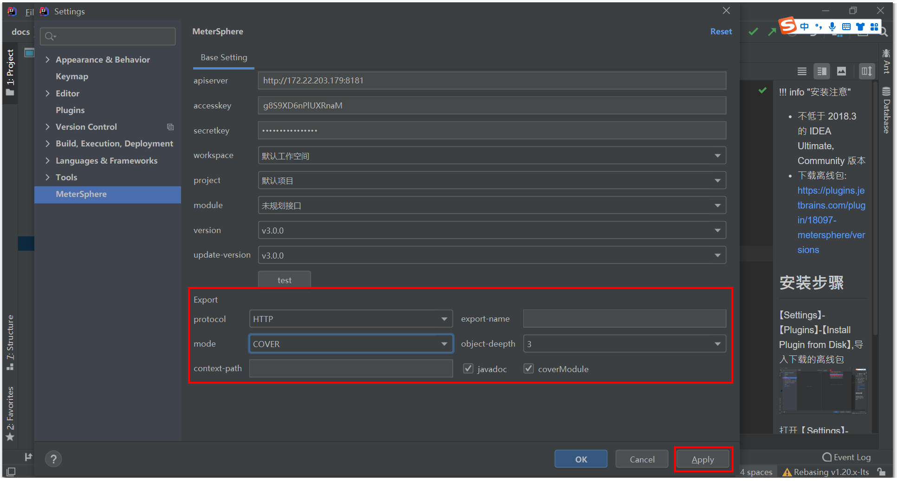

开发人员可通过该插件实时将编写的接口代码推送到 MeterSphere 系统

!!! info "安装注意"
    * 不低于 2018.3 的 IDEA Ultimate，Community 版本
    * 下载离线包: https://plugins.jetbrains.com/plugin/18097-metersphere/versions

## 1 安装步骤
### 1.1 在线安装
【Settings】-【Plugins】,搜索【MeterSphere】，点击 install 即可进行安装

### 1.2 离线安装
【Settings】-【Plugins】-【Install Plugin from Disk】,导入下载的离线包

## 2 使用步骤
进入【个人信息】-【API Keys】获取 AK/SK 信息  

打开【Settings】-【MeterSphere】配置好访问地址以及 AK/SK 等详细信息，点击【test】按钮即可看到连接成功

配置导出是否覆盖、目录层级等信息后，点击【Apply】按钮即可

在要同步接口的 Controller 右键选择【Export MeterSphere】即可将代码中的接口推送到 MeterSphere 系统中