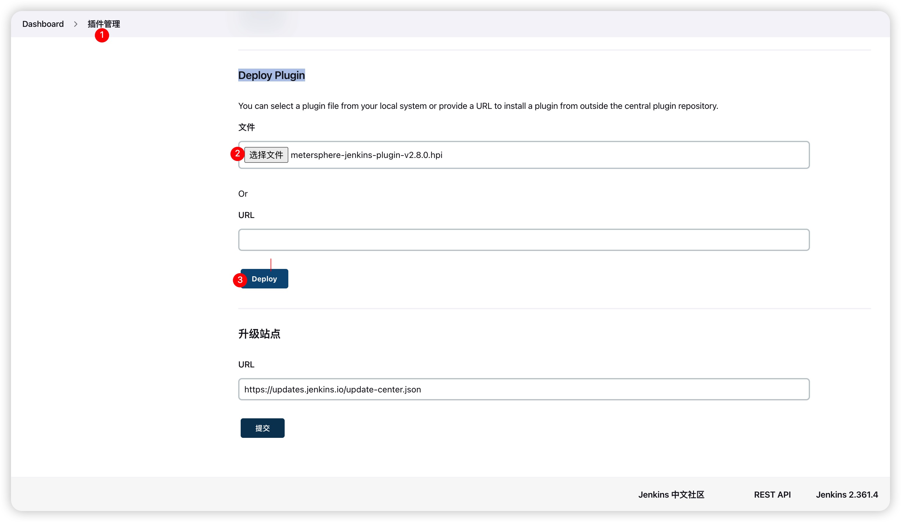
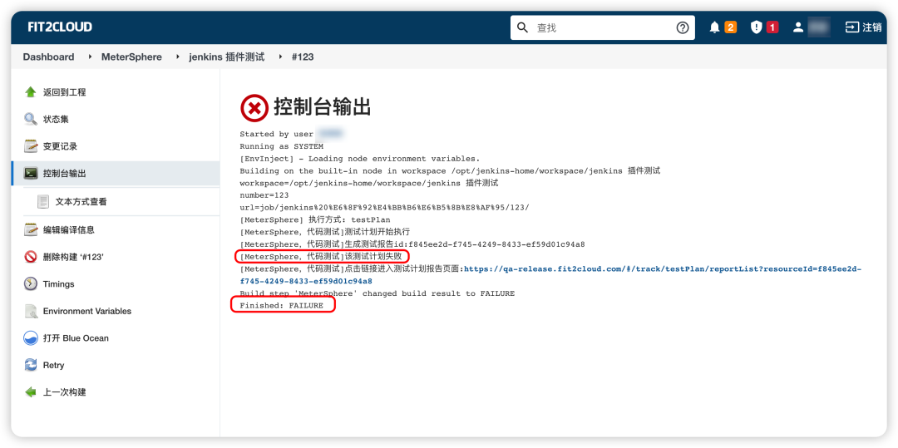

!!! ms-abstract ""
     该插件为 MeterSphere 配套DevOps 持续集成工具链中与 Jenkins 的自动化执行插件。

## 1 插件安装
!!! ms-abstract ""
    根据 MeterSphere 版本，在 [MeterSphere Jenkins-plugin](https://github.com/metersphere/jenkins-plugin/releases)  下载对应版本的 hpi 包， 并在 Jenkins 的插件管理-高级中的Deploy Plugin段中，选择上传已下载好的 hpi 插件包。

{ width="900px" }

## 2 插件使用
!!! ms-abstract ""
    插件安装后，在指定的 Jenkins 构建任务的构建步骤中，增加并配置【MeterSphere】类型的构建步骤。 
    配置 MeterSphere 认证信息，并指定需要触发执行的接口测试、性能测试或测试计划，配置完成后即可运行 Jenkins Job。

{ width="900px" }

!!! ms-abstract ""
    v2版本将 Jenkins Job 的运行结果变更为当前运行的测试计划或用例的实际运行结果状态，即当用例运行失败时，Jenkins Job 的状态也为失败。

{ width="900px" }
