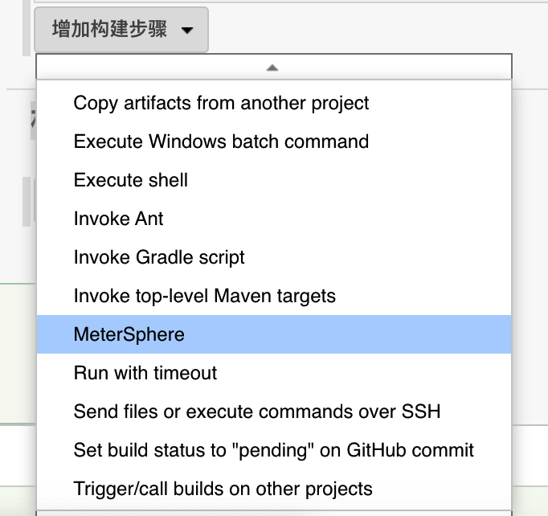
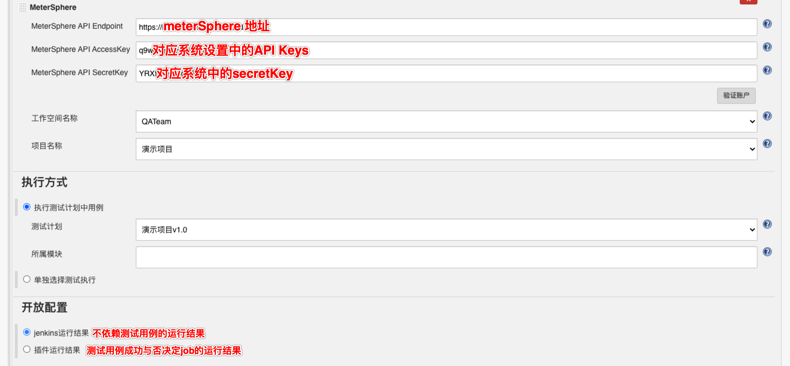

## 1 插件下载
要想实现在 Jenkins 中完成 MeterSphere 自动化接口测试，需要在 Jenkins 上安装 MeterSphere 提供的 Jenkins 插件。
```
插件下载地址: https://github.com/metersphere/jenkins-plugin/releases
下载 MeterSphere 对应版本的 hpi 包,在 Jenkins 的插件管理页面，上传并安装下载好的 hpi 插件包
```

## 2 插件使用
插件安装后，在指定的 Jenkins 构建任务中，添加【MeterSphere】类型的构建步骤


通过配置 MeterSphere 认证信息，并指定需要触发执行的接口测试、性能测试或测试计划。

