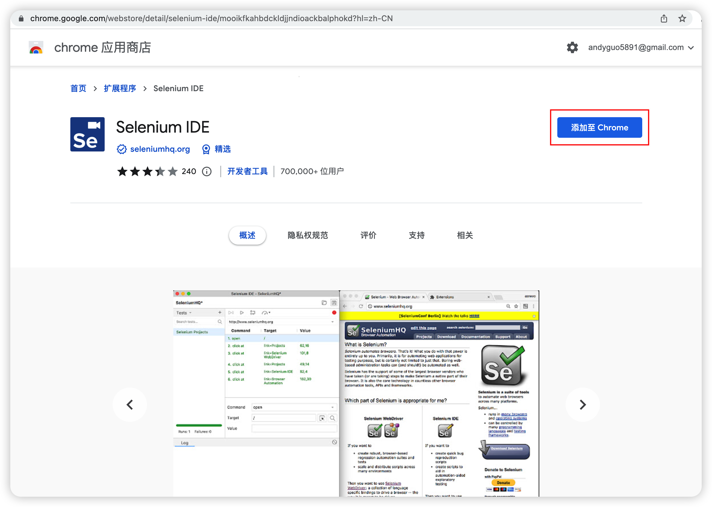
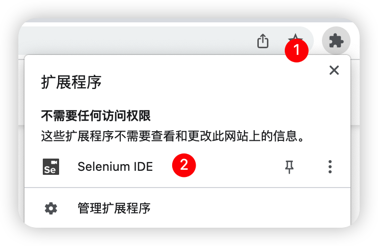
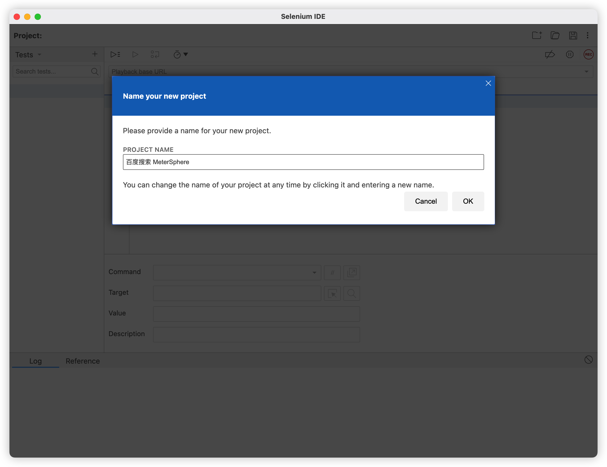
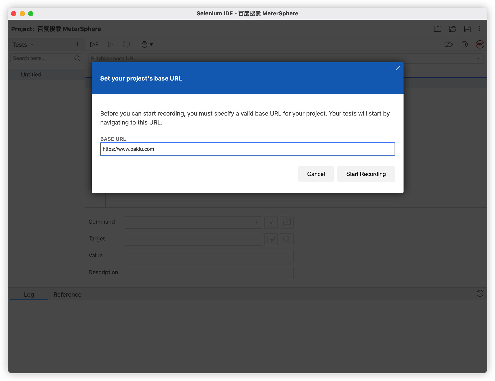
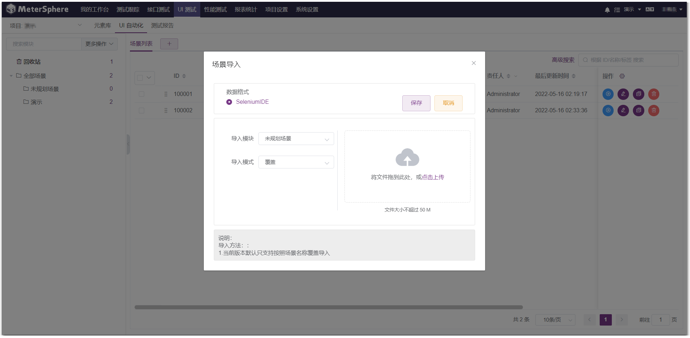

!!! ms-abstract ""
    该插件为 Selenium 原生插件，用于录制、回放用户在 web 页面上的操作，支持 Chrome，firefox、Edge等主流浏览器。以Chrome浏览器为例说明插件的下载安装以及使用。

## 1 插件安装
!!! ms-abstract ""
    在 Chrome 应用商店中搜索 selenium 关键字, 选择Selenium IDE,点击【添加至 Chrome】完成插件安装。

## 2 插件使用
!!! ms-abstract ""
     在 Chrome 浏览器中点击扩展程序按钮，并选择 Selenium IDE插件图标，启动插件程序。 

!!! ms-abstract ""
    启动【Selenium IDE】插件  

!!! ms-abstract ""
    创建录制的项目，输入项目名称  
    点击【录制】按钮，在输入录制网站地址之后开始录制。  

!!! ms-abstract ""
    录制完成后，点击【停止】按钮结束录制，并点击【保存】按钮，将录制结果保存后置为 .side 文件

!!! ms-abstract ""
    将保存的 .side 文件导入到 MeterSphere UI 测试中即进行 Web UI的自动化测试。

