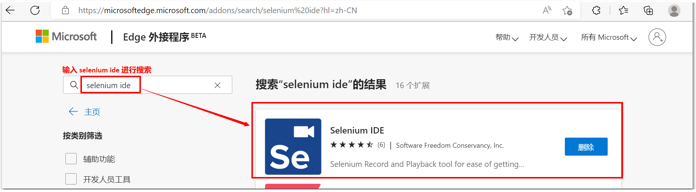
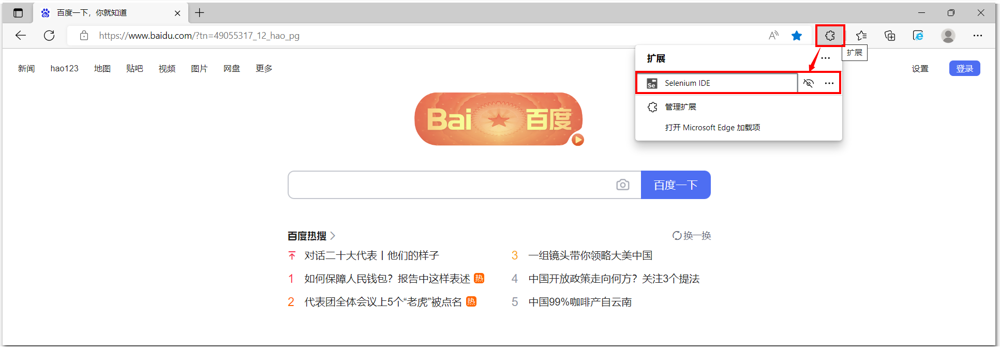
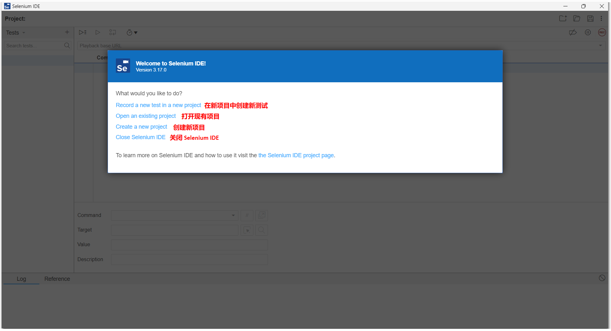
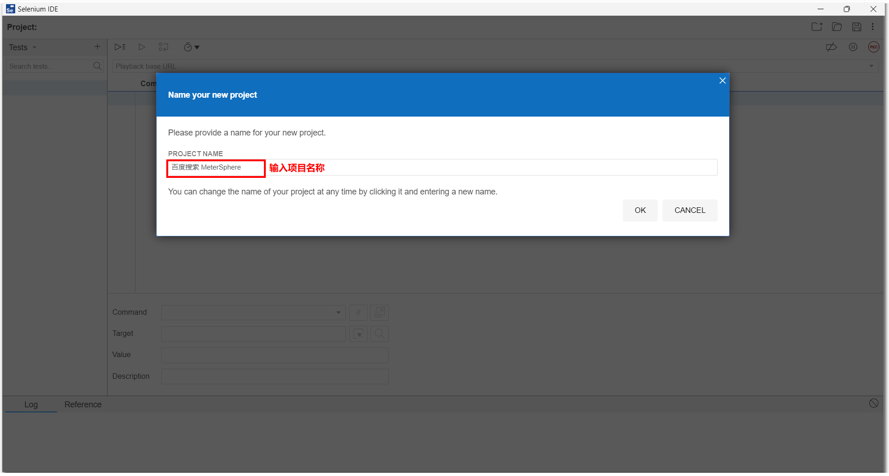
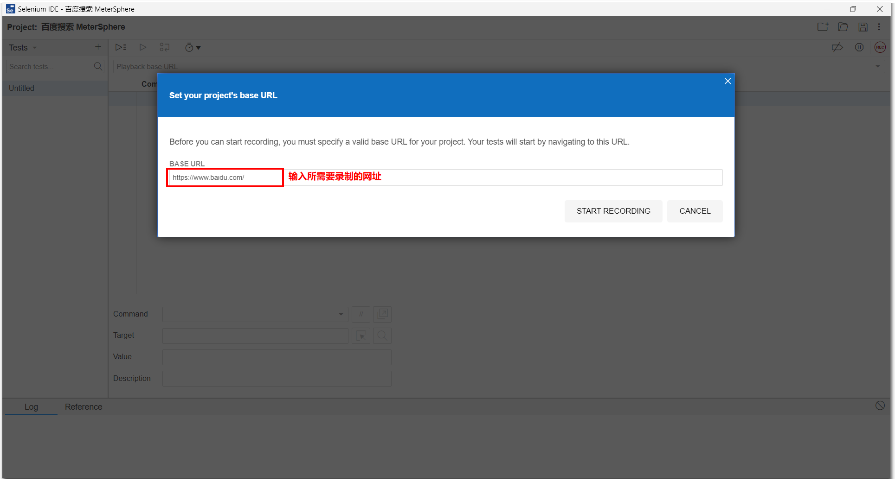
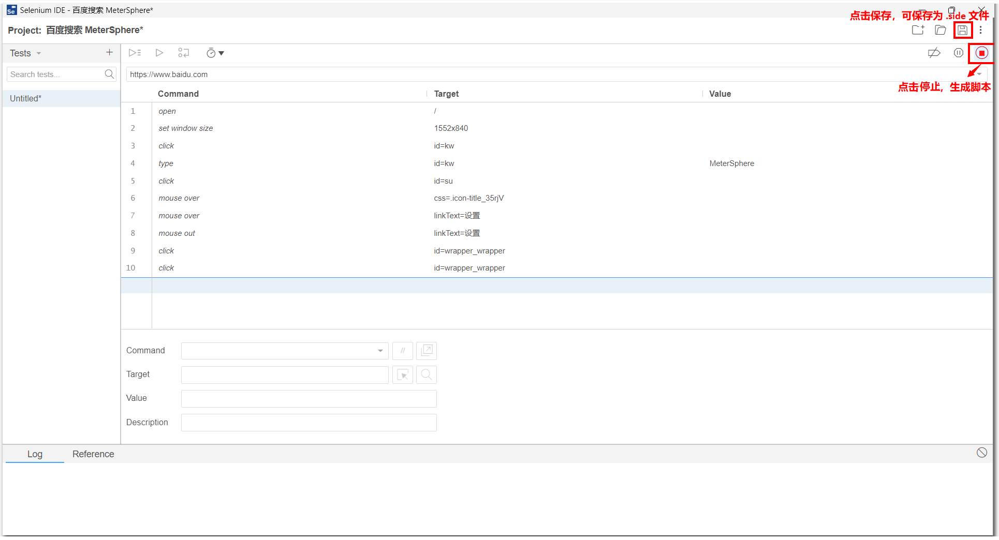

## 1 下载
可以在【浏览器-扩展程序】里面直接进行搜索下载即可 

## 2 录制
下载完成后，点击【扩展程序】，可看到【Selenium IDE】插件，点击即可启动  

启动【Selenium IDE】插件  

创建录制的项目，输入项目名称  

输入要录制的网站地址  

录制完成后，点击【停止】按钮后，可点击【保存】按钮，即可保存后置为 .side 文件

将保存的 .side 文件导入到 MeterSphere UI 测试中即可 
