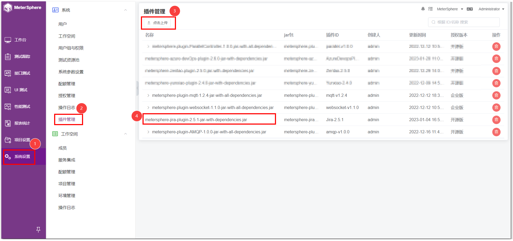

!!! ms-abstract ""
    MeterSphere v2.4 版本实现了服务集成的插件化，目前已经支持禅道、Jira、TAPD等平台的对接，也可根据自身需求开发对应插件。系统设置-插件管理上传插件 使用方式跟原来一致，具体参考 [metersphere-platform-plugin](https://github.com/metersphere/metersphere-platform-plugin) 。以 Jira 平台为例，在【系统设置】-【系统】-【插件管理】界面下，上传 Jira 插件包。

{ width="900px" }

!!! ms-abstract ""
    【系统设置】-【系统】-【服务集成】处可看到 Jira 平台，选中 Jira 平台可出现相关账号信息。点击【编辑】填写Jira 平台相关账号信息后进行保存，并通过【测试连接】进行验证。

{ width="900px" }

!!! ms-abstract ""
    验证通过后，在【系统设置】-【系统】-【项目管理】处，进行项目编辑时，可看到【集成第三方平台】的下拉框有 Jira 平台选项以及 Jira 平台的相关信息。

{ width="900px" }