## 1 应用管理权限
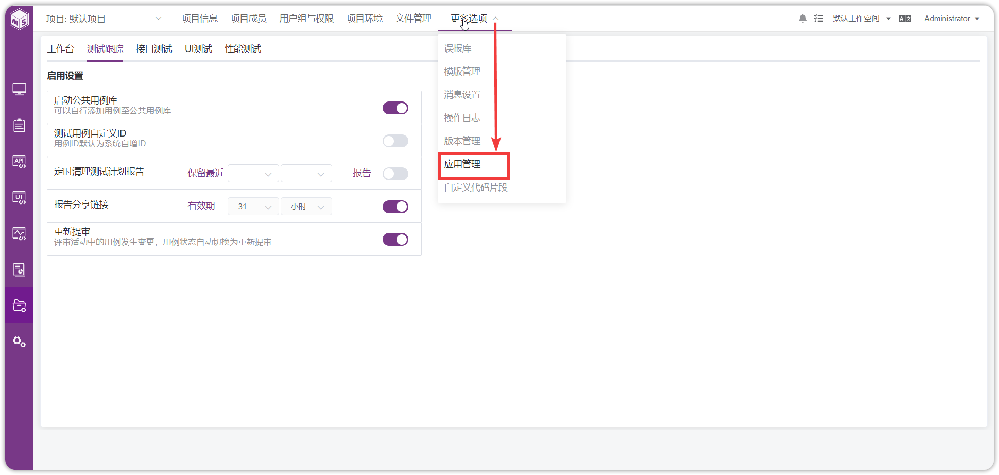{ width="900px" }

!!! ms-abstract ""
    如果【项目设置】-【更多选项】里看不到【应用管理】菜单，表示此用户没有此权限，需要到【系统设置】-【系统】-【用户组与权限】修改【项目管理员】的权限。
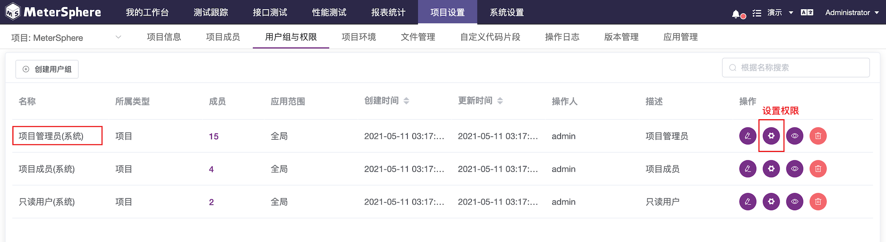{ width="900px" }

!!! ms-abstract ""
    选中应用设置权限即可。
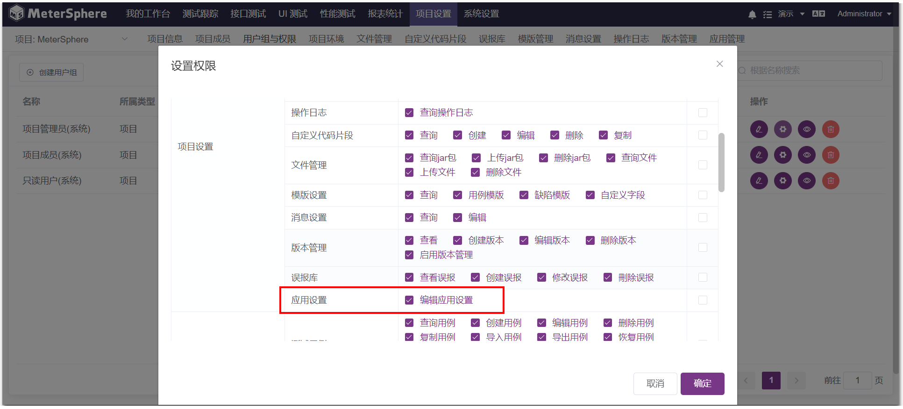{ width="900px" }

## 2 应用管理设置
!!! ms-abstract ""
    点击【项目设置】-【更多选项】-【应用管理】可以对 MeterSphere 的【工作台】、【测试跟踪】、【接口测试】、【UI测试】、【性能测试】等应用进行高级设置。
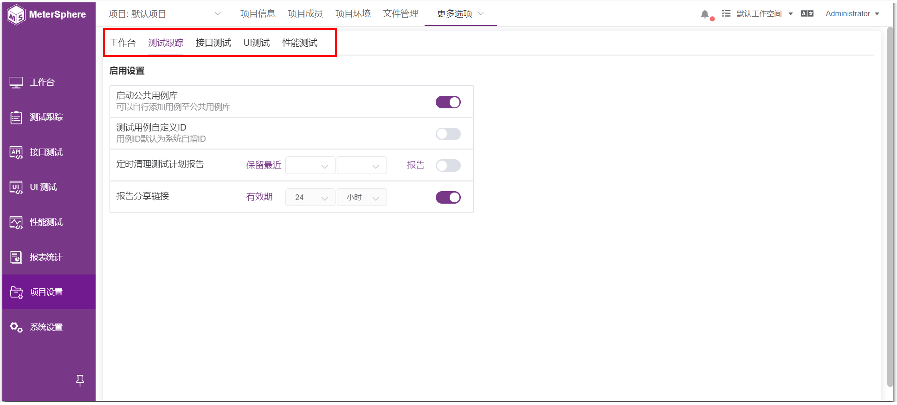{ width="900px" }

### 2.1 工作台
!!! ms-abstract ""
    维护【工作台】下的一些高级应用配置管理，包含【我的待办-待更新列表】配置。
{ width="900px" }

{ width="900px" }

### 2.2 测试跟踪设置
!!! ms-abstract ""
    维护【测试跟踪】下的一些高级应用配置管理，包含 【启动公共用例库】、【测试用例自定义ID】、【定时清理测试计划报告】、【报告分享链接】配置。
{ width="900px" }

!!! ms-abstract ""

    - **启动公共用例库**

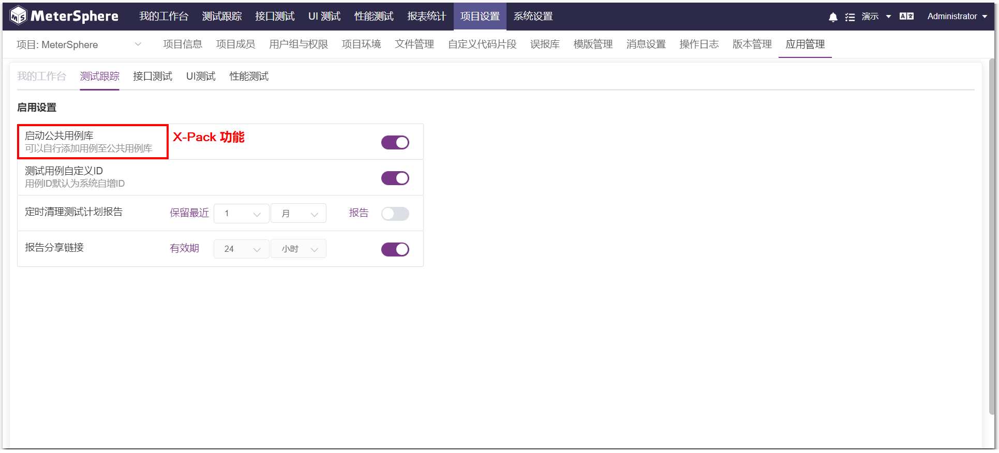{ width="900px" }

!!! ms-abstract ""

    - **测试用例自定义ID** 
    开启后，在创建【测试用例】页面，可以自定义设置用例 ID。
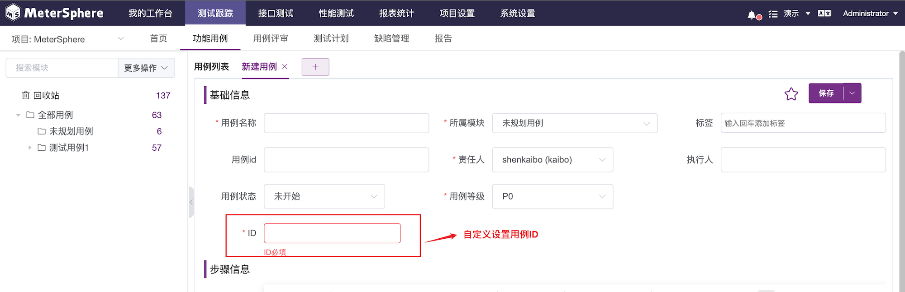{ width="900px" }

!!! ms-abstract ""

    - **定时清理测试计划报告**

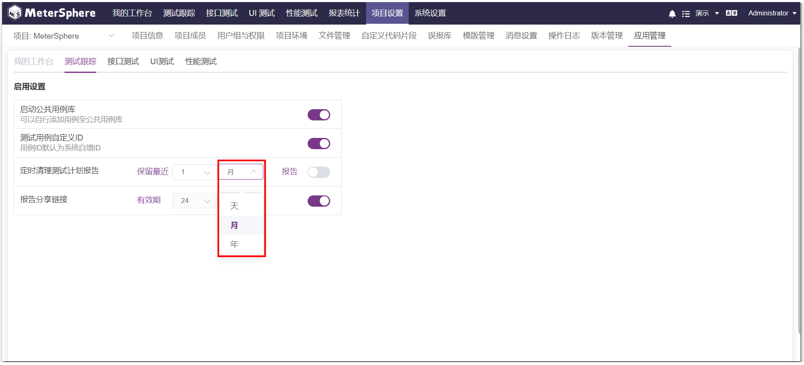{ width="900px" }

!!! ms-abstract ""

    - **报告分享链接**

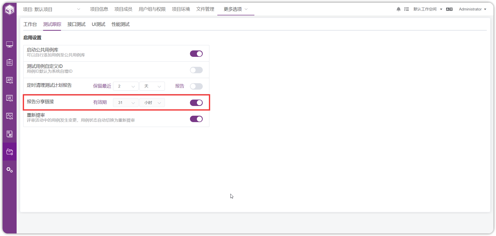{ width="900px" }

### 2.3 接口测试设置
!!! ms-abstract ""
    维护【接口测试】下的一些高级应用配置管理，包含【接口定义URL可重复】、【场景自定义ID】、【TCP Mock Port】以及【定时清理接口测试报告】、【报告分享链接】以及【接口定义快捷添加按钮】等配置。
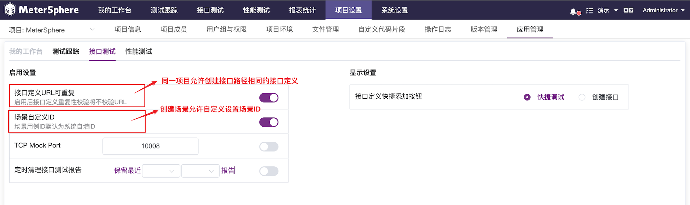{ width="900px" }

!!! ms-abstract ""

    - **接口定义URL可重复** 
    启用后接口定义重复性校验将不校验URL，同一个项目下允许接口路径相同的【接口定义】。
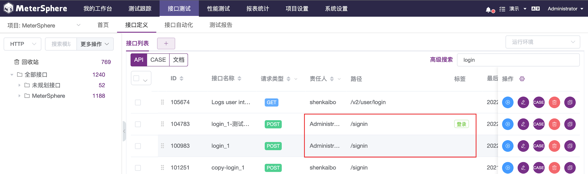{ width="900px" }

!!! ms-abstract ""

    - **场景自定义ID** 
    启用后创建场景支持自定义设置场景ID。
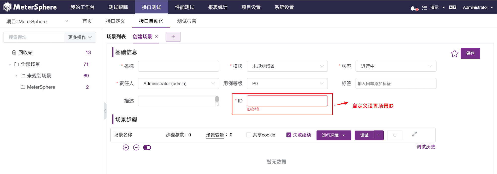{ width="900px" }

!!! ms-abstract ""

    - **TCP Mock Port** 
    设置接口协议为TCP的接口，Mock服务的可用性。
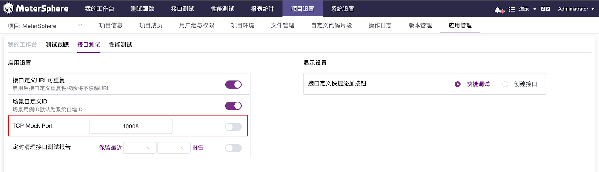{ width="900px" }

!!! ms-abstract ""
    如果 TCP 协议的接口需要使用 Mock 服务，则需要开启此服务，开启后在接口测试中，Mock 服务才可用。
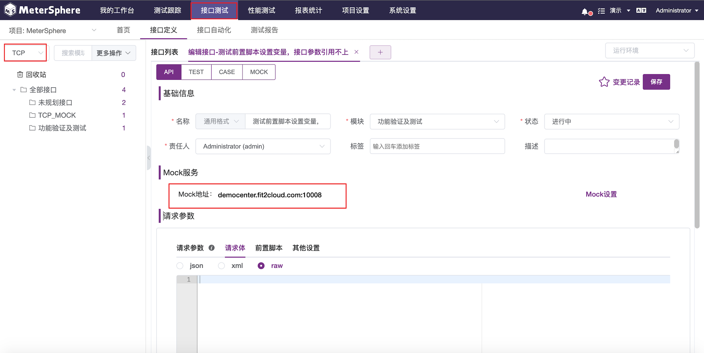{ width="900px" }

!!! ms-abstract ""

    - **定时清理接口测试报告** 

{ width="900px" }

!!! ms-abstract ""

    - **报告分享链接**

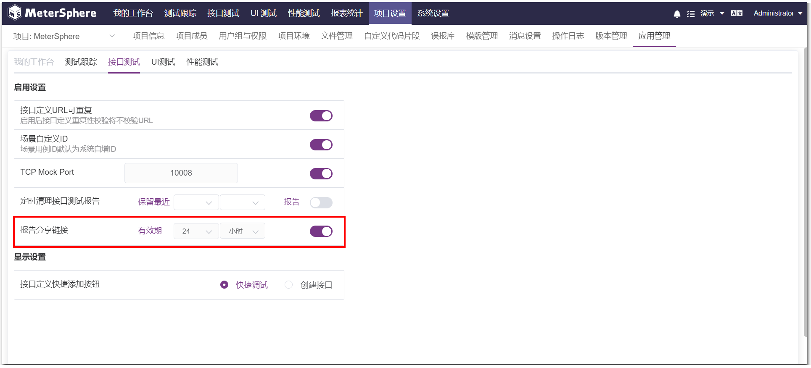{ width="900px" }

!!! ms-abstract ""

    - **接口定义快捷添加按钮**

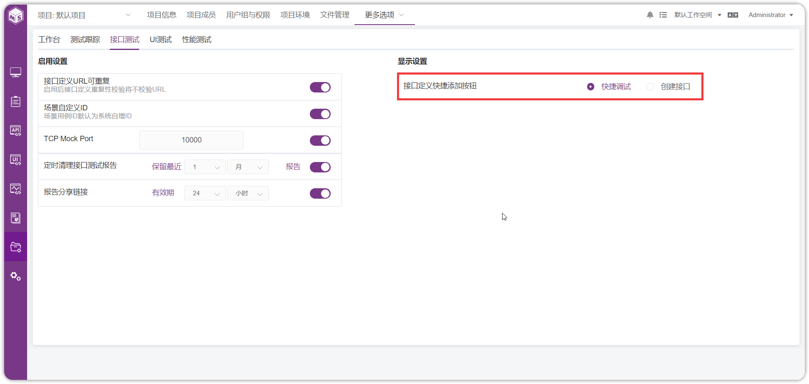{ width="900px" }

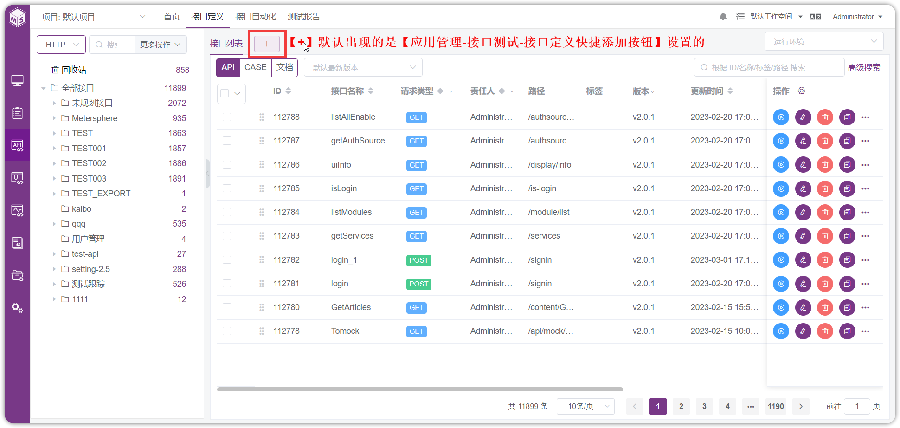{ width="900px" }

### 2.4 UI测试设置
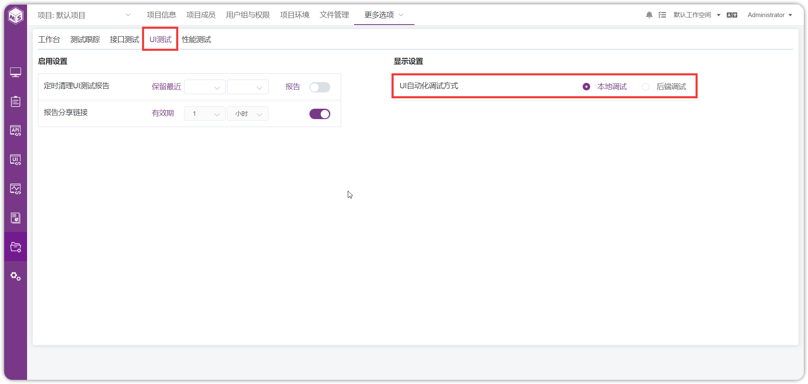{ width="900px" }

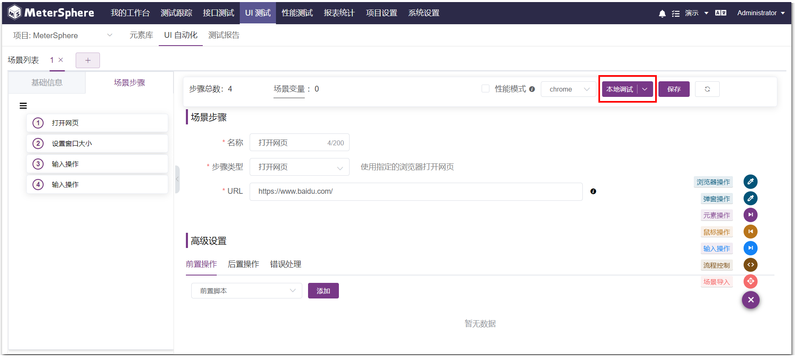{ width="900px" }

### 2.5 性能测试设置
!!! ms-abstract ""
    维护【性能测试】下的一些高级应用配置管理，包含【定时清理接口测试报告】、【报告分享链接】配置。
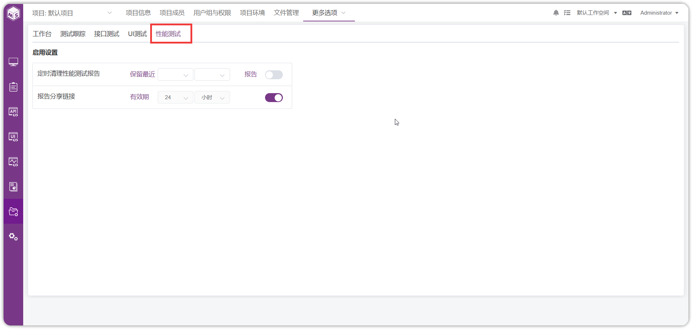{ width="900px" }
