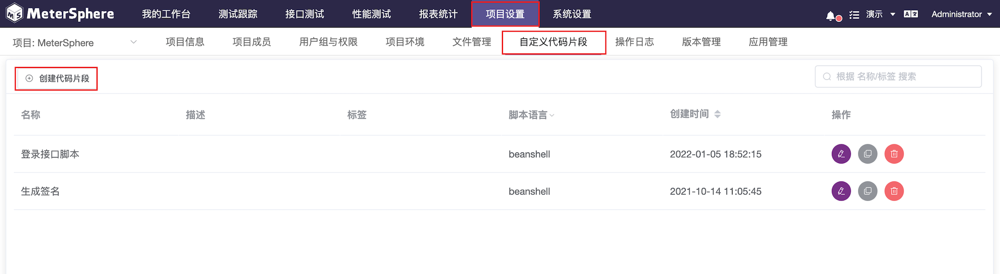
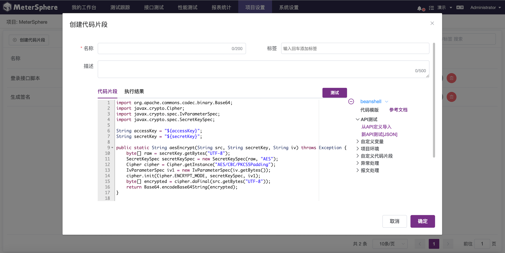
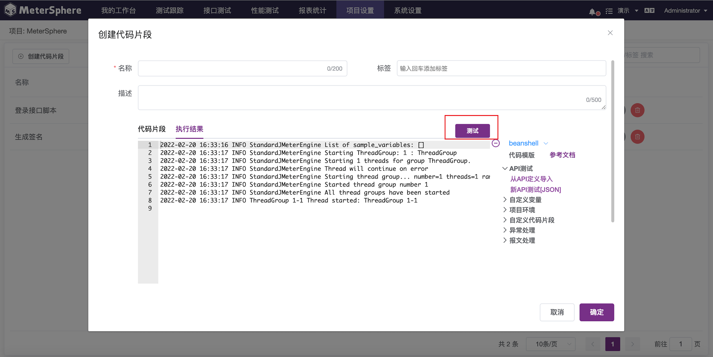
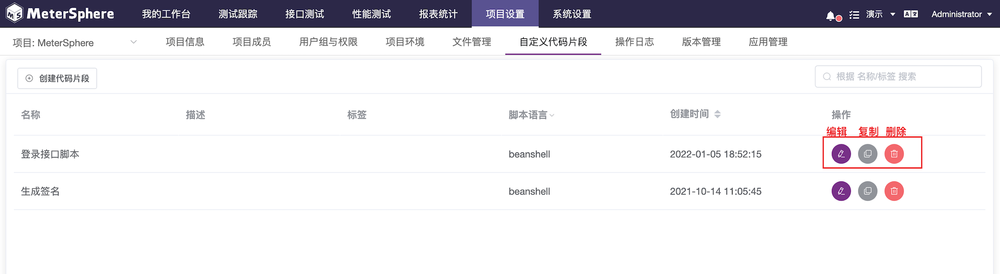
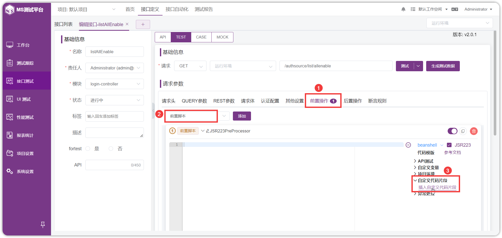
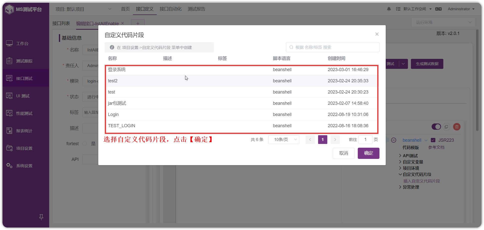

!!! ms-abstract ""
    在接口自动化中经常需要添加前后置脚本及自定义脚本，通过新增的自定义代码片段功能，用户可以将常用的脚本保存下来，在需要使用的地方直接添加即可。

## 1 自定义代码片段维护
!!! ms-abstract ""
    选择【项目设置】-【更多选项】-【自定义代码片段】。
{ width="900px" }

!!! ms-abstract ""
    点击【创建代码片段】，可以把常用的脚本代码保存在这里。
{ width="900px" }

!!! ms-abstract ""
    点击【测试】可以校验此代码执行的情况，点击【确定】创建的代码片段保存在代码列表中。
{ width="900px" }

!!! ms-abstract ""
    同时系统提供相关的管理功能：【编辑】、【复制】和【删除】等，对代码片段进行管理。
{ width="900px" }

## 2 自定义代码片段使用
!!! ms-abstract ""
    代码片段维护好后，在【接口、场景测试用例】或者【环境】的【前置脚本、后置脚本】中，选择【插入自定义代码片段】可以直接引用此代码，以【接口测试用例】为例。
{ width="900px" }

{ width="900px" }