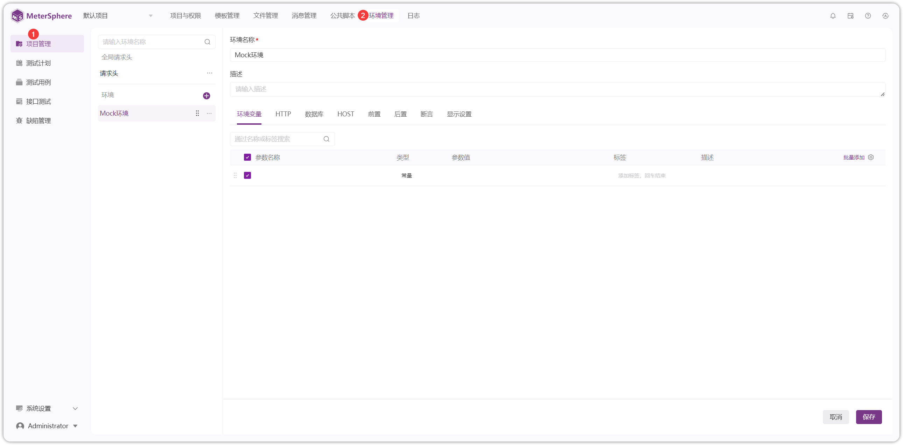
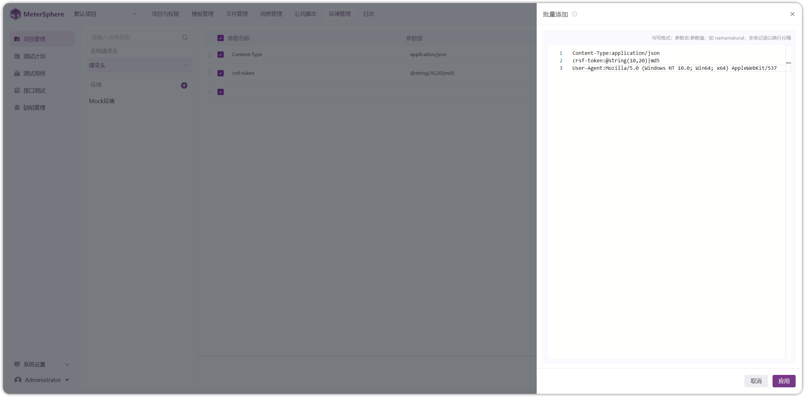
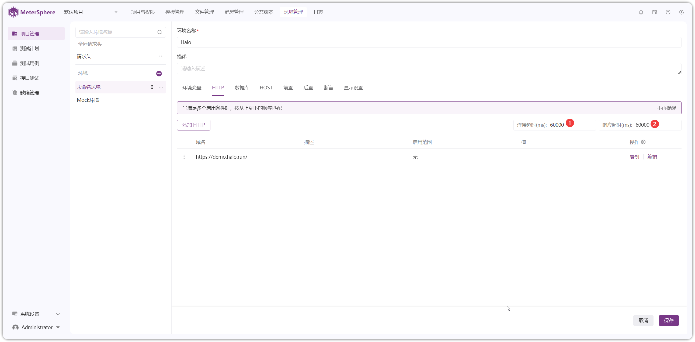
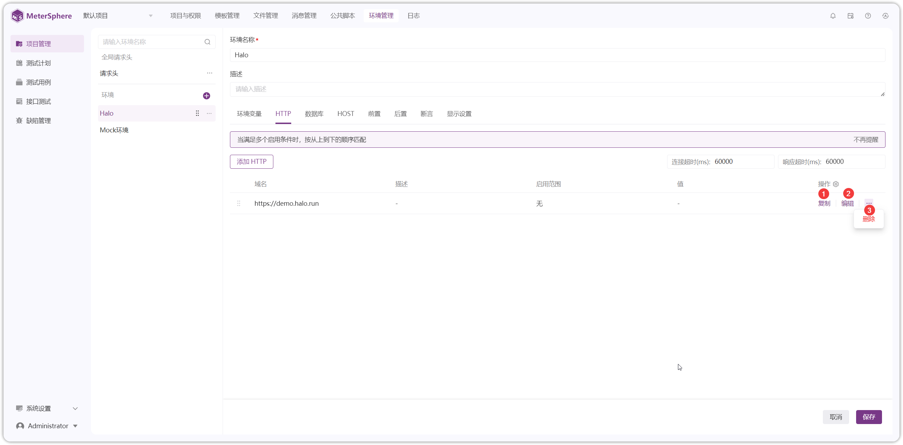
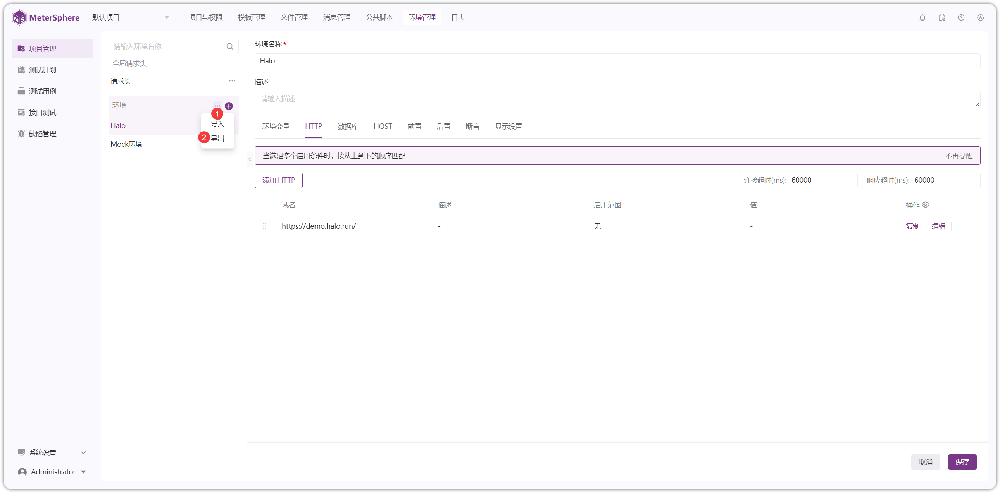
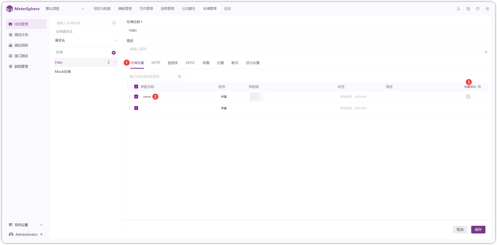
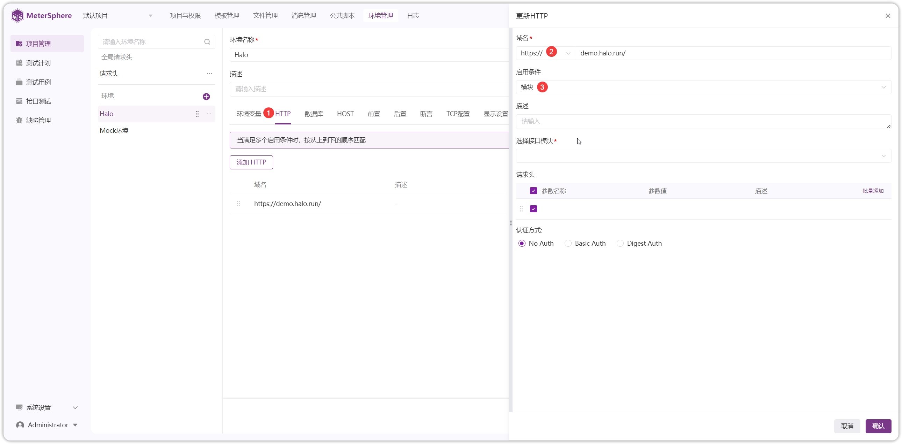
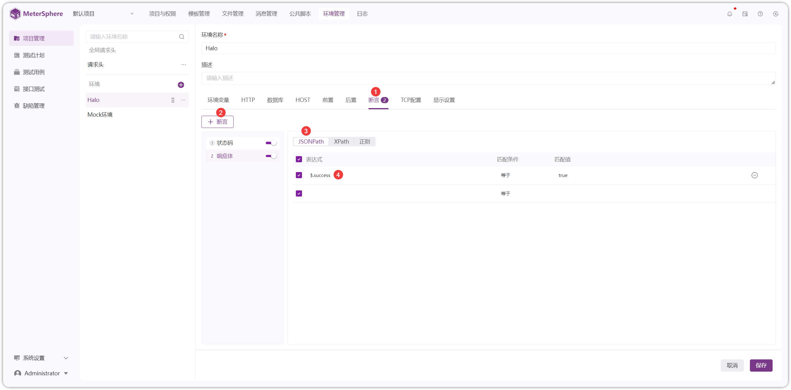

!!! ms-abstract ""
    点击【项目管理-环境管理】进入项目环境管理页面。
{ width="900px" }

## 1 环境
### 1.1 请求头
!!! ms-abstract ""
    配置【请求头】后，在整个项目中通用。
{ width="900px" }

!!! ms-abstract ""
    参数值使用【Mock】和【JMeter】函数，以【Mock】函数为例。
{ width="900px" }

!!! ms-abstract ""
    【批量添加】请求头。
{ width="900px" }

### 1.2 环境配置
!!! ms-abstract ""
    如下图，点击【+】填写环境名称，点击【添加 HTTP 】填写域名等信息后保存。
{ width="900px" }

!!! ms-abstract ""
    设置【连接超时】时间、【响应超时】时间，默认值为60秒。
{ width="900px" }

!!! ms-abstract "操作说明"
    - 【复制】复制环境。
    - 【编辑】编辑环境域名、启用条件、请求头等内容。
    - 【删除】删除环境。
    - 【导入】导入环境，开启覆盖，环境名称重复则覆盖，不重复则新增；关闭覆盖，环境名称重复则不导入。
    - 【导出】勾选或全选环境导出。

{ width="900px" }

{ width="900px" }

!!! ms-abstract "功能说明:"

    - **环境变量**：此处设置的变量是环境变量，可单个添加和批量添加。
    - **HTTP配置**：此处可配置环境地址以及启用条件，也可设置请求头。
    - **数据库**：配置数据库的数据源和连接信息。
    - **HOST**：设置 IP 和域名映射，仅支持接口测试。
    - **前置**：分为【场景】和【请求】，【场景】是场景执行前执行一次，如 TOKEN 获取及场景初始化。【请求】是每一个 API 步骤执行前均执行一次，如请求内容加密。
    - **后置**：参考【前置】功能。
    - **断言**：参考接口 CASE 内的断言，只支持接口测试。
    - **显示设置**：显示环境配置内容，可进行【启用/关闭】。

!!! ms-abstract ""
    【环境变量】进行单个添加和批量添加。
{ width="900px" }

!!! ms-abstract ""
    添加【数据库】数据源操作，以 MySQL 数据库为例。
{ width="900px" }

!!! ms-abstract "数据源字段说明:"

    - **数据源名称**：自定义名称。
    - **驱动**：默认内置 MySQL 驱动，其他驱动需要在【项目-文件管理】上传驱动包，下拉选项中自动显示。
    - **数据库连接 URL**：常用数据库连接 URL 如下 
        - **MySQL**：jdbc:mysql://127.0.0.1:3306/database，若执行多条 SQL ，则连接地址为 jdbc:mysql://127.0.0.1:3306/database?allowMultiQueries=true
        - **Oracle**：jdbc:oracle:thin:@192.168.2.1:1521:database，12C 版本数据库连接地址为 jdbc:oracle:thin:@192.168.2.1:1521/database
        - **SQLServer**：jdbc:sqlserver://127.0.0.1:1433;DatabaseName=database;encrypt=true;trustServerCertificate=true;
        - **Postgresql**：jdbc:postgresql://127.0.0.1:5432/database
    - **用户名**：数据库登录的用户名。
    - **密码**：数据库登录的密码。
    - **最大连接数**：数据库的最大连接数，默认显示 1。
    - **超时时间**：默认显示 1000。

!!! ms-abstract ""
    添加【HTTP】和【HTTPS】请求，环境启用条件有【无】、【模块】、【路径】。
{ width="900px" }

!!! ms-abstract "环境启用条件规则:"

    - 匹配顺序按【路径】>【模块】>【无】，相同匹配按从上到下的顺序匹配。
    - 有配置【无】的环境，当【路径】和【模块】都没有匹配上时，使用【无】的环境；没有配置【无】的环境，则环境为空，执行失败。

!!! ms-abstract ""
    添加【HOST】，将环境中使用的域名和 IP 进行映射。
{ width="900px" }

!!! ms-abstract ""
    添加【场景】和【请求】的全局【前置】，进行【脚本操作】和【SQL操作】。以【场景-SQL操作】为例。
{ width="900px" }

!!! ms-abstract ""
    【后置】操作可参考【前置】操作。

!!! ms-abstract ""
    【断言】设置有多种断言方式，详细断言可参考【接口 CASE】处的断言。本处以【响应体-JSONPath】为例。
{ width="900px" }

!!! ms-abstract ""
    需要在【系统设置-系统-插件】处上传 TCP 的插件包，环境管理处才会显示【TCP配置】。
{ width="900px" }

!!! ms-abstract ""
    【显示设置】进行【启用/关闭】操作。
{ width="900px" }

[//]: # (## 2 环境组)

[//]: # (!!! ms-abstract "")

[//]: # (    场景中跨项目引用接口时，需要给每个项目的接口设置运行环境，此时可以配置环境组。 )

[//]: # (    点击【项目管理-环境管理-环境组】进入环境组页面，进行【新增】、【删除】操作。)

[//]: # (![!显示设置]&#40;../../img/project_management/enviroment/环境组功能.png&#41;{ width="900px" })

