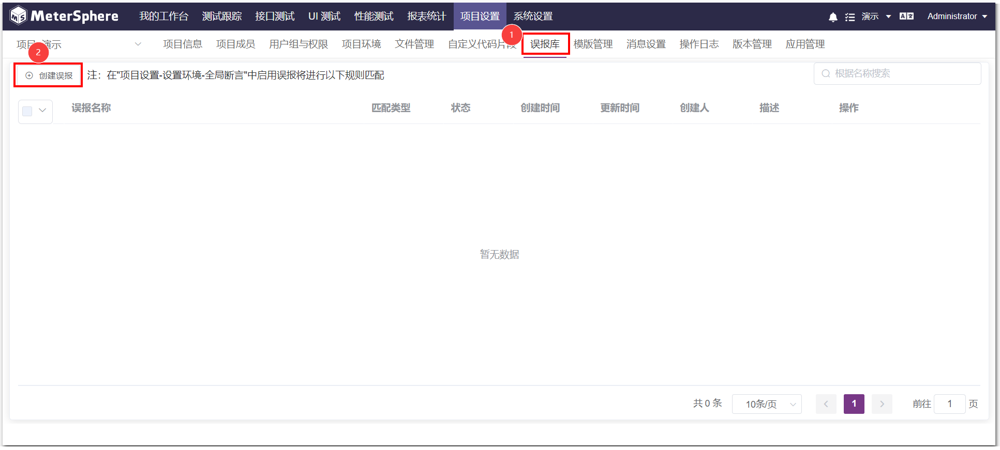
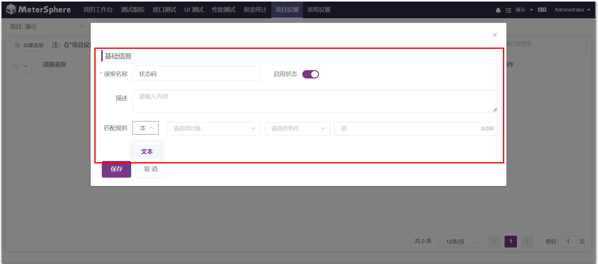
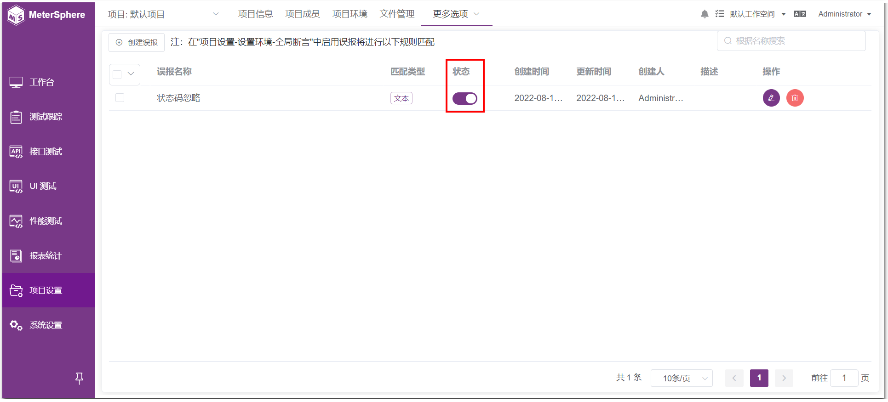

!!! ms-abstract ""
    当执行反向用例后响应状态码非 200 时，MS 会将其归为错误结果，但对用户业务而言是正确的，此时可以使用误报库的功能进行避免

## 1 误报库 (X-Pack)
!!! ms-abstract ""
    点击【项目设置】-【更多选项】-【误报库】页面，点击【创建误报】
{ width="900px" }

!!! ms-abstract ""
    在【创建误报】页面，输入相关配置后，点击【保存】即可
{ width="900px" }

!!! ms-abstract ""
    【创建误报】完成后，可【开启/关闭】该误报
{ width="900px" }

!!! ms-abstract ""
    点击【编辑】按钮，可编辑误报内容，之后点击【保存】即可
{ width="900px" }

!!! ms-abstract ""
    点击【删除】按钮，点击删除提示中的【确定】按钮，该误报就被删除了
{ width="900px" }