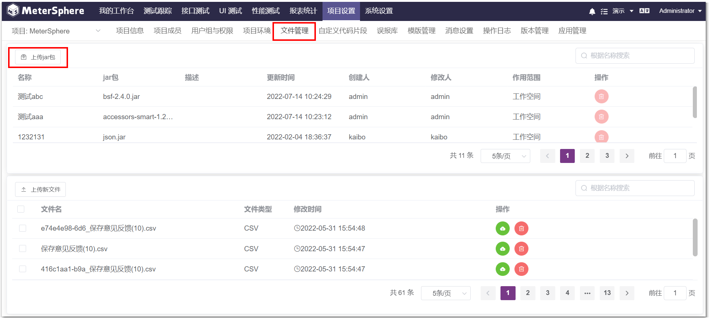
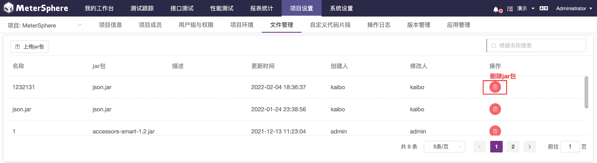
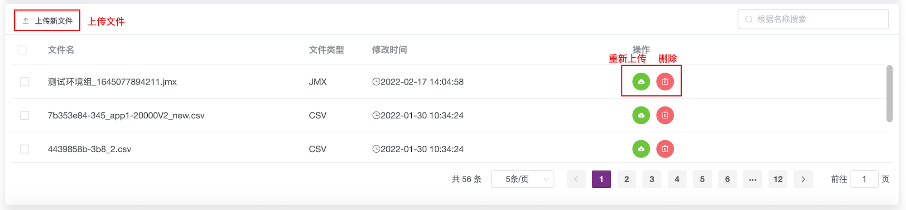

可上传测试所需的jar包、脚本、相关文件，在项目级别统一管理。

## 1 Jar包管理功能

同时可以删除、更新当前项目级别的jar包。

!!! info "说明" 
    删除或者更新jar包需要重启ms-server服务。

Jar包的管理功能，详细功能操作及说明参考 [系统->工作空间->项目管理->Jar包管理](../../system_management/workspace/#_2)。

## 2 性能测试文件管理
点击“上传新文件”，可在这里维护当前项目级别性能测试相关文件，比如性能测试脚本、性能测试依赖jar包、性能测试数据文件等。
