!!! ms-abstract ""
    点击【项目管理-文件管理】，进入文件管理页面
{ width="900px" }

## 1 模块管理
!!! ms-abstract ""
    点击【添加子模块】，添加模块节点
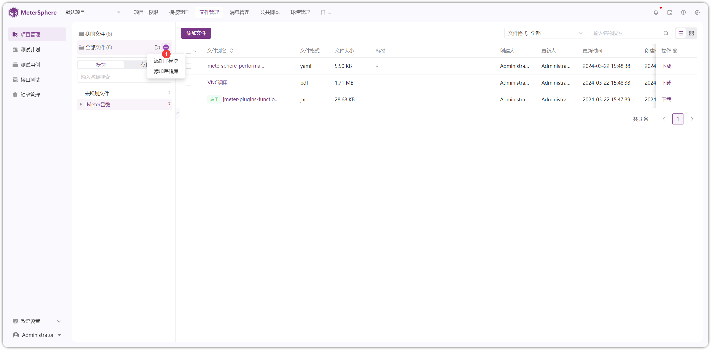{ width="900px" }

!!! ms-abstract "操作说明" 
    - 【展开/收缩】展开或收起左侧模块树全部节点
    - 【添加子模块】输入模块名称回车键进行保存
    - 【重命名】重命名节点
    - 【删除】删除操作会删除模块及其下所有资源，请谨慎操作！！！

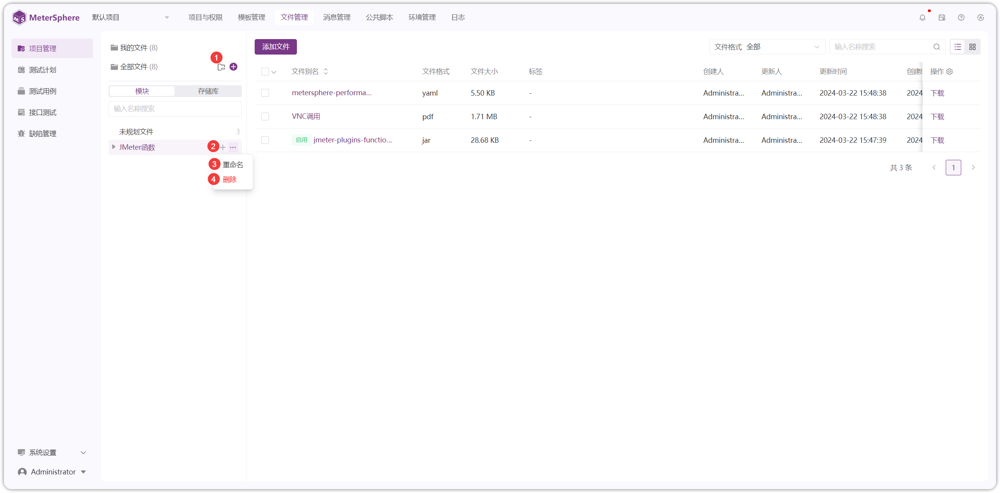{ width="900px" }

## 2.上传文件
!!! ms-abstract ""
    点击【添加文件】，选择文件类型，将文件拖拽到指定区域即可上传。以 JAR 文件上传为例
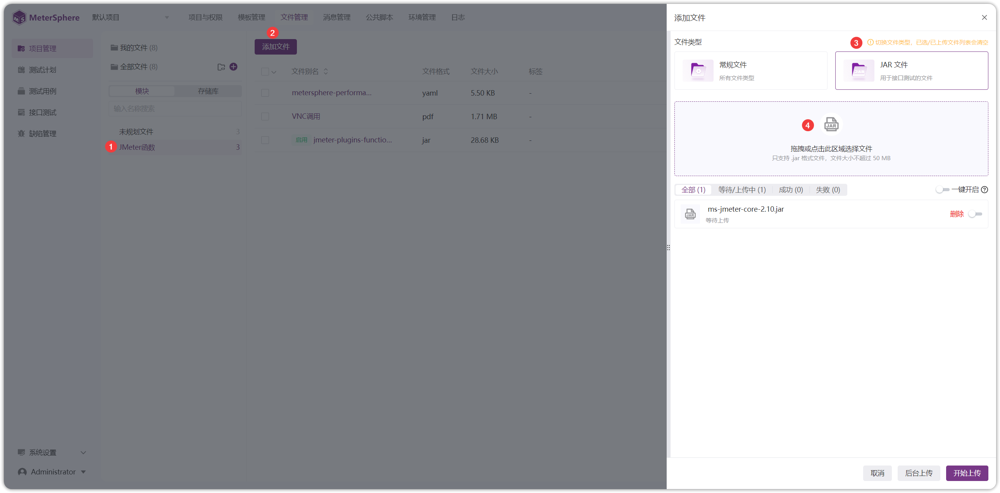{ width="900px" }

!!! ms-abstract ""
    JAR 文件上传后，默认是【禁用】状态，需要点击【启用】，否则在接口前后置脚本中引用不到 JAR 包内容
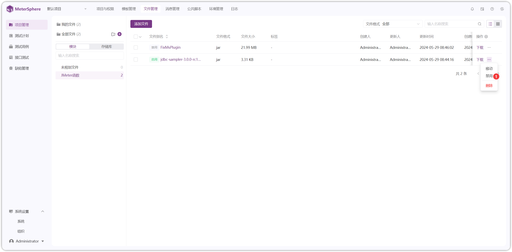{ width="900px" }

!!! ms-abstract "操作说明"
    - 【下载】下载文件到本地
    - 【删除】删除文件，会导致关联该文件的用例执行失败，请谨慎操作！！！
    - 【移动】移动文件到其他模块
    - 【开启/禁用】JAR 包需要开启，否则在接口前后置脚本中引用不到 JAR 包内容
    - 【切换显示】文件列表形式切换到图形样式

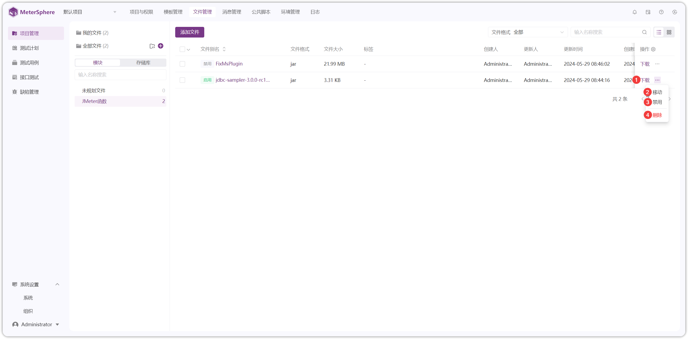{ width="900px" }

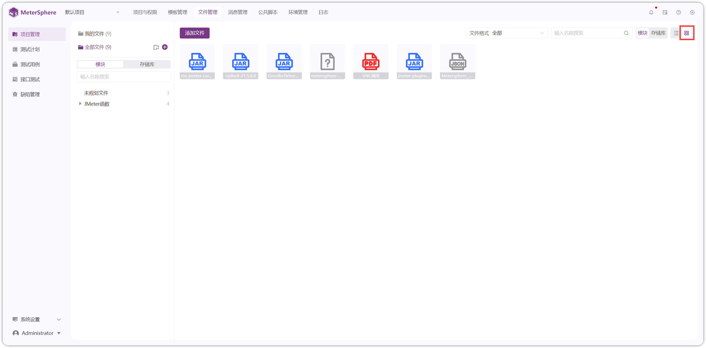{ width="900px" }

!!! ms-abstract ""
    设置列表表头、每页显示数量
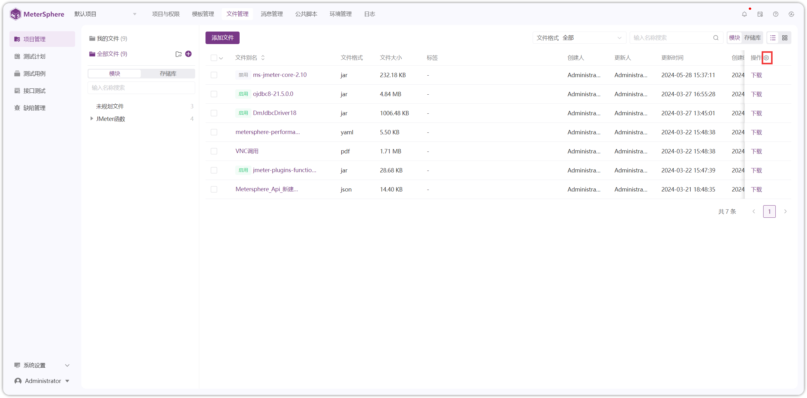{ width="900px" }
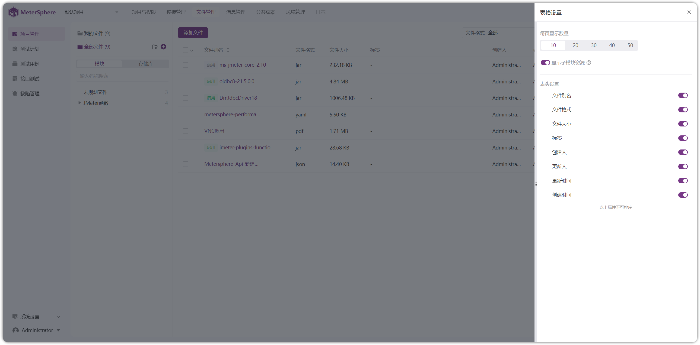{ width="900px" }

## 3 存储库
!!! ms-abstract ""
    点击【添加存储库】，对接第三方仓库，如 Gitea、GitHub、GitLab、Gitee 和其他仓库等。
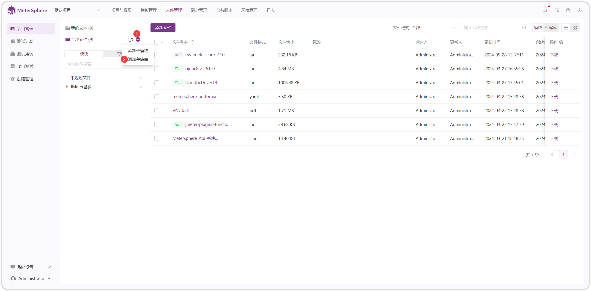{ width="900px" }

{ width="900px" }

!!! ms-abstract ""
    以 Gitea 仓库为例，【存储库地址】要以【.git】结尾，点击【测试连接】连接成功
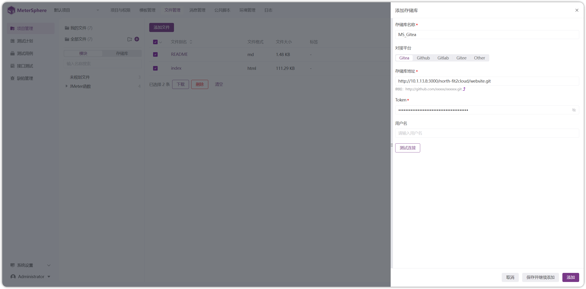{ width="900px" }

!!! ms-abstract ""
    点击【储存库-添加文件】，填写分支和文件路径
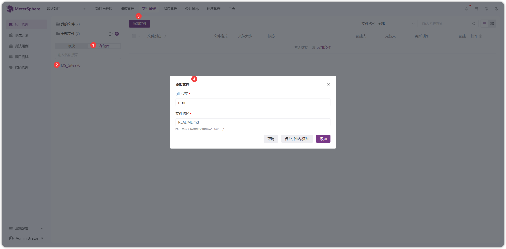{ width="900px" }

!!! ms-abstract "操作说明"
    - 【下载】下载文件到本地
    - 【删除】删除文件，会导致关联该文件的用例执行失败，请谨慎操作！！！

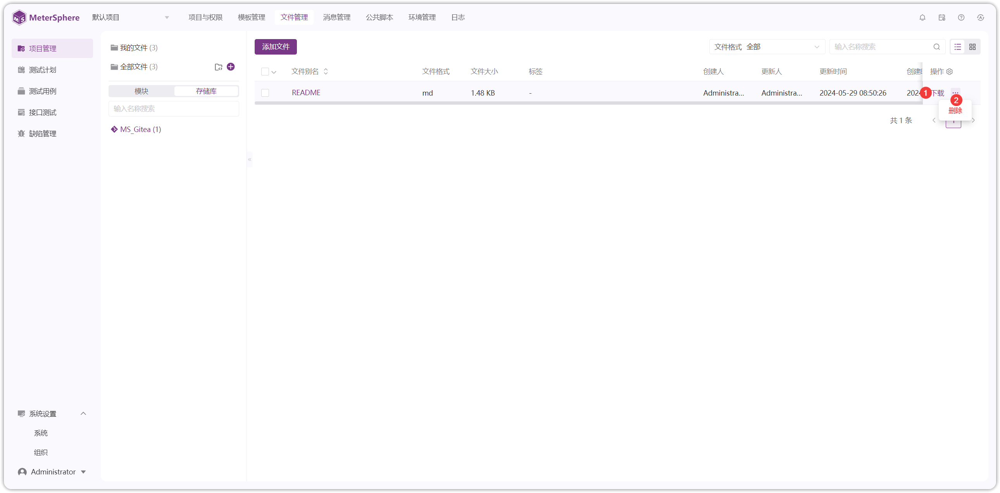{ width="900px" }