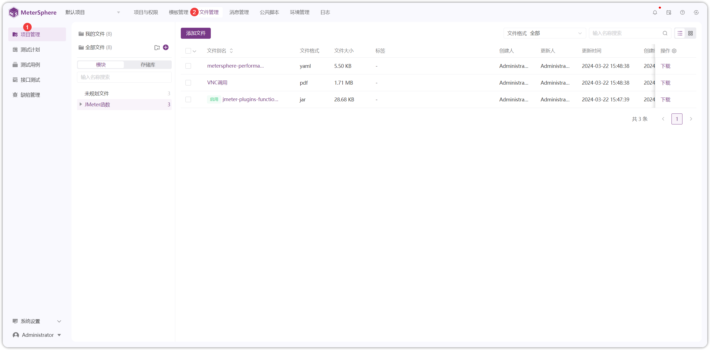

!!! ms-abstract ""
    点击【项目管理】-【文件管理】，进入文件管理页面
{ width="900px" }

## 1 模块管理
!!! ms-abstract ""
    选择【模块】，可对模块目录进行重命名、新增、删除等操作
{ width="900px" }

## 2.上传文件
!!! ms-abstract ""
    可上传 JAR、CSV、TXT、JMX、XLSX 等多种格式的文件，上传的 JAR 可在接口前后置脚本中进行使用
{ width="900px" }

!!! ms-abstract ""
    用于接口测试的要开启加载 Jar 包的 Switch 开关，否则在接口前后置脚本中引用该 Jar 包不生效
{ width="900px" }

!!! ms-abstract ""
    上传的文件可在性能测试页面进行选择
{ width="900px" }

## 3 查看文件
!!! ms-abstract ""
    点击查看按钮，可查看该文件的详细信息，也可在该页面增加文件的描述
{ width="900px" }

!!! ms-abstract ""  
    可点击上一个/下一个按钮，切换当前查看的文件
{ width="900px" }

!!! ms-abstract ""
    可对该文件出现上传，下载，删除等操作
{ width="900px" }

## 4 文件下载
!!! ms-abstract ""
    可点击列表后面下载按钮进行文件下载，也可在文件查看页面进行文件下载
{ width="900px" }

## 5 文件删除
!!! ms-abstract ""
    可点击列表后面删除按钮进行文件删除，也可在文件查看页面进行文件删除
{ width="900px" }

## 6 第三方仓库
!!! ms-abstract ""
    新建模块时，选择【存储库】，支持对接第三方仓库（如 GitHub、GitLab 和 Gitee），填写相应信息。
{ width="900px" }

!!! ms-abstract ""
    点击【上传文件】按钮，填写相关信息，点击确定按钮即可
{ width="900px" }

!!! ms-abstract ""
    点击【查看】按钮，可查看文件详细信息
{ width="900px" }

!!! ms-abstract ""
    切换到【关联用例】和【版本历史】页面，可查看具体详细信息
{ width="900px" }