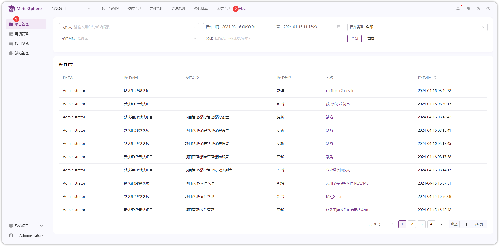
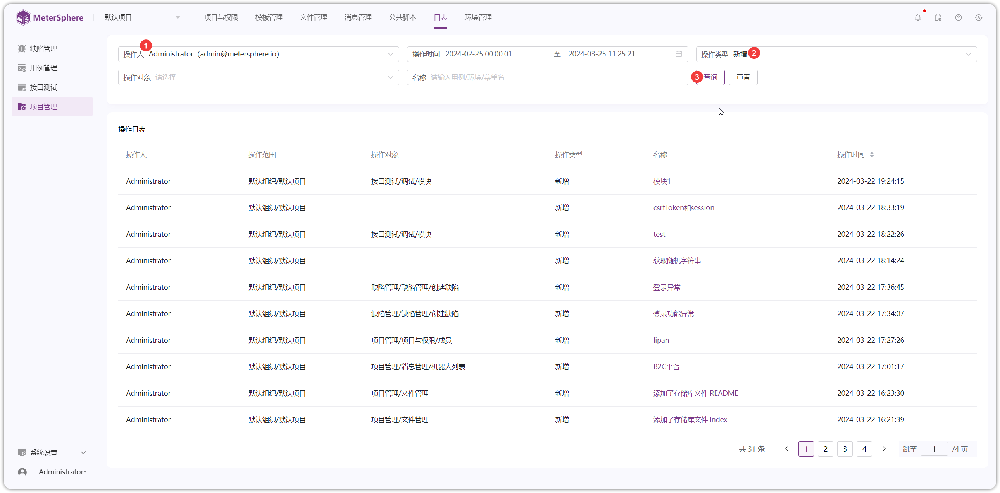
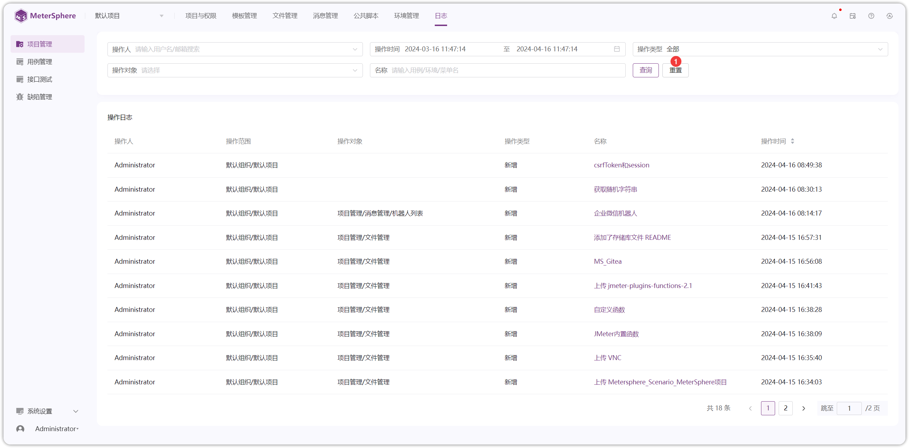

!!! ms-abstract ""
    在【系统设置-系统参数-内存清理-日志】处设置日志保留时间。
    点击【项目管理-日志】进入日志管理页面，显示登录用户当前所处的项目日志信息。
{ width="900px" }

!!! ms-abstract ""
    根据【操作人】、【操作时间】、【操作对象】、【名称】、【操作类型】筛选或组合筛选相关日志信息。以【操作人】和【操作类型】组合筛选为例。
{ width="900px" }

!!! ms-abstract ""
    筛选条件进行【重置】操作。
{ width="900px" }