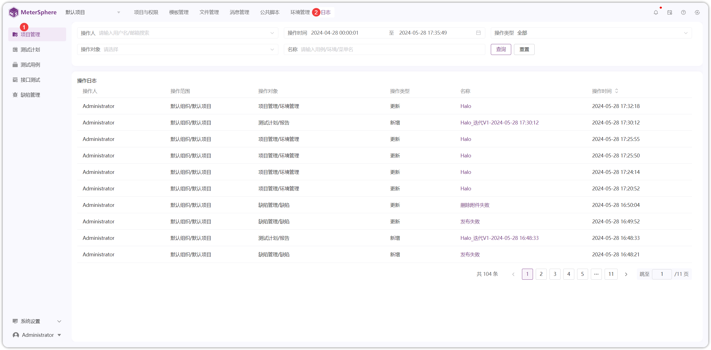
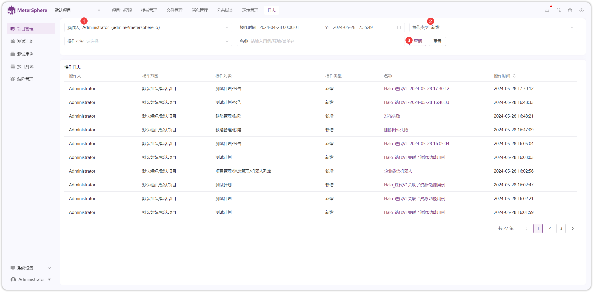
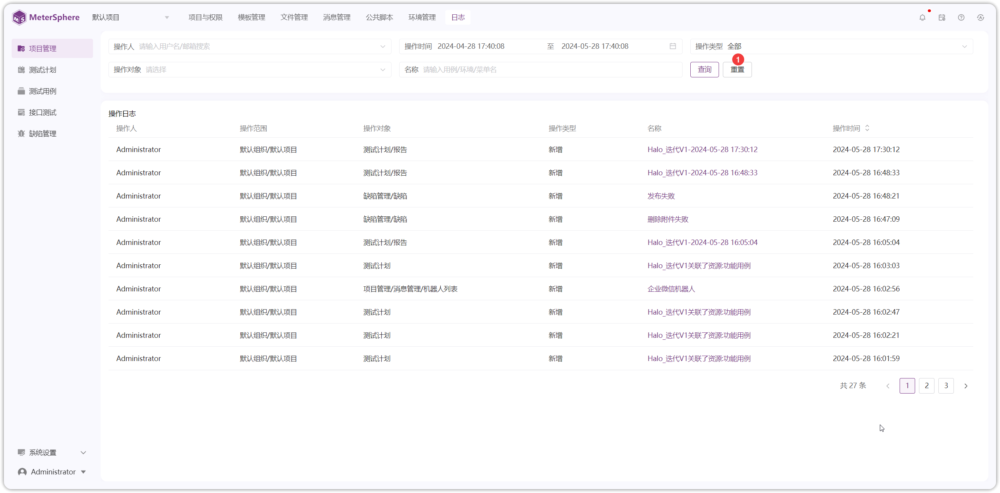

!!! ms-abstract ""
    点击【项目管理】-【日志】显示登录用户当前所处的项目日志信息
{ width="900px" }

!!! ms-abstract ""
    支持根据【操作人】【操作时间】【操作对象】【名称】【操作类型】筛选或组合进行筛选相关日志信息，以【操作人】和【操作类型】组合筛选为例。
{ width="900px" }

!!! ms-abstract ""
    支持对筛选条件进行【重置】操作
{ width="900px" }