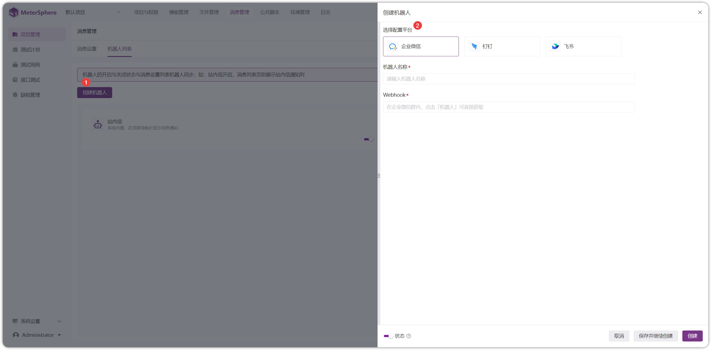
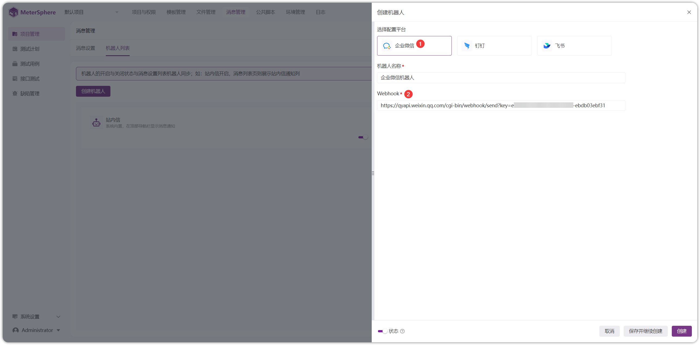

## 1 机器人列表
!!! ms-abstract ""
    点击【消息管理-机器人列表】，进入机器人列表页面。
{ width="900px" }

!!! ms-abstract ""
    【站内信】、【邮件】、【企业微信】、【钉钉】、【飞书】等多种方式发送消息通知。 
    其中【邮件】通知需要在【系统设置-邮件设置】中配置 SMTP 服务，【企业微信】、【钉钉】、【飞书】需要配置机器人。
{ width="900px" }

!!! ms-abstract ""
    以配置【企业微信】机器人为例。创建企业微信群，选择【... -添加群机器人】后，获取【webhook】地址。
{ width="900px" }

!!! ms-abstract ""
    填写【webhook】地址进行保存。
{ width="900px" }

!!! ms-abstract "操作说明"
    - 【编辑】编辑机器人名称、Webhook 地址。
    - 【删除】删除机器人后将不再推送绑定的消息事件！！！
    - 【启用/禁用】启用则会显示在消息设置列表中，禁用不会显示。

{ width="900px" }

## 2 消息设置 
!!! ms-abstract ""
    点击【消息设置】进入消息设置页面，设置【缺陷管理】、【用例管理】、【接口测试】、【定时任务】的消息通知。
{ width="900px" } 

!!! ms-abstract "说明"
    - 【缺陷管理】缺陷的创建、更新、删除、评论、执行完成均可设置消息通知。
    - 【用例管理】用例的创建、更新、删除、评论、评审通过/不通过、评论以及用例评审的创建、更新、删除、评审完成均可设置消息通知。
    - 【接口测试】API / CASE / MOCK /场景等创建、更新、删除、执行成功与失败、误报等均可设置消息通知。
    - 【定时任务】定时任务的开启、关闭均可设置消息通知。

!!! ms-abstract ""
    以【缺陷管理】中【创建】功能为例，开启企业微信并设置消息通知接收人。
{ width="900px" } 

!!! ms-abstract ""
    点击【缺陷管理-创建缺陷】，填写缺陷内容后进行创建，企业微信群接收到消息通知。

    