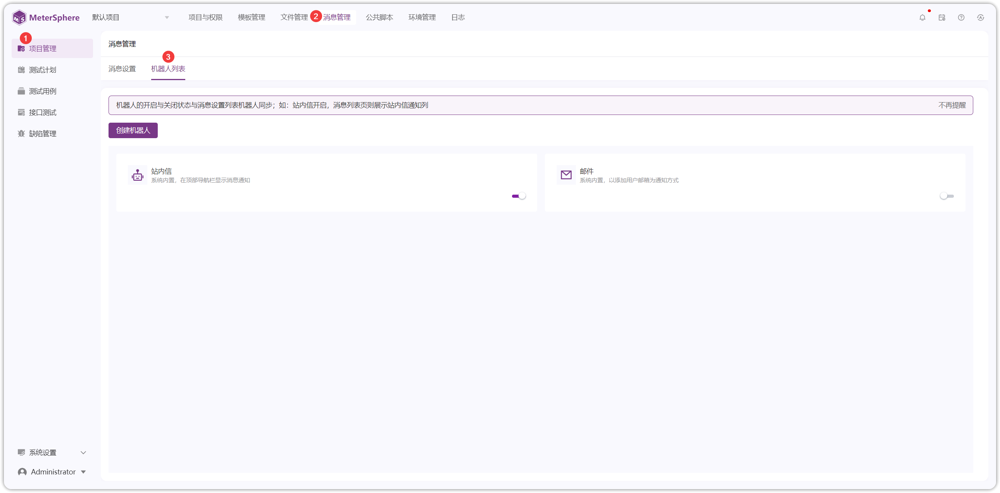
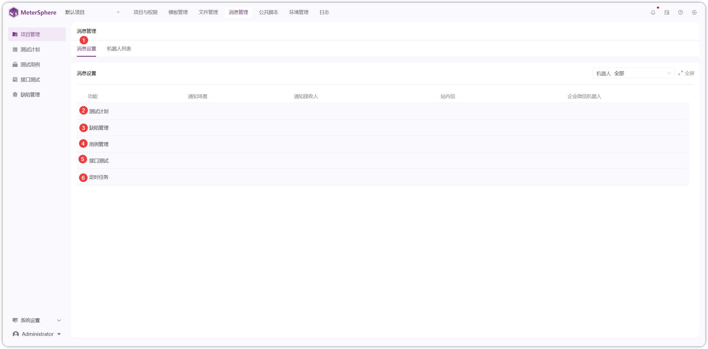

## 1 机器人列表
!!! ms-abstract ""
    点击【消息管理】-【机器人列表】，进入机器人列表页面
{ width="900px" }

!!! ms-abstract ""
    支持【站内信】【邮件】【企业微信】【钉钉】【飞书】等多种方式发送消息通知 
    其中【邮件】通知需要在【系统设置-邮件设置】中配置 SMTP 服务，【企业微信】【钉钉】【飞书】需要配置机器人
{ width="900px" }

!!! ms-abstract ""
    以【企业微信】配置机器人为例。创建企业微信群，选择【...】-【添加群机器人】后，可获取【webhook】地址
{ width="900px" }

!!! ms-abstract ""
    填写【webhook】地址进行保存
{ width="900px" }

!!! ms-abstract ""
    支持对已添加的机器人进行【编辑】【删除】【开启/关闭】操作。【开启】则会显示在消息设置列表中，手动选择通知类型。
{ width="900px" }

## 2 消息设置 
!!! ms-abstract ""
    点击【消息设置】进入消息设置页面，支持对【缺陷管理】【用例管理】【接口测试】【定时任务】设置消息通知
{ width="900px" } 

!!! ms-abstract ""
    以【缺陷管理】中【创建】功能为例，开启企业微信并设置消息通知接收人
{ width="900px" } 

!!! ms-abstract ""
    点击【缺陷管理】-【创建缺陷】，填写缺陷内容后进行创建，企业微信群可接收到消息通知

    