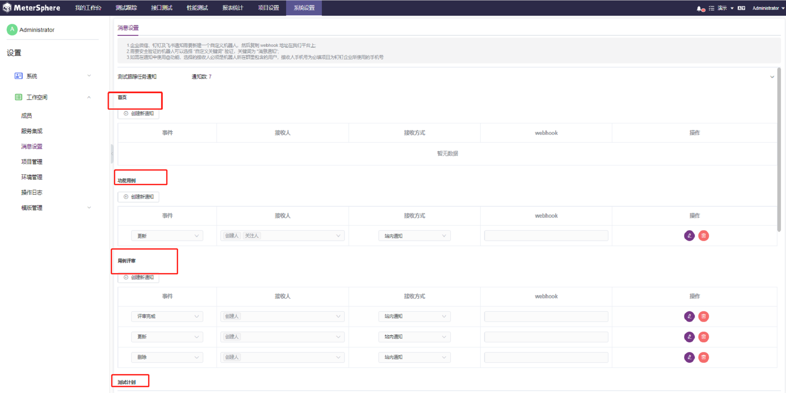
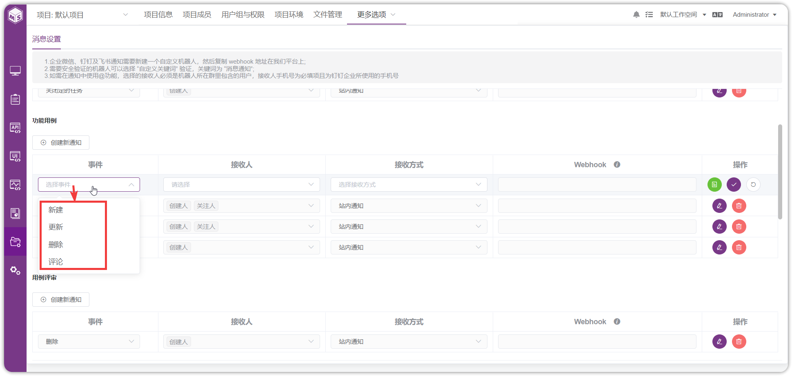
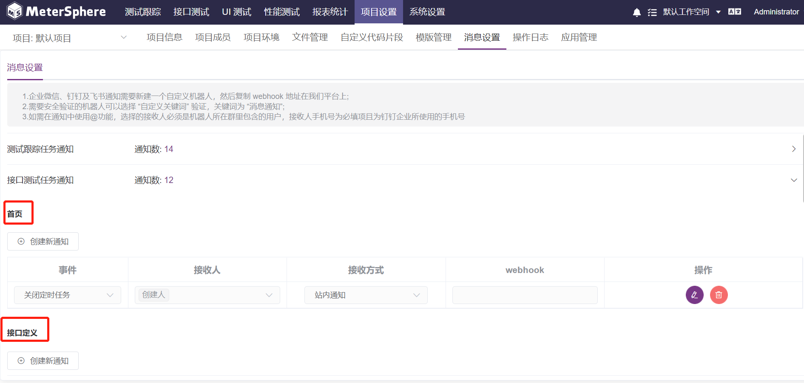
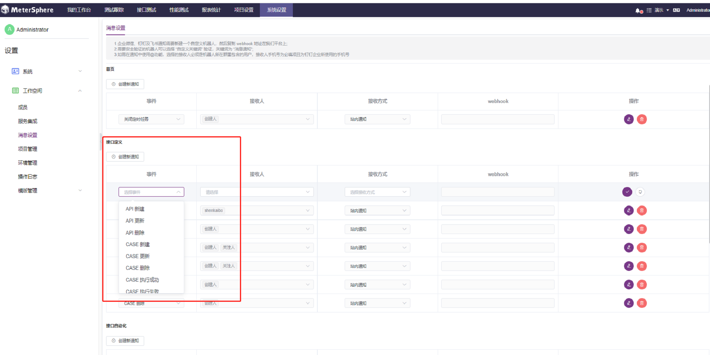
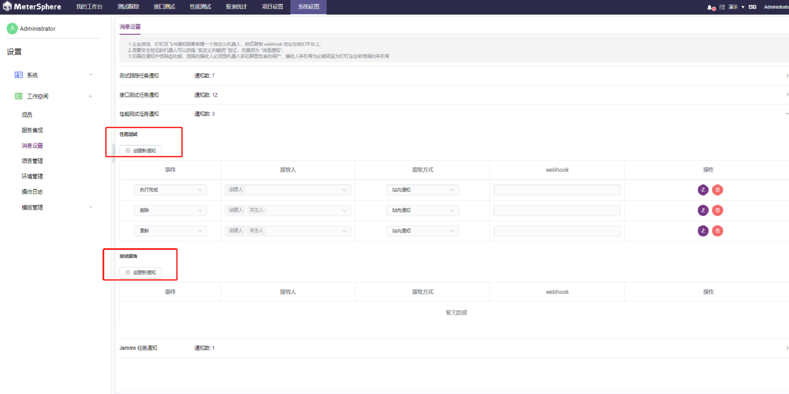
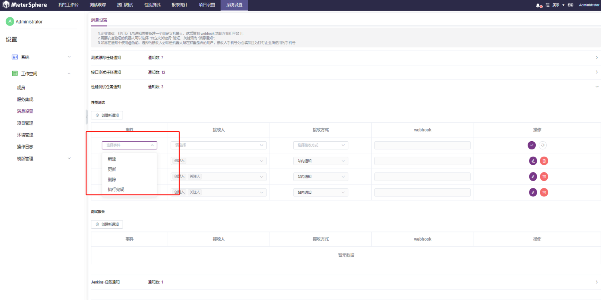
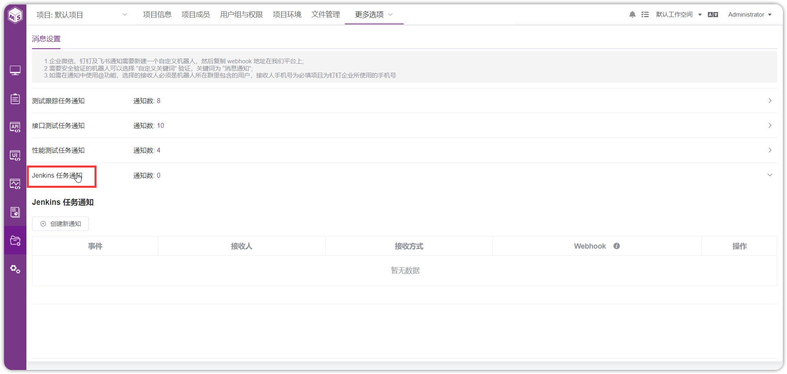
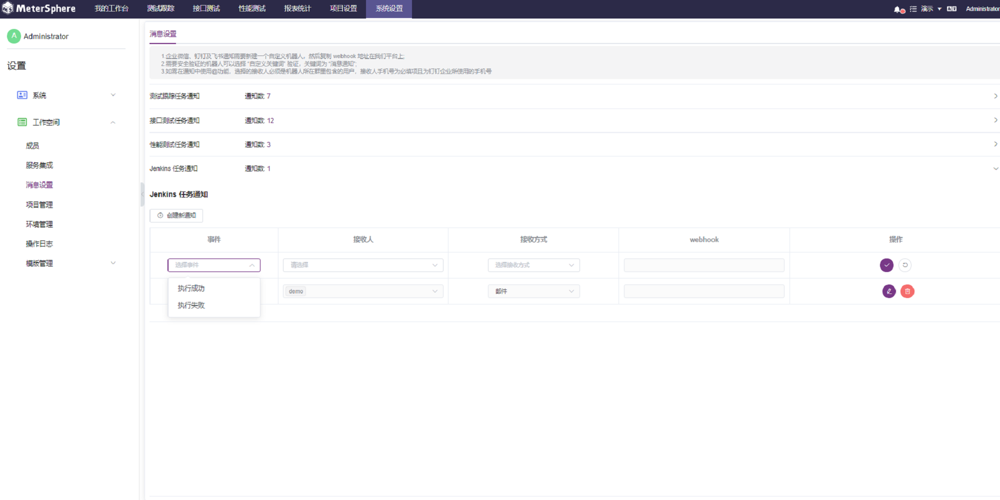

### 消息设置

针对系统的每个功能都支持用户根据需要进行`项目级别`的任务通知设置。点击`项目管理`，点击`消息设置`即可进入消息设置页面。

并且系统支持接收人员按角色或指定具体人员；同时支持站内通知和站外通知多种通知方式等功能。

- 测试跟踪任务通知 

测试跟踪的每个页面：首页、测试用例、用例评审、测试计划、测试报告、缺陷管理等页面都支持自定义任务通知。

同时测试跟踪页面上的每个关键操作，都可以支持用户自定义任务通知。比如测试计划的新建、更新、删除、执行完成等，都可以设置相应的任务通知。

 

- 接口测试任务通知

接口测试的每个页面：首页、接口定义、接口自动化、测试报告等页面都支持自定义任务通知。

 

同时接口测试页面上的每个关键操作，都可以支持用户自定义任务通知。比如接口定义中 API 相关的增删改、CASE 相关的增删改等操作，都可以设置相应的任务通知。

 

- 性能测试任务通知

性能测试的每个页面：测试、测试报告等页面都支持自定义任务通知。

 

同时性能测试页面上的每个关键操作，都可以支持用户自定义任务通知。比如测试的新建、更新、删除、执行完成等操作，都可以设置相应的任务通知。

 

- Jenkins任务通知

自动化通过 Jenkins 持续部署来启动 MeterSphere 自动化脚本时，可以在这里设置此类型的任务通知。

 

Jenkins 任务通知自动化通过 Jenkins 持续部署来启动 MeterSphere 自动化脚本时，可以在这里设置此类型的任务通知。

 