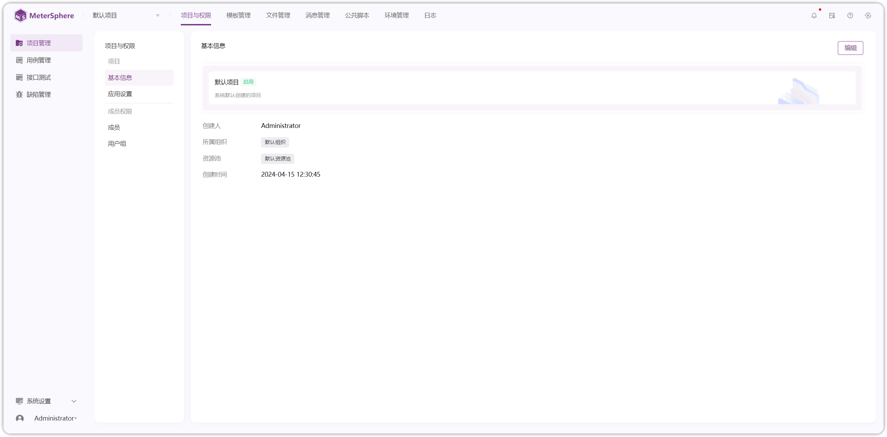

## 概述
!!! ms-abstract ""
    Meterphere 项目管理模块提供以下主要功能： 

    - **项目与权限**：当前项目的【基本信息】【应用设置】【成员】【权限】等功能进行操作。
    - **模板管理**：自定义【用例模板】【缺陷模板】的字段
    - **文件管理**：支持上传测试所需的 JAR 包、脚本、CSV 文件等相关文件，也支持 Gitea、Github、Gitlab、Gitee 等远程仓库拉取文件
    - **消息管理**：支持配置通过机器人、站内信、邮件等方式对缺陷、用例、测试情况、定时任务等情况进行消息通知
    - **公共脚本**：支持添加自定义脚本，在测试过程中引用
    - **日志**：记录用户操作项目操作范围、操作对象、操作类型、操作时间等日志信息
    - **环境管理**：维护当前项目的所有环境信息，环境组信息。

{ width="900px" }
