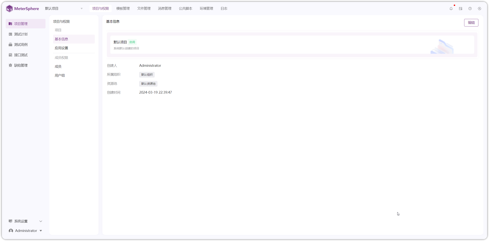

!!! ms-abstract ""
    项目管理模块提供以下主要功能： 

    - **项目与权限**：对当前项目的基本信息、应用设置、成员、权限功能进行操作。
    - **模板管理**：自定义项目的用例字段和模板，缺陷字段、模板及工作流。
    - **文件管理**：管理测试所需的 JAR 包、脚本、CSV 文件等相关文件，可以拉取 Gitea、Github、Gitlab、Gitee 等远程仓库文件。
    - **消息管理**：通过配置机器人、站内信、邮件等方式，对缺陷、用例、测试情况、定时任务等进行消息通知。
    - **公共脚本**：添加自定义脚本，在测试过程中引用。
    - **日志**：记录该项目所有用户的操作日志，包括操作范围、操作对象、操作类型、操作时间等。
    - **环境管理**：维护当前项目的所有环境信息，环境组信息。

{ width="900px" }
