## 1 基本信息
!!! ms-abstract ""
    点击【项目管理-项目与权限-基本信息】，查看项目的基本信息。
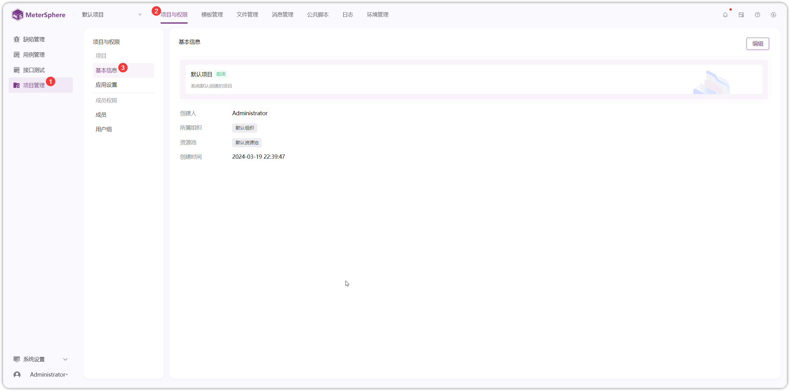{ width="900px" }

!!! ms-abstract ""
    在【基本信息】页面，点击【编辑】，可更新项目名称和描述内容。
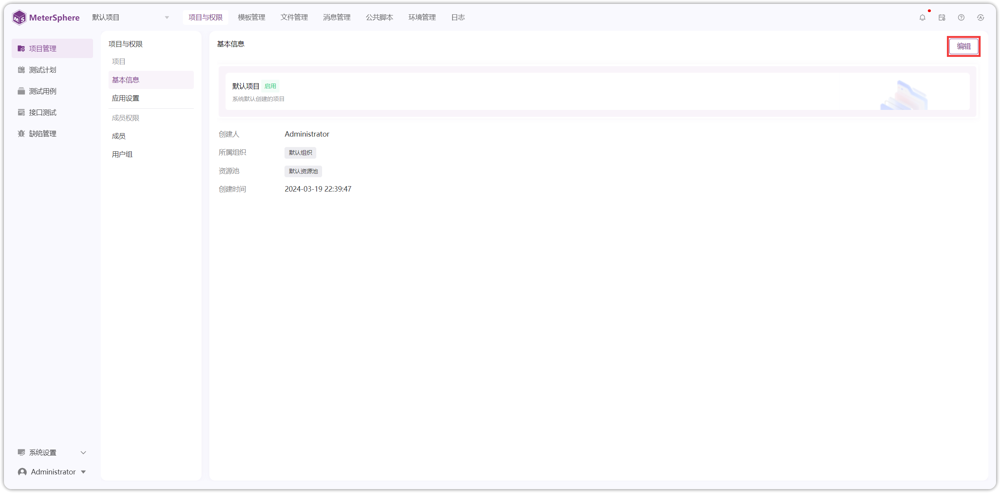{ width="900px" }

## 2 应用设置
!!! ms-abstract ""
    点击【应用设置】，进入应用设置页面。
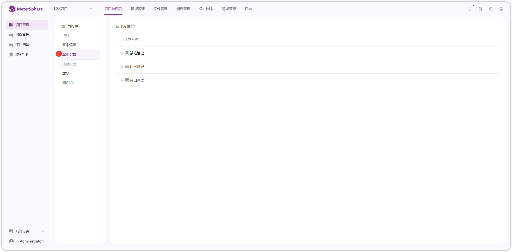{ width="900px" }

### 2.1 测试计划
!!! ms-abstract ""    
    点击【测试计划】，以小时、天、月、年为单位，配置报告保留时间和报告链接有效期。
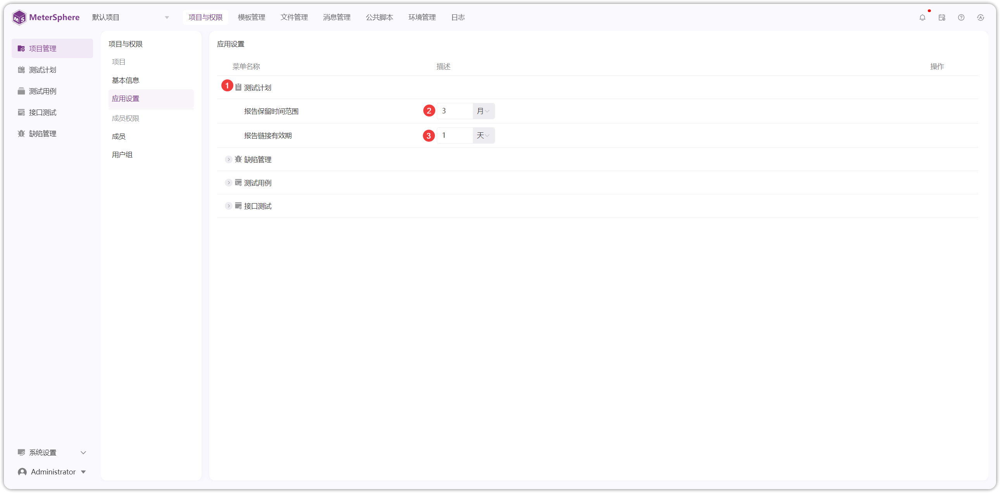{ width="900px" }

### 2.2 缺陷管理
!!! ms-abstract ""
    需要先在【系统设置-组织-服务集成】处配置 JIRA、禅道、TAPD 等第三方平台。详情参考：[服务集成](../system_management/organization.md#4) 
    点击【项目管理-项目与权限-应用设置-缺陷管理-同步缺陷】，配置同步缺陷信息，以 JIRA 为例。
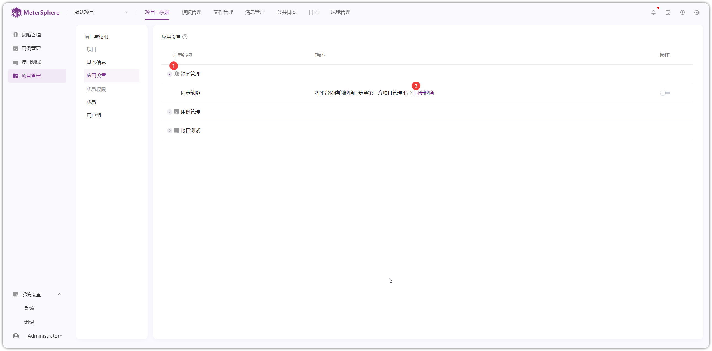{ width="900px" }

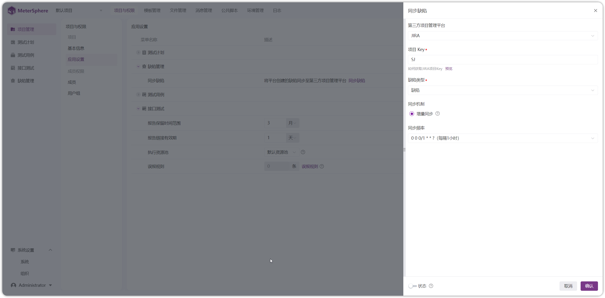{ width="900px" }

!!! ms-abstract "字段说明"
    - **第三方项目管理平台**：下拉选项显示【系统设置-组织-服务集成】处测试连接通过的平台。  
    - **项目 Key**：第三方平台项目 Key 。 
    - **缺陷类型**：拉取第三方平台的缺陷类型。  
    - **同步机制**：
        - 增量同步：仅对 MeterSphere 中存在的三方缺陷做内容变更。  
        - 全量同步：将第三方平台的缺陷全量同步到 MeterSphere。
    - **同步频率**：下拉选择同步间隔周期。  
    - **状态**：开启/关闭，平台创建的缺陷同步或不同步至第三方项目管理平台。

### 2.3 测试用例
!!! ms-abstract ""
    点击【项目管理-项目与权限-应用设置-测试用例】，可开启/关闭【重新评审】、【关联需求】功能。
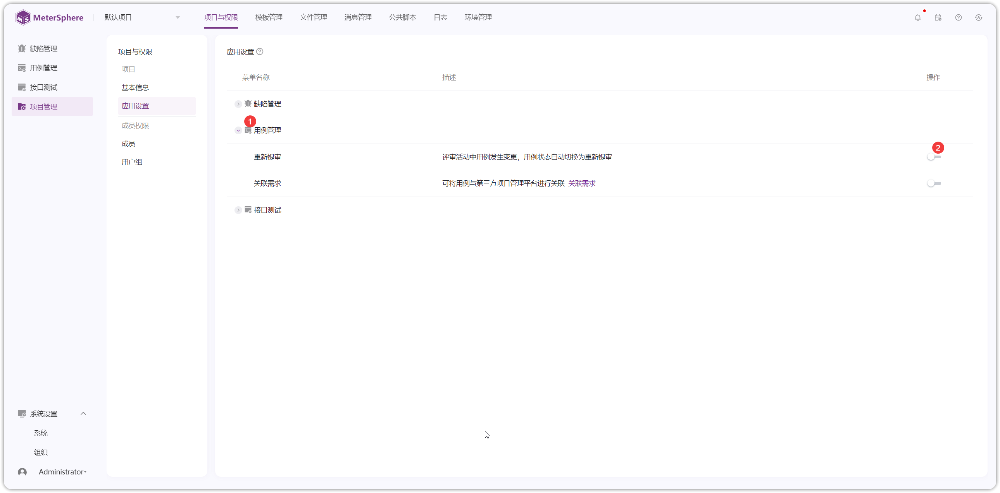{ width="900px" }

!!! ms-abstract "说明"
    - 【重新评审】评审活动中用例发生变更，用例状态自动切换为重新提审。
    - 【关联需求】将用例与第三方项目管理平台（如 JIRA、TAPD、禅道）的需求信息进行关联，详情参考：[服务集成](../system_management/organization.md#4)

!!! ms-abstract ""
    点击【关联需求】，配置关联需求信息，以 JIRA 为例。
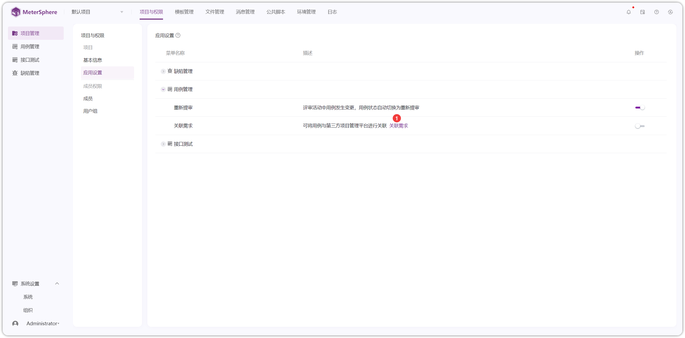{ width="900px" }

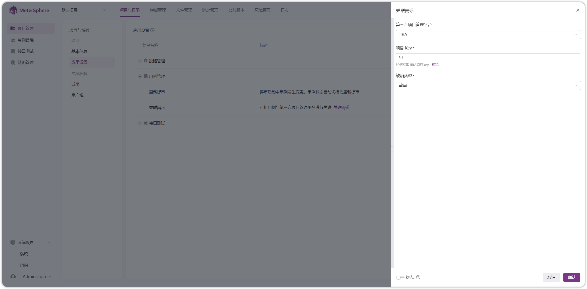{ width="900px" }

### 2.4 接口测试
!!! ms-abstract ""
    点击【接口测试】，设置测试报告保留的时间范围、报告链接有效期、接口执行的资源池、误报规则等内容。
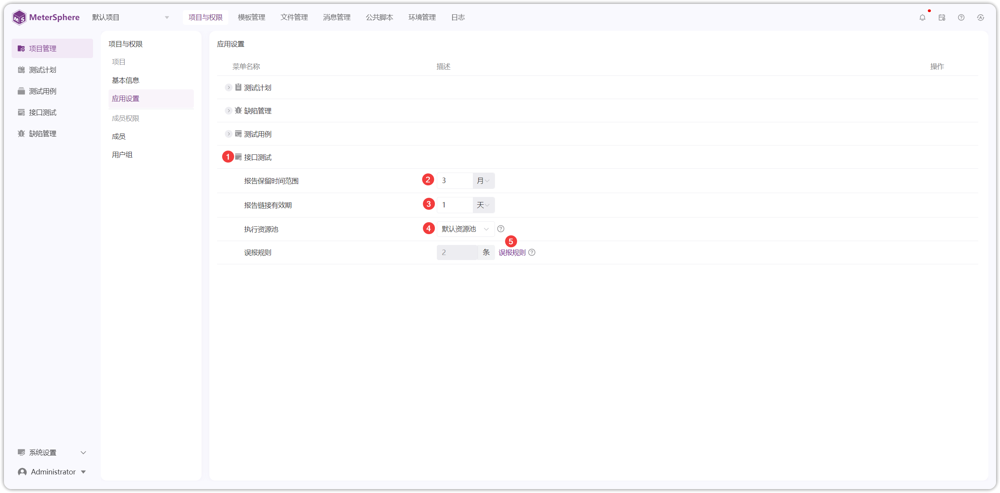{ width="900px" }

!!! ms-abstract "注意"
    开源版只有一个默认资源池，企业版可以添加多个资源池
    
!!! ms-abstract ""
    先在【系统-资源池】处新增资源池，再【系统-组织与项目-项目】的编辑页面，添加资源池，此处【执行资源池】下拉选择资源池。
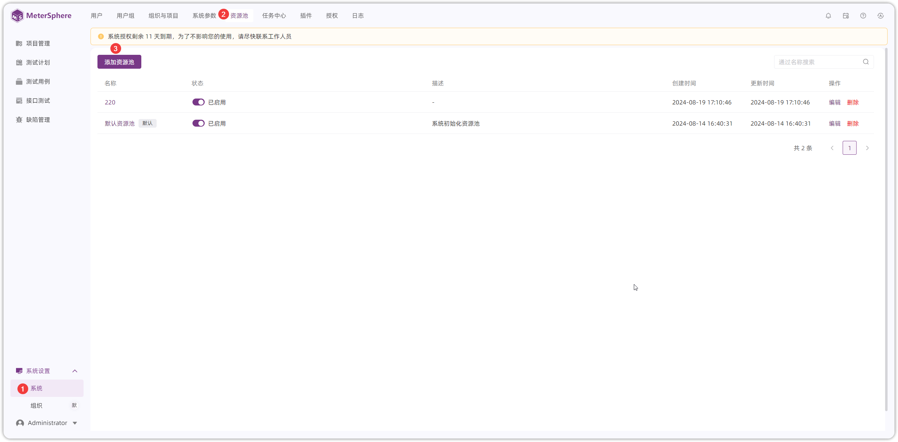{ width="900px" }

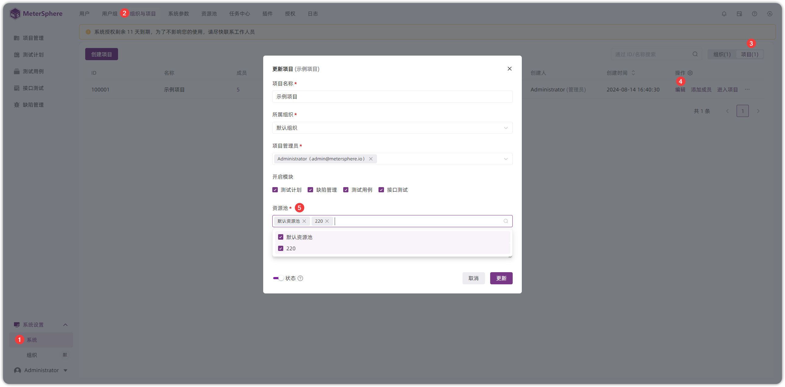{ width="900px" }

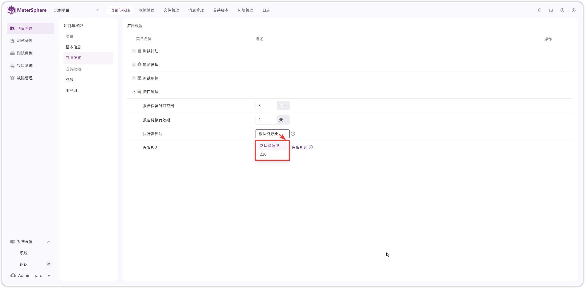{ width="900px" }

!!! ms-abstract ""
    点击【误报规则】，进入新增规则页面。
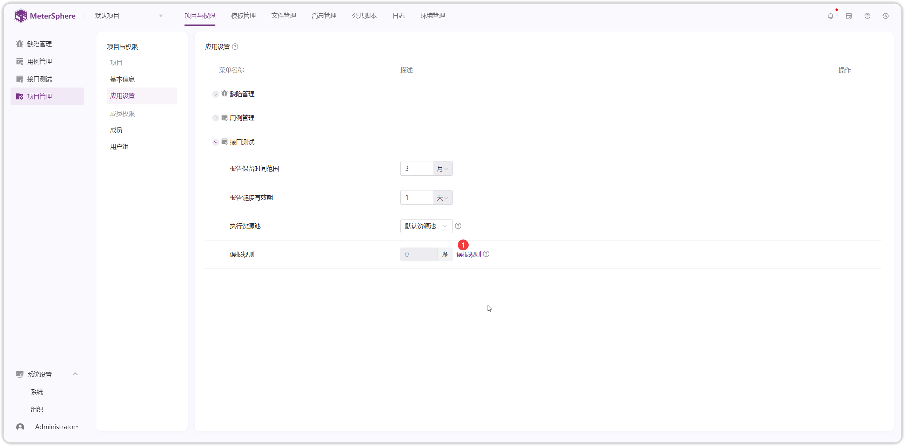{ width="900px" }

!!! ms-abstract ""
    点击【新增误报规则】，配置相应的误报规则。
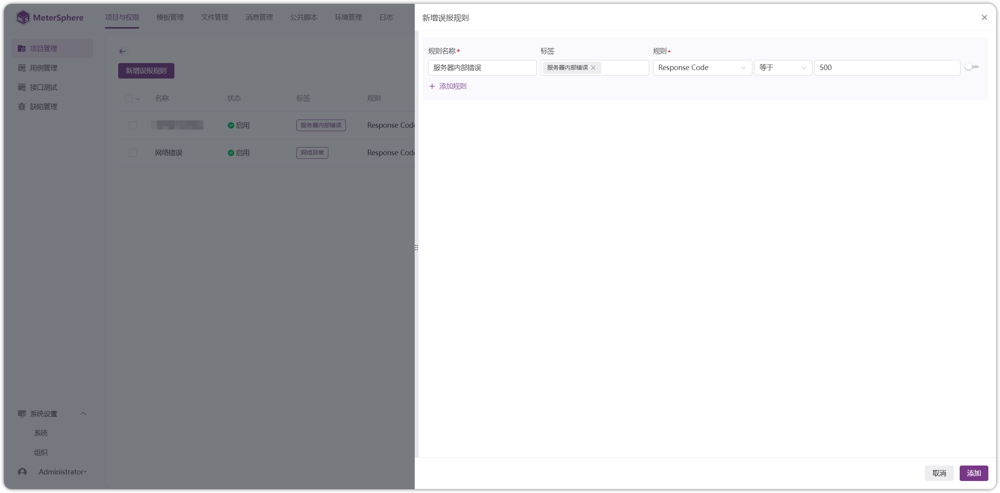{ width="900px" }

!!! ms-abstract "操作说明"
    - 【编辑】编辑误报名称、标签、规则等内容。
    - 【启用/禁用】设置启用状态时，接口返回结果匹配误报规则后，将接口执行结果标记为误报。
    - 【删除】删除所选误报规则，仅对新执行的测试报告生效，请谨慎操作！！！
    - 【清空】取消勾选。

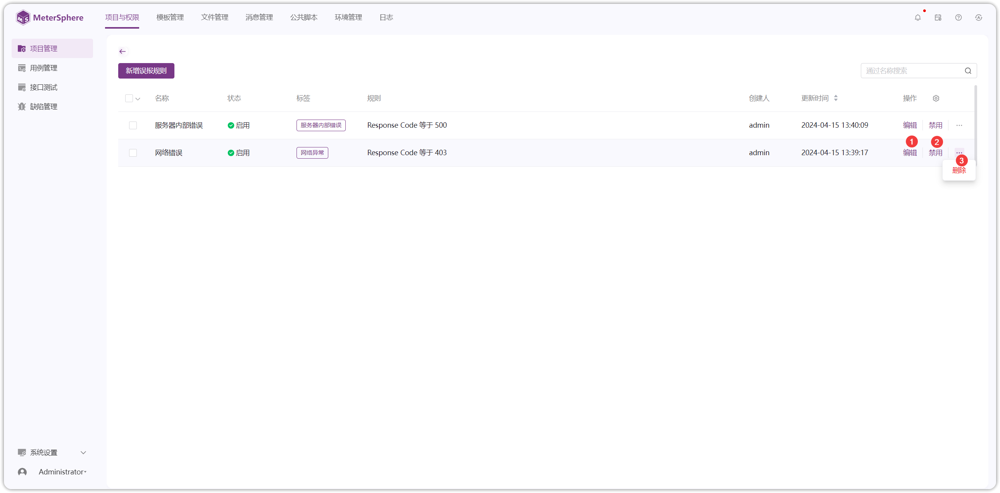{ width="900px" }

## 3 成员
!!! ms-abstract ""
    点击【成员-添加成员】打开添加成员弹窗，选择成员和对应用户组，点击【保存】即可。
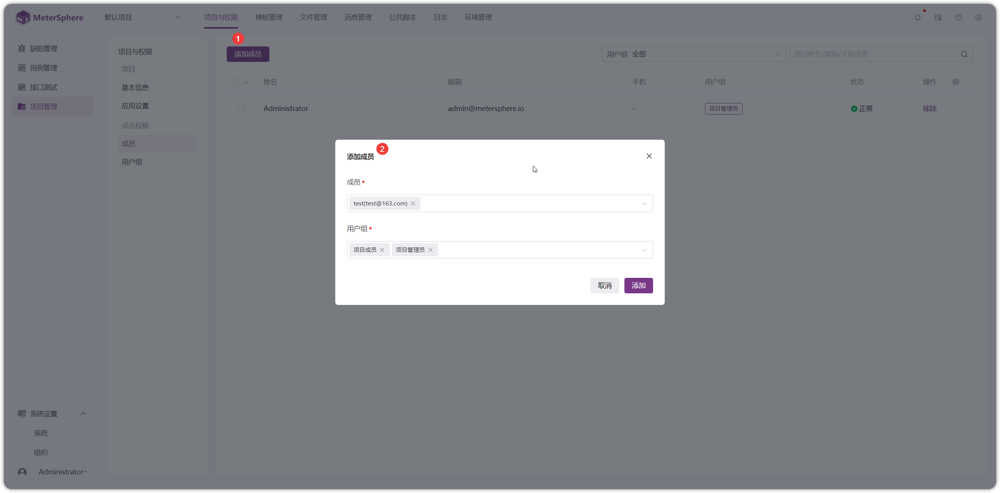{ width="900px" }

!!! ms-abstract ""
    如下图，即可给用户添加用户组。
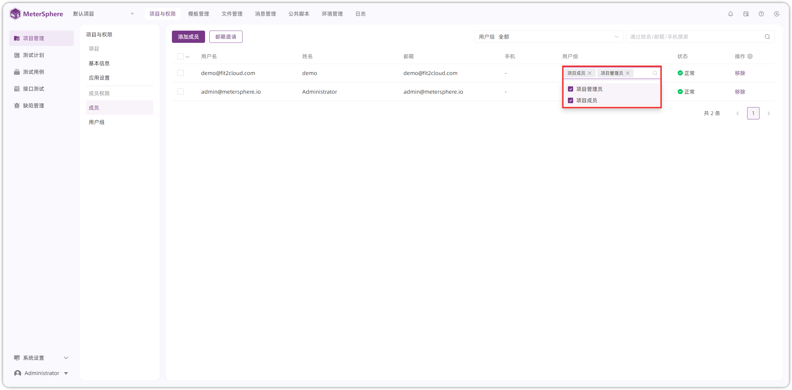{ width="900px" }

!!! ms-abstract ""
    点击【设置】进入表格设置页面，可对列表模式、每页显示数量、表头等内容进行设置。
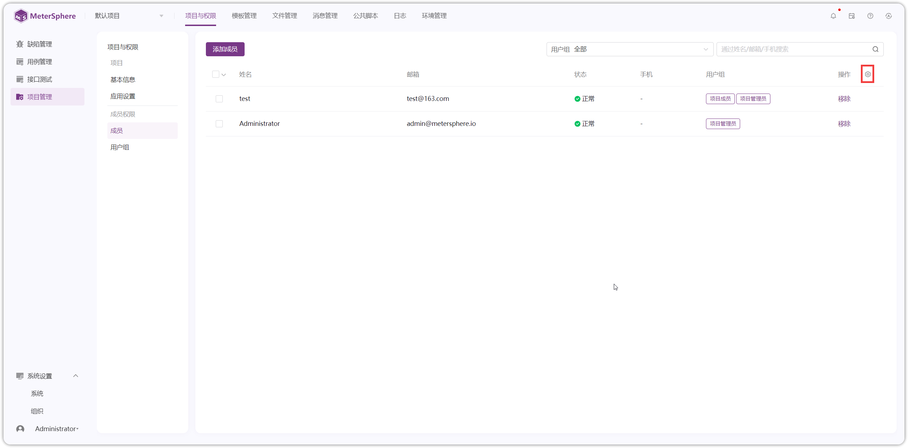{ width="900px" }

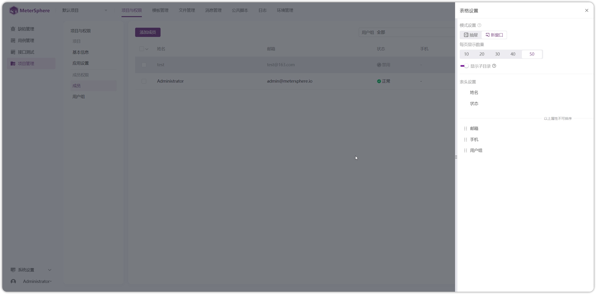{ width="900px" }

!!! ms-abstract ""
    成员【启用/禁用】状态可在【系统设置-系统-用户】进行设置。
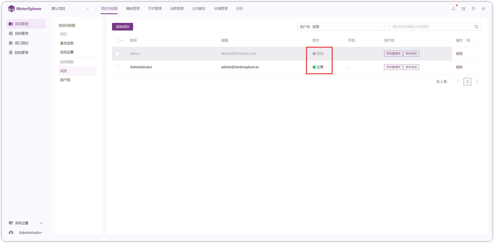{ width="900px" }

!!! ms-abstract ""
    将多个项目成员批量添加到用户组、从项目移除。
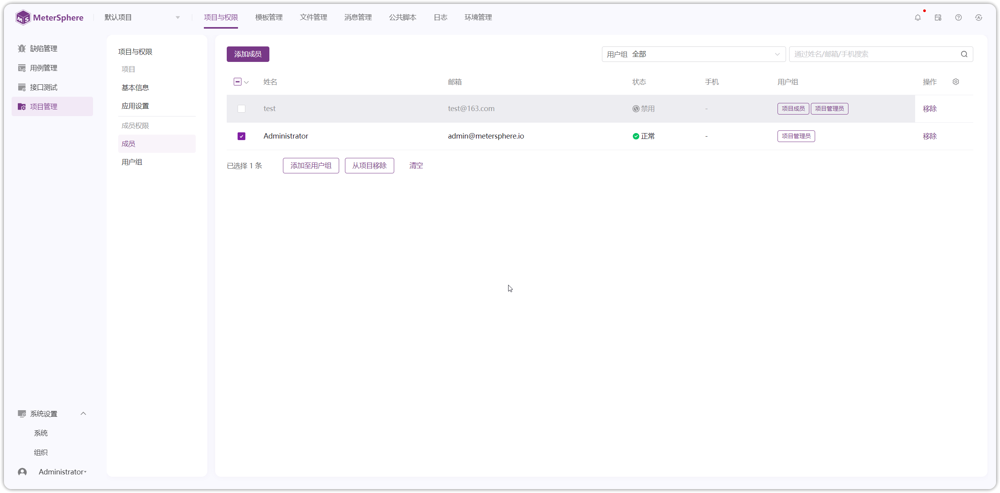{ width="900px" }

## 4 用户组
!!! ms-abstract ""
    点击【用户组】，进入用户组操作页面。
{ width="900px" }

!!! ms-abstract ""
    点击【添加用户组】，输入用户组名称。
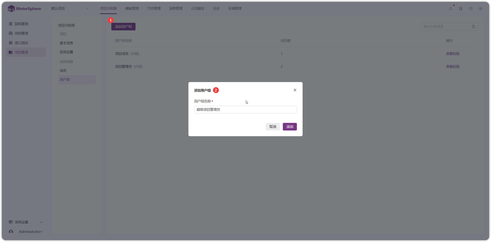{ width="900px" }

!!! ms-abstract "操作说明"
    - 【查看权限】可对用户组进行赋权操作。
    - 【删除】仅能删除自定义的用户组，删除用户组后，项目下用户组数据将一起删除，请谨慎操作！！！

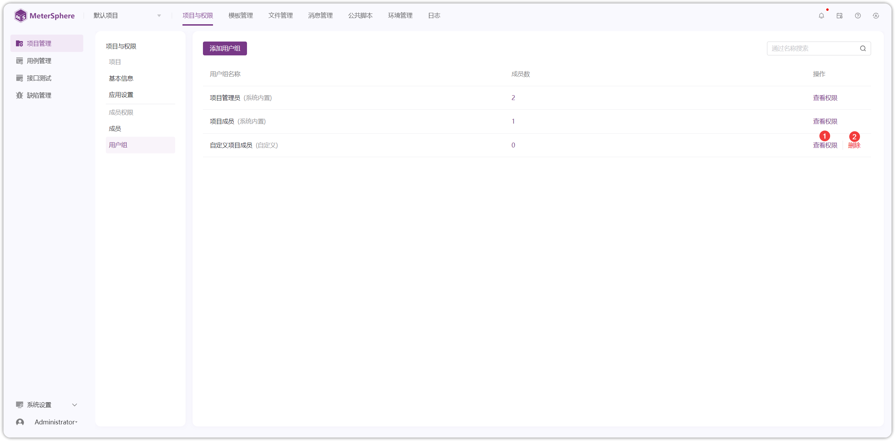{ width="900px" }

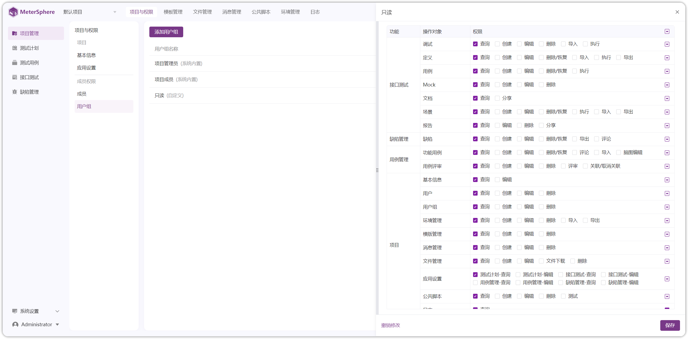{ width="900px" }
