## 1 基本信息
!!! ms-abstract ""
    点击【项目管理】-【项目与权限】-【基本信息】，查看项目的基本信息
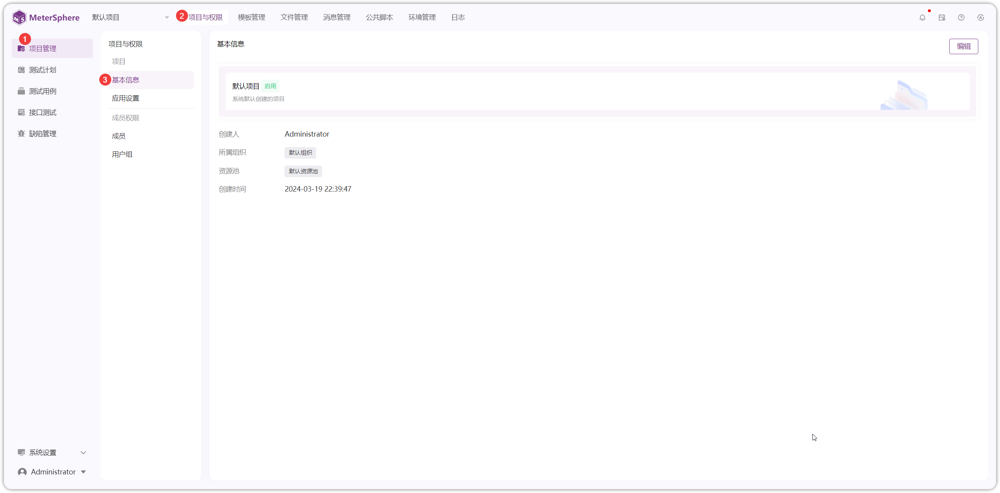{ width="900px" }

!!! ms-abstract ""
    在【基本信息】页面，点击【编辑】，编辑项目名称和描述内容
{ width="900px" }

## 2 应用设置
!!! ms-abstract ""
    点击【应用设置】，进入应用设置页面
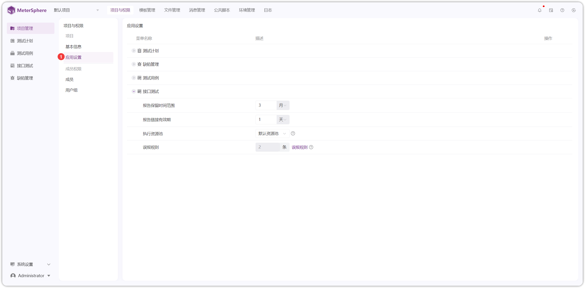{ width="900px" }

### 2.1 缺陷管理
!!! ms-abstract ""
    需要先在【系统设置】-【组织】-【服务集成】处配置 JIRA、禅道、TAPD 等第三方平台  
    点击【缺陷管理】-【同步缺陷】，配置同步缺陷信息，以 JIRA 为例
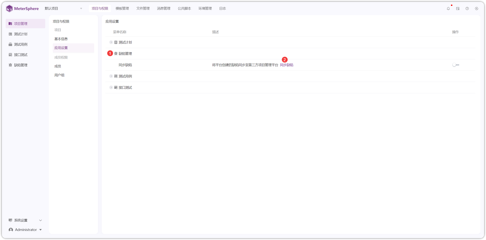{ width="900px" }

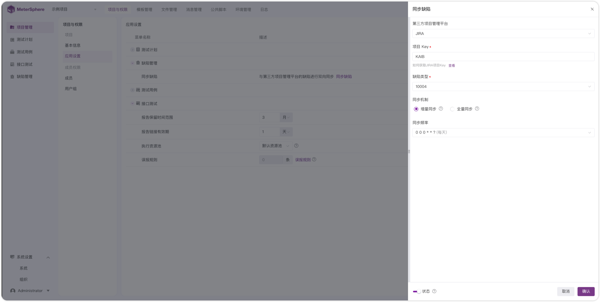{ width="900px" }

!!! ms-abstract "字段说明"
    - **第三方项目管理平台**：下拉选项显示【系统设置】-【组织】-【服务集成】处测试连接通过的平台  
    - **项目 Key**：第三方平台项目 Key  
    - **缺陷类型**：拉取第三方平台的缺陷类型  
    - **同步机制**：增量同步，仅同步在 MeterSphere 创建的缺陷内容变更  
    - **同步频率**：设置自动同步的时间点  
    - **状态**：开启/关闭，平台创建的缺陷同步或不同步至第三方项目管理平台

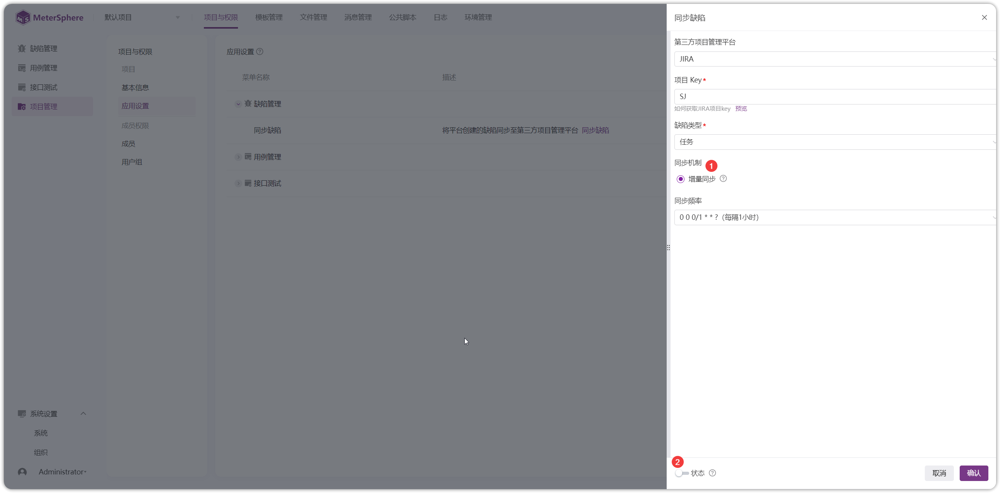{ width="900px" }

### 2.2 用例管理
!!! ms-abstract ""
    点击【用例管理】，可开启/关闭【重新评审】、【关联需求】功能
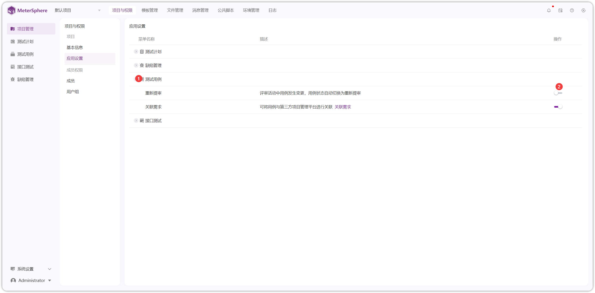{ width="900px" }

!!! ms-abstract "说明"
    - 【重新评审】评审活动中用例发生变更，用例状态自动切换为重新提审
    - 【关联需求】将用例与第三方项目管理平台（如 JIRA、TAPD、禅道）的需求信息进行关联

!!! ms-abstract ""
    点击【关联需求】，配置关联需求信息，以 JIRA 为例   
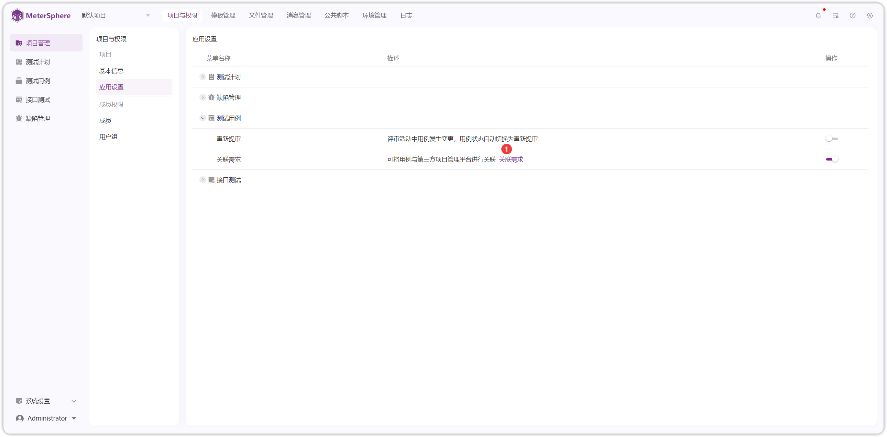{ width="900px" }

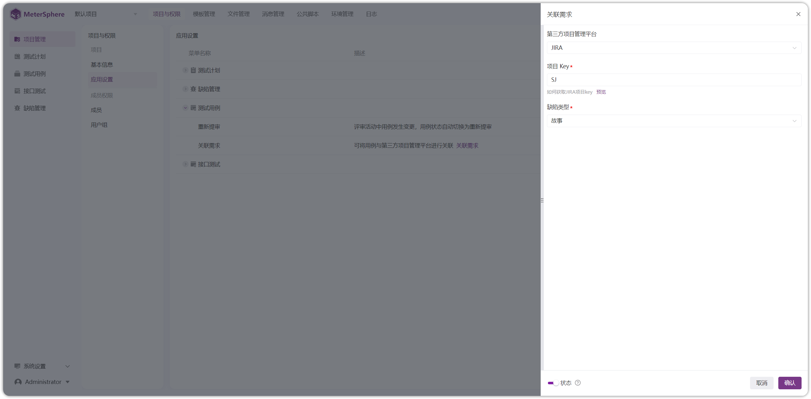{ width="900px" }

### 2.3 接口测试
!!! ms-abstract ""
    点击【接口测试】，设置测试报告保留的时间范围、报告链接有效期、接口执行的资源池、误报规则等内容
{ width="900px" }

!!! ms-abstract ""
    点击【误报规则】，进入新增规则页面
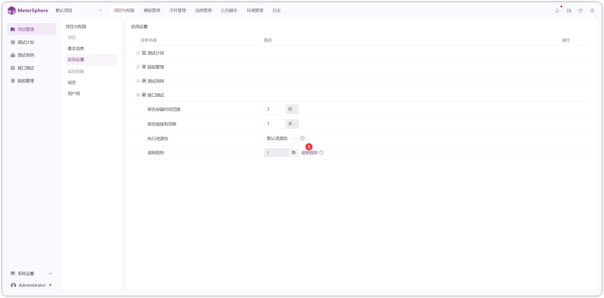{ width="900px" }

!!! ms-abstract ""
    点击【新增误报规则】，配置相应的误报规则
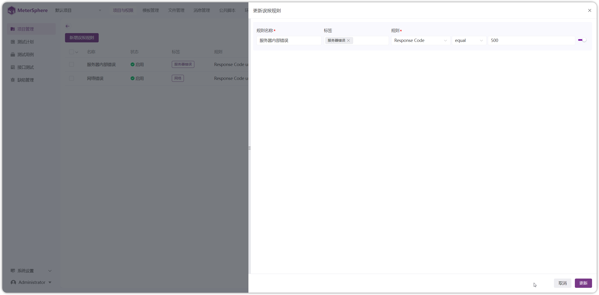{ width="900px" }

!!! ms-abstract "操作说明"
    - 【编辑】编辑误报名称、标签、规则等内容
    - 【启用/禁用】设置启用状态时，接口返回结果匹配上误报规则后，将接口执行结果标记为误报。
    - 【删除】误报删除，仅对新执行的测试报告生效，请谨慎操作！！！

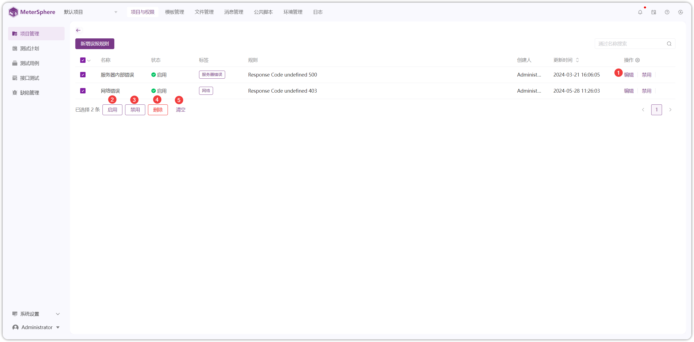{ width="900px" }

## 3 成员
!!! ms-abstract ""
    点击【成员】，进入成员操作页面
{ width="900px" }

!!! ms-abstract ""
    点击【添加成员】进入添加成员页面，选择成员和对应用户组，点击【保存】即可
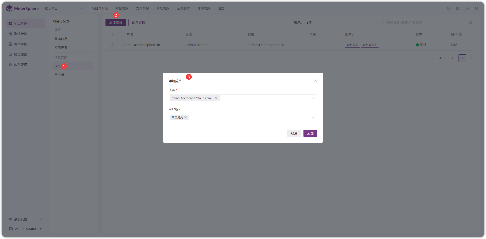{ width="900px" }

!!! ms-abstract ""
    点击【设置】进入表格设置页面，可对列表模式、每页显示数量、表头等内容进行设置
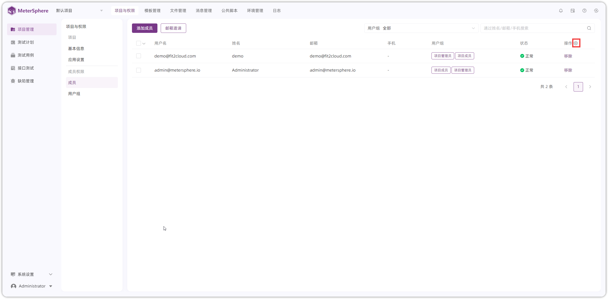{ width="900px" }

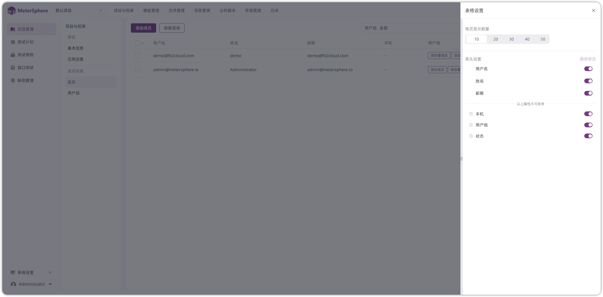{ width="900px" }

!!! ms-abstract ""
    成员【启用/禁用】状态需要在【系统设置】-【组织】-【成员】进行设置
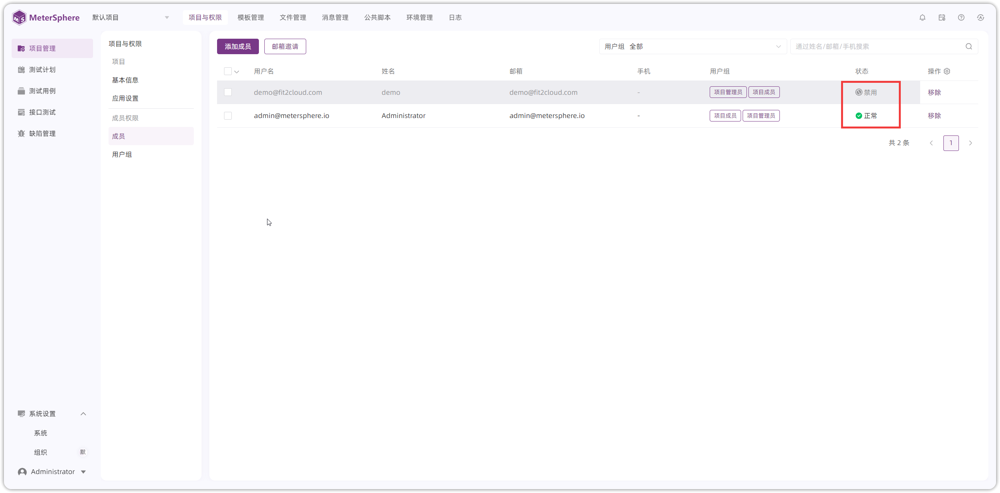{ width="900px" }

!!! ms-abstract ""
    批量将项目成员添加到用户组、从项目移除
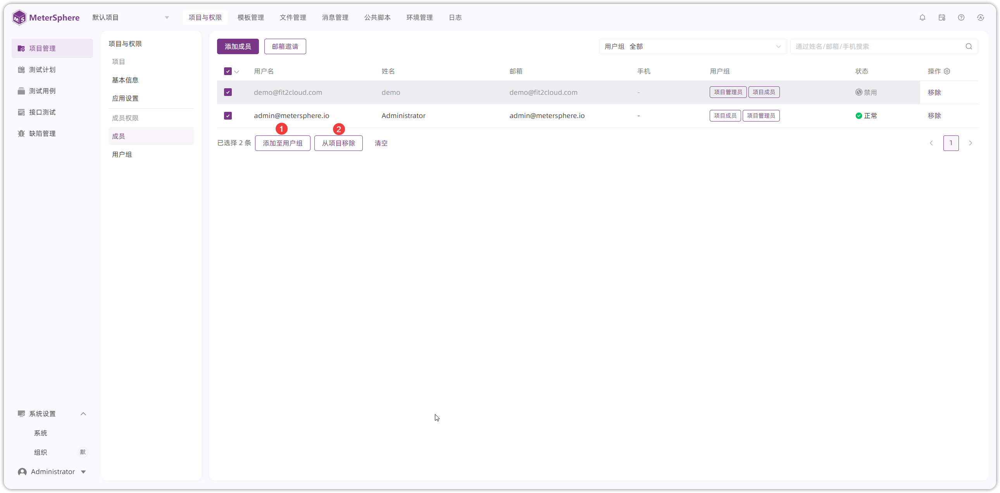{ width="900px" }

## 4 用户组
!!! ms-abstract ""
    点击【用户组】，进入用户组操作页面
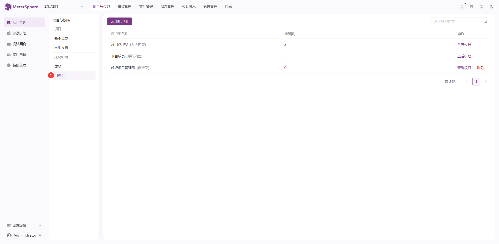{ width="900px" }

!!! ms-abstract ""
    点击【添加用户组】，输入用户组名称
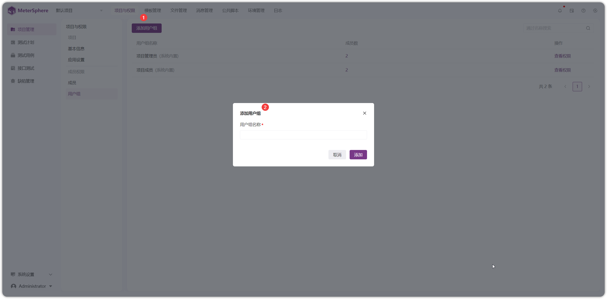{ width="900px" }

!!! ms-abstract "操作说明"
    - 【查看权限】可对用户组进行赋权操作
    - 【删除】仅能删除自定义的用户组，删除用户组后，项目下用户组数据将一起删除，请谨慎操作！！！

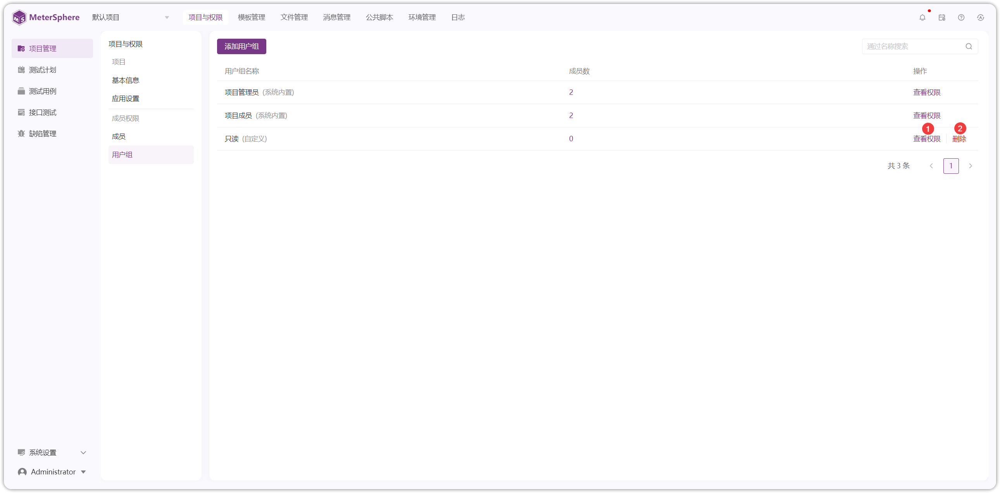{ width="900px" }

{ width="900px" }
