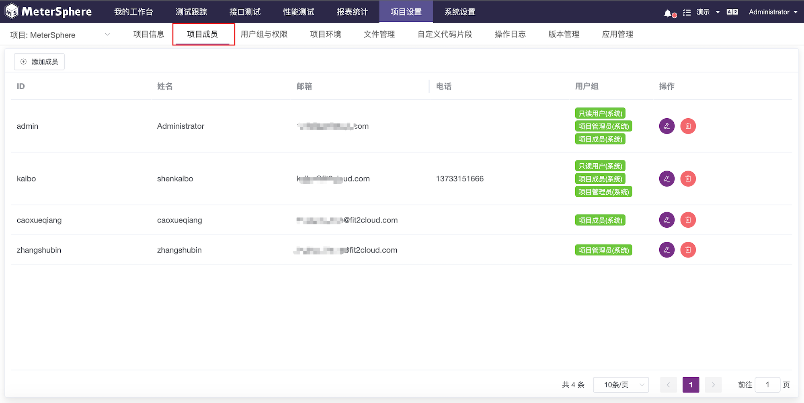
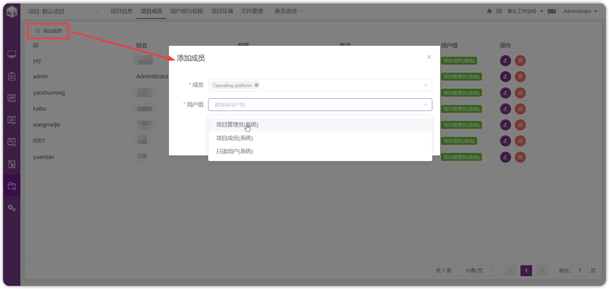
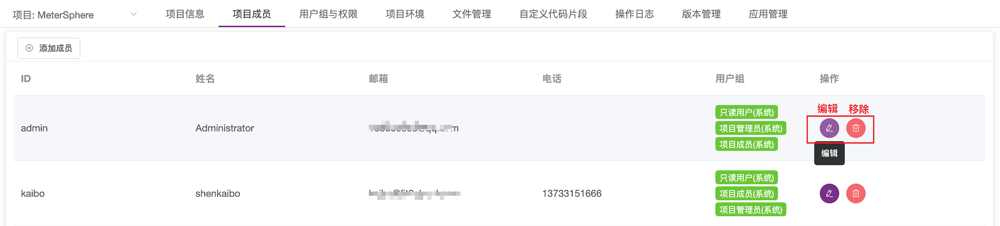

## 项目成员
为项目指定项目成员，即哪些成员有项目角色，同时可对当前项目成员进行添加、修改及移除的操作。
点击“项目成员”菜单，即可查看当前有项目角色的成员。

点击页面左上角“添加成员”，可根据用户ID和用户邮箱搜索需要添加的用户，可选择用户组，点击“确定”按钮完成项目成员添加。

添加完成后可在成员列表中查看到添加的成员，在成员的操作列中可点击“编辑”和“移除”进行成员修改和成员移除操作。
