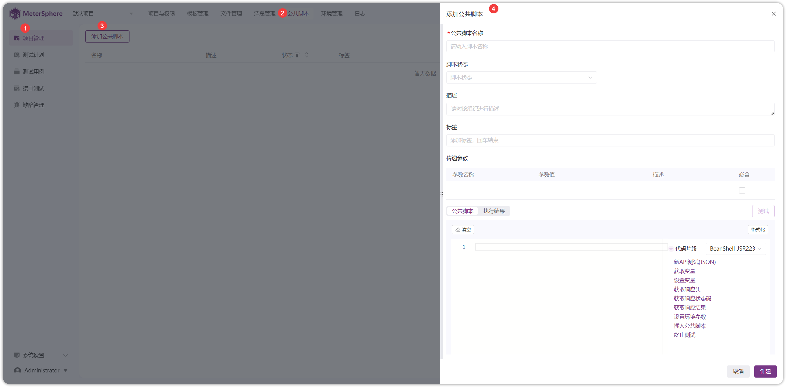
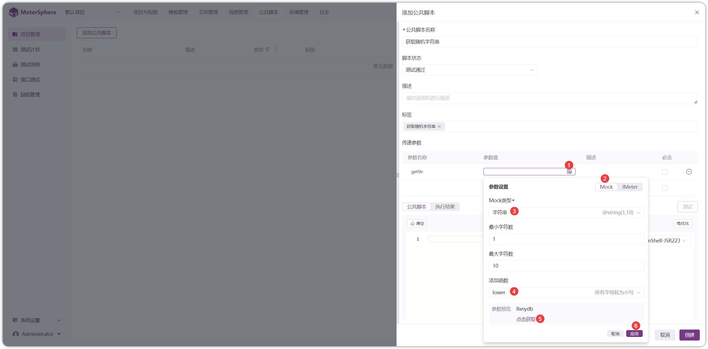
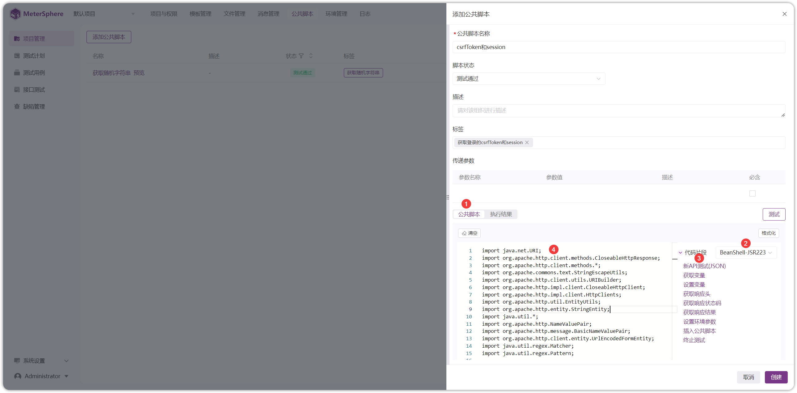
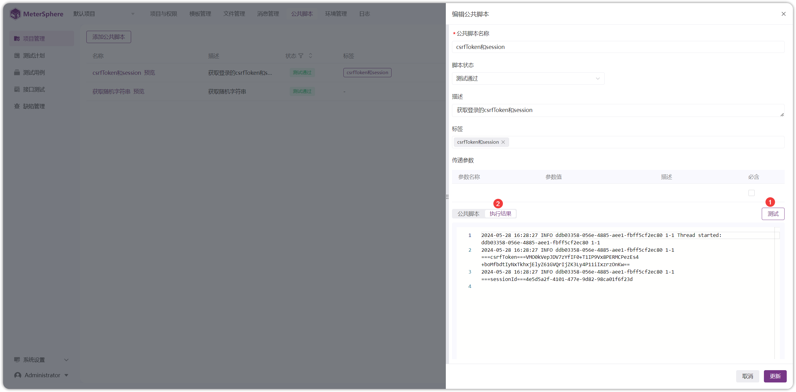
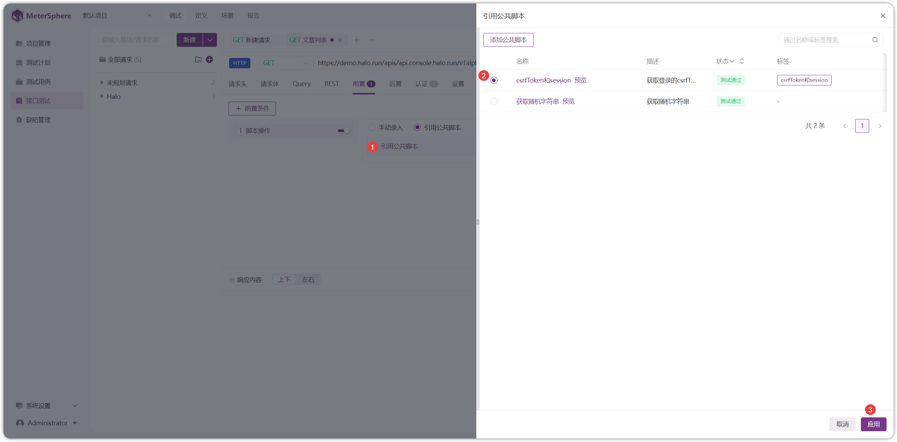
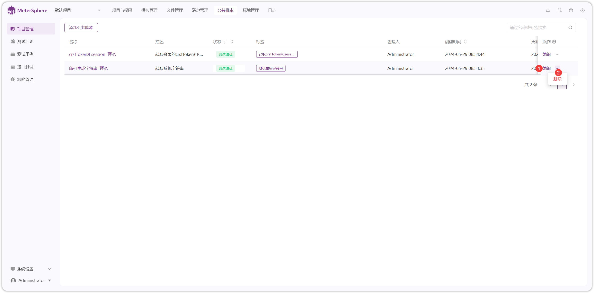

!!! ms-abstract ""
    维护当前项目接口测试里使用的参数、前后置脚本 
    点击【项目管理】-【公共脚本】-【添加公共脚本】，进入添加公共脚本页面
{ width="900px" }

!!! ms-abstract ""
    设置【传递参数】时，参数值使用内置 Mock 函数和 JMeter 函数。以 Mock 函数为例
{ width="900px" }

!!! ms-abstract ""
    设置【公共脚本】时，需选择脚本语言类型，然后自定义脚本。此处以导入 API 定义的登录接口获取 Token 为例
{ width="900px" }

!!! ms-abstract ""
    编写【公共脚本】完成后，点击【调试】，【执行结果】控制台打印了需要的 Token，点击【保存】即可
{ width="900px" }

!!! ms-abstract ""
    【公共脚本】保存后，在【接口测试-接口-前置-引用公共脚本】处，点击【引用公共脚本】即可进行引用
{ width="900px" }

{ width="900px" }

!!! ms-abstract "操作说明"
    - 【编辑】编辑公共脚本名称、状态、标签、参数、脚本等内容
    - 【删除】删除脚本可能会导致引用该脚本的测试用例执行失败，请谨慎操作！！！

{ width="900px" }
