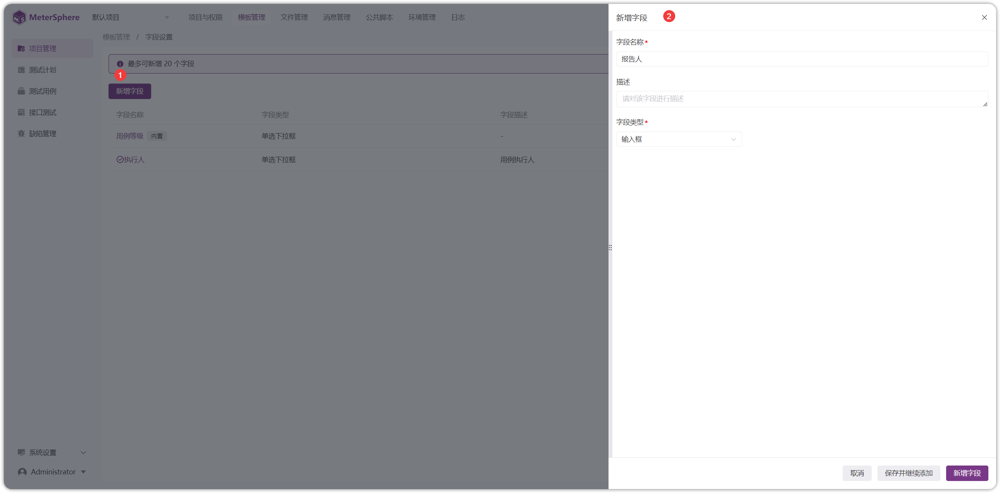
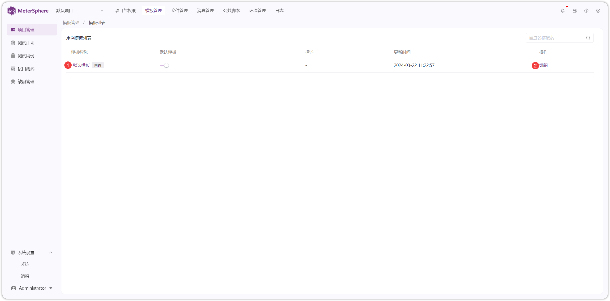
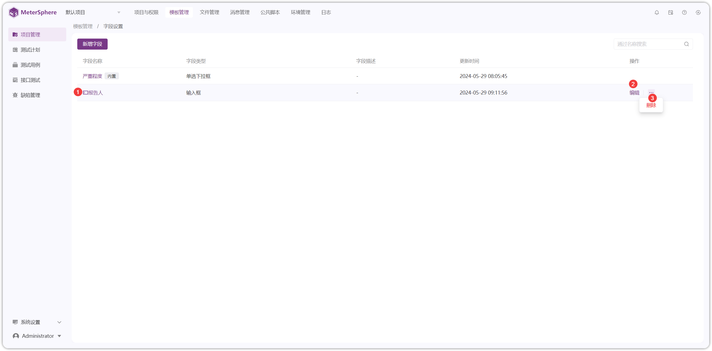
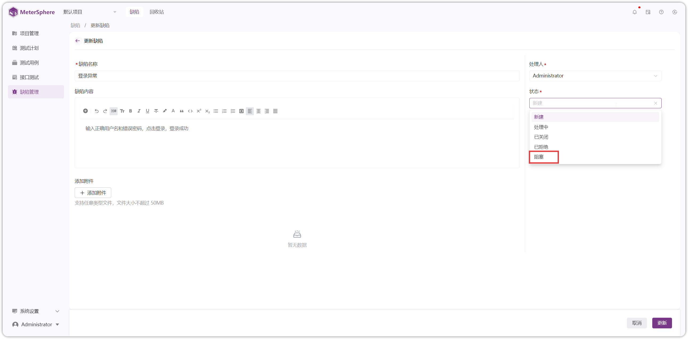

!!! ms-abstract ""
    需要先点击【系统设置】-【组织】-【模板】启用项目用例模板。启用后，项目可自定义模版，将不存在组织模版。此操作不可逆，请谨慎操作！
{ width="900px" }

!!! ms-abstract ""
    系统支持用户自定义【用例模板】、【缺陷模板】及字段设置。
{ width="900px" }

## 1 用例模版
### 1.1 字段设置
!!! ms-abstract ""
    点击【字段设置】进入字段设置页面，点击【新增字段】，填写相应内容进行保存。【用例模板】里可关联新增字段。
{ width="900px" }

!!! ms-abstract ""
    支持对自定义字段进行【查看】【编辑】【删除】操作
{ width="900px" }

### 1.2 模板设置
!!! ms-abstract ""
    点击【模板】进入模板设置页面，支持【编辑】【查看】模板内容。
{ width="900px" }

!!! ms-abstract ""
    点击【编辑】，进入编辑模板页面，自定义模板内容进行更新
{ width="900px" }

!!! ms-abstract ""
    点击【默认模板】，即可查看模板内容。
{ width="900px" }

## 2 缺陷模版
!!! ms-abstract ""
    需要先点击【系统设置】-【组织】-【模板】启用项目缺陷模板。启用后，项目可自定义缺陷模版，将不存在组织模版。此操作不可逆，请谨慎操作！
{ width="900px" }

!!! ms-abstract ""
    支持【缺陷模板】进行自定义【字段设置】【模板】【工作流设置】操作
{ width="900px" }

### 2.1 字段设置
!!! ms-abstract ""
    点击【字段设置】进入字段设置页面，点击【新增字段】，填写相应内容进行保存。【缺陷模板】里可关联新增字段。
{ width="900px" }

!!! ms-abstract ""
    支持对自定义字段进行【查看】【编辑】【删除】操作
{ width="900px" }

### 2.2 模板设置
!!! ms-abstract ""
    点击【模板】进入模板设置页面，支持【新增】【编辑】【查看】【复制】【删除】以及设置为【默认模板】等操作。
{ width="900px" }

!!! ms-abstract ""
    点击【创建缺陷模板】，进入模板创建页面，自定义模板内容进行创建
{ width="900px" }

!!! ms-abstract ""
    点击新增的【缺陷模板】，即可查看模板内容。
{ width="900px" }

!!! ms-abstract ""
    点击开启【默认模板】，在【缺陷管理】-【缺陷】-【创建缺陷】时，会使用刚设置的缺陷模板
{ width="900px" }

### 2.3 工作流设置
!!! ms-abstract ""
    点击【工作流设置】进入工作流设置页面，更改事项的属性或工作流配置，会在相关项目立即生效，请谨慎操作！！！
    支持自定义工作流，点击【添加状态】，填写相应内容，新增工作流状态
{ width="900px" }

!!! ms-abstract ""
    第一列为缺陷所在状态，在状态列点击【创建流转步骤】打勾，则表示该行状态可流转到列的状态，设置完成后，在【缺陷管理】选择缺陷，其【状态】选项，可看到当前状态可流转到设置后状态。
{ width="900px" }
{ width="900px" }

!!! ms-abstract ""
    工作流可进行【编辑】，查看【详情】，将其设置【设为初始态】，设置【结束状态】，【删除】等操作
{ width="900px" }
