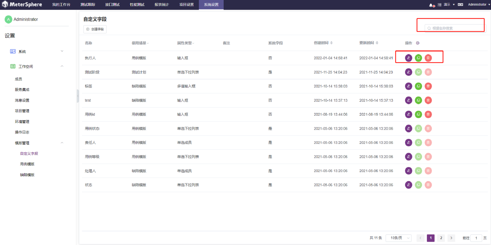
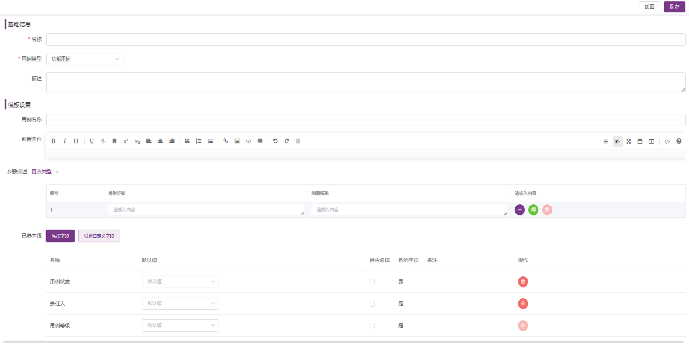

系统支持用户自定义`项目级别`的用例模板、缺陷模板。

####  自定义字段 

在自定义模板前（用例&缺陷），需要先自定义模板中字段的基本属性。点击页面左侧`工作空间`，点击`模板管理`>>`自定义字段`，即可查看当前工作空间中的所有自定义字段列表。

- 创建字段

点击页面左上角`创建字段`，设置字段的基本信息：名称、备注、使用场景、字段类型等基本信息，点击`确认`完成工作空间自定义字段添加。

     个别字段说明：
       1） 使用场景：设置定义的字段使用于具体的模板中
       2） 字段类型：系统提供多种字段类型可供选择，根据不同字段类型，系统自动控制字段的显示、设置和属性等。字段支持的类型有输入框、文本框、下来选择框（单选&多选）、日期时间器、数值等等类型，

- 维护字段

创建完成后可在自定义字段列表中查看到添加的自定义字段，在自定义字段信息中可点击`编辑`和`移除`进行自定义字段修改、复制和移除操作。

####  用例模版 

工作空间用例模板即是当前工作空间的所有项目都可使用的测试用例模板，并且可对当前工作空间的用例模板添加、修改、复制及移除的操作。点击页面左侧`工作空间`，点击`模版管理``用例模版`，即可查看当前工作空间中的所有用例模板列表。

- 创建字段

点击页面左上角`创建模板`，创建新的用例模板,设置用例基本信息、模板设置明细信息等等，点击`确认`完成工作空间用例模板添加。如果模板添加的字段信息不存在，可以在`模板管理`>>`自定义字段`中进行创建，然后在此引用即可。

- 维护字段

创建完成后可在用例模板列表中查看到添加的用例模板，在用例模板信息中可点击`编辑`和`移除`进行用例模板修改、复制和移除操作。

####  缺陷模版 

在`模版管理`下拉菜单中点击`缺陷模版`，右侧显示当前工作空间下的缺陷模版列表，支持查询、编辑、复制、删除等操作。点击`创建缺陷模版`按钮新建缺陷模版，在弹出的页面中设置用例基本信息，点击`确认`完成添加。

- 创建缺陷模板

点击页面左上角 `创建缺陷模板` 新建缺陷模板，设置用例基本信息、模板设置明细信息等等，点击 `确认` 完成工作空间缺陷模板添加。如果模板添加字段信息不存在，可以在 `模板管理->自定义字段` 中进行创建，然后在此引用即可。

- 维护字段

创建完成后可在缺陷模板列表中查看到添加的模板，在缺陷模板信息中可点击`编辑`和“移除”进行缺陷模板修改、复制和移除操作。

