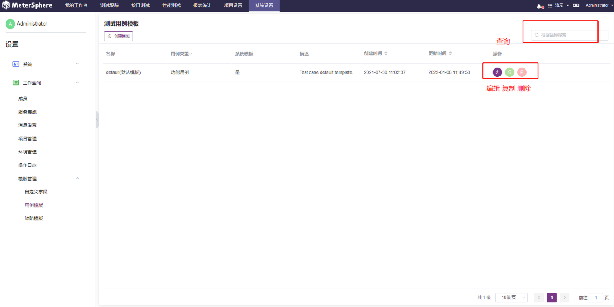
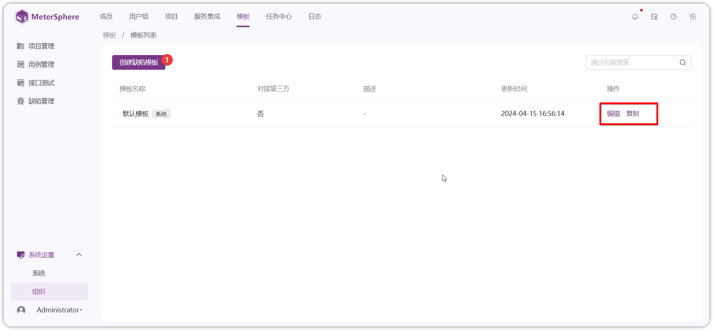

系统支持用户自定义【项目级别】的【模板字段】、【用例模板】、【缺陷模板】、【接口模板】。

#### 1  模板字段 
在自定义模板前（用例&缺陷），需要先自定义模板中字段的基本属性。点击【项目设置】-【更多选项】-【模板管理】-【模板字段】，即可查看当前工作空间中的所有模板字段列表。

- 创建字段

点击页面左上角【创建字段】，设置字段的基本信息：名称、备注、使用场景、字段类型等基本信息，点击【确定】完成模板字段添加。

     个别字段说明：
       1）【使用场景】：设置定义的字段使用于具体的模板中。
       2）【字段类型】：系统提供多种字段类型可供选择，根据不同字段类型，系统自动控制字段的显示、设置和属性等。字段支持的类型有输入框、文本框、下来选择框（单选&多选）、日期时间器、数值等等类型。

- 维护字段

创建完成后可在模板字段列表中查看到添加的模板字段，在自定义字段信息中可点击【编辑】、【复制】和【删除】按钮进行模板字段修改、复制和删除操作。

#### 2  用例模版 
用例模板即当前项目下都可使用的测试用例模板，并且可对用例模板添加、修改、复制及移除的操作。点击页面【项目设置】-【更多选项】-【模版管理】-【用例模版】，即可查看当前项目中的所有用例模板列表。

- 创建模板

点击页面左上角【创建模板】，创建新的用例模板，设置用例基本信息、模板设置明细信息等，点击【保存】完成用例模板添加。如果模板添加的字段信息不存在，可以在【项目设置】-【更多选项】-【模版管理】-【模版字段】中进行创建，然后在此引用即可。

- 维护模板

创建完成后可在用例模板列表中查看到添加的用例模板，在用例模板信息中可点击【编辑】、【复制】和【删除】按钮进行用例模板修改、复制和删除操作。

- 引用模板

创建用例模板后，需要在项目中使用创建的模板，可在【系统设置】-【项目管理】-【编辑】页面，选择要使用的用例模板

#### 3  缺陷模版 
在【模版管理】-【缺陷模版】，会显示当前项目下的缺陷模版列表，支持查询、编辑、复制、删除等操作。

- 创建缺陷模板

点击页面左上角【创建缺陷模板】新建缺陷模板，设置用例基本信息、模板设置明细信息等，点击【保存】完成项目缺陷模板添加。如果模板添加字段信息不存在，可以在【项目设置】-【更多选项】-【模版管理】-【模版字段】中进行创建，然后在此引用即可。

- 维护字段

创建完成后可在缺陷模板列表中查看到添加的模板，在缺陷模板信息中可点击【编辑】、【复制】和【删除】按钮进行缺陷模板修改、复制和删除等操作。

- 引用模板

创建缺陷模板后，需要在项目中使用创建的模板，可在【系统设置】-【项目管理】-【编辑】页面，选择要使用的缺陷模板

#### 4  接口模板 
接口测试支持自定义接口模板，支持查询、编辑、复制、删除等操作。

- 创建接口模板

点击页面左上角【创建模板】新建接口陷模板，填写基本信息、模板设置等信息，添加字段或设置自定义字段后，点击【保存】即可。

- 维护模板

创建完成后可在接口模板列表中查看到添加的接口模板，在接口模板信息中可对模板进行【编辑】、【复制】和【删除】等操作。

- 引用模板

创建接口模板后，需要在项目中使用创建的模板，可在【系统设置】-【项目管理】-【编辑】页面，选择要使用的接口模板

在创建接口定义时，接口基础信息中会展示自定义的模板字段

