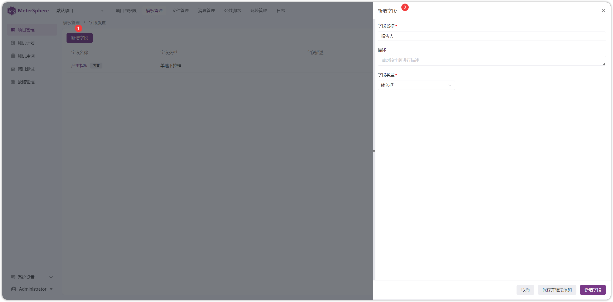
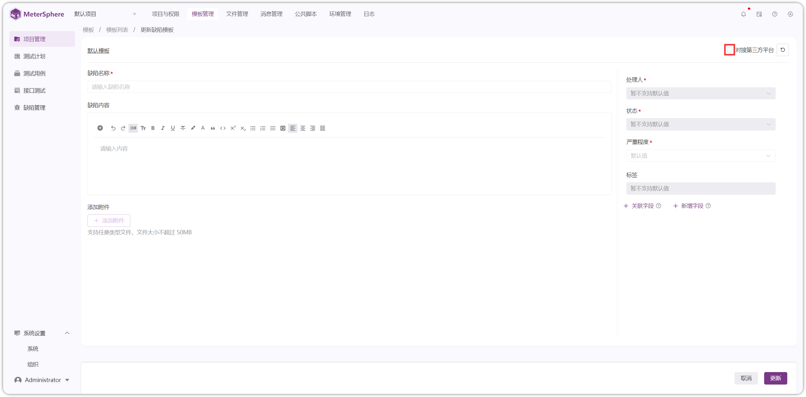
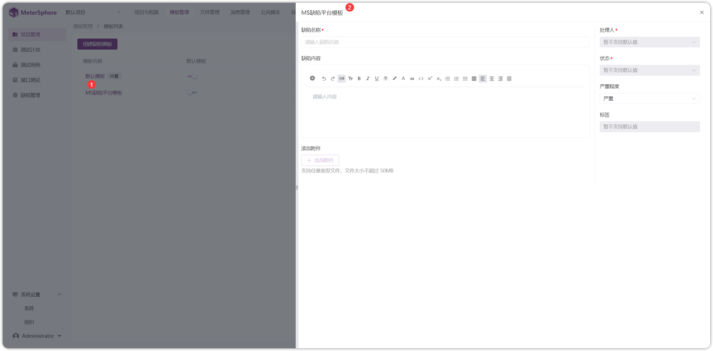
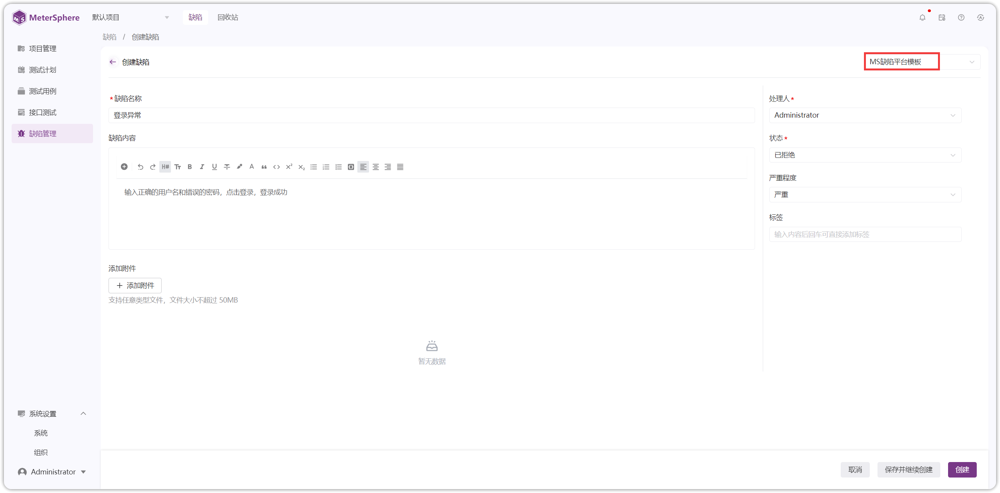
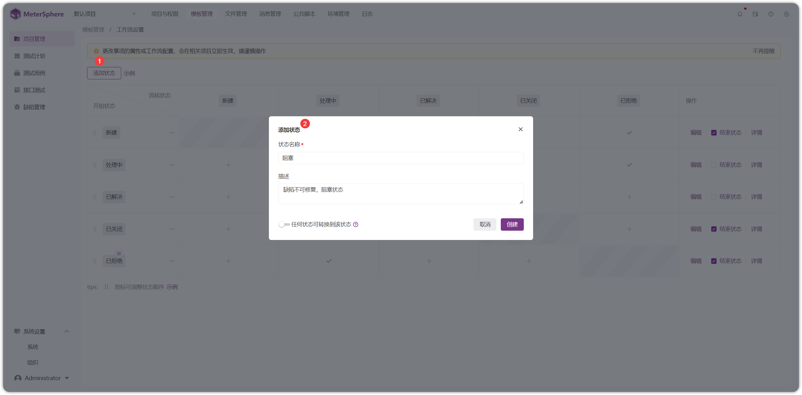
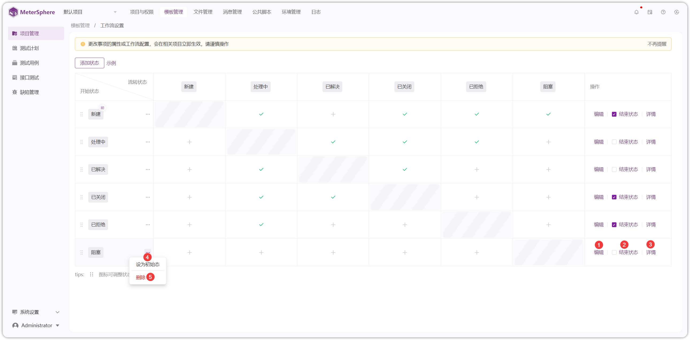

!!! ms-abstract ""
    需要先点击【系统设置-组织-模板】启用项目用例模板。启用后，项目可自定义模板，将不存在组织模板。此操作不可逆，请谨慎操作！！！
{ width="900px" }

!!! ms-abstract ""
    自定义缺陷工作流，用例、缺陷模板及模板字段。
{ width="900px" }

## 1 用例模板
### 1.1 字段设置
!!! ms-abstract ""
    点击【字段设置】进入字段设置页面，点击【新增字段】，填写相应内容进行保存。【用例模板】里可关联新增字段。
{ width="900px" }

!!! ms-abstract "操作说明"
    - 【查看】查看字段名称、描述、字段类型、选项等内容。
    - 【编辑】编辑自定义字段字段名称、描述、字段类型、选项等内容。
    - 【删除】若自定义字段字段在模板中已使用，删除后数据将会丢失，请谨慎操作！！！

{ width="900px" }

### 1.2 模板设置
!!! ms-abstract ""
    点击【模板列表】进入模板列表页面，目前社区版只有一套项目默认模板，不支持新建用例模板。
{ width="900px" }
    
!!! ms-abstract "操作说明"
    - 【查看】查看模板的用例名称、前置条件、步骤描述、备注等内容。
    - 【编辑】编辑模板的用例名称、前置条件、步骤描述、备注等内容，可以新增或关联自定义字段。

!!! ms-abstract ""
    点击【编辑】，进入编辑模板页面，自定义模板内容进行更新。
{ width="900px" }

!!! ms-abstract ""
    点击【模板名称】，查看模板内容。
{ width="900px" }

## 2 缺陷模板
!!! ms-abstract ""
    需要先点击【系统设置-组织-模板】启用项目缺陷模板。启用后，项目可自定义缺陷模板，将不存在组织模板。此操作不可逆，请谨慎操作！！！
{ width="900px" }

!!! ms-abstract "说明"
    - 【字段设置】系统内置字段不可操作，只能操作自定义字段。
    - 【模板列表】默认使用的是组织模板，组织模板的变更对所有项目生效，如果切换为项目模板，则每个项目独立管理模板！此操作不可逆，请谨慎操作！！！
    - 【工作流设置】自定义缺陷流转状态，缺陷的起始状态，有且仅有一个，且不可删除。缺陷最终状态为已关闭，对于已关闭的缺陷，不会统计在待处理的数据中。

{ width="900px" }

### 2.1 字段设置
!!! ms-abstract ""
    点击【字段设置】进入字段设置页面，点击【新增字段】，填写相应内容进行保存。【缺陷模板】里可关联新增字段。
{ width="900px" }

!!! ms-abstract ""
    自定义字段进行【查看】、【编辑】、【删除】操作。
{ width="900px" }

### 2.2 模板设置
!!! ms-abstract "注意"
    - 【第三方平台模板】：系统自动生成，不可更改。
    - 【本地平台模板】：可编辑项目自带的默认模板和创建自定义缺陷模板，模板最多设置20个，超过20个，创建模板按钮置灰 
    
!!! ms-abstract ""
    点击【模板列表】进入模板列表页面，进行【新增】、【编辑】、【查看】、【复制】、【删除】以及【开启/关闭】默认模板等操作。
{ width="900px" }

!!! ms-abstract "操作说明"
    - 【新增】填写缺陷模板的名称、缺陷内容和新增、关联字段。
    - 【编辑】本地平台模板可进行编辑名称、缺陷内容和新增、关联字段的操作。
    - 【查看】查看本地平台缺陷模板。
    - 【复制】复制本地平台缺陷模板。
    - 【删除】项目默认模板和第三方集成平台自动生成的缺陷模板不可删除，自定义模板可进行删除操作。
    - 【开启/关闭】设置为项目默认模板，创建缺陷时会使用该模板。

!!! ms-abstract ""
    点击【创建缺陷模板】，进入模板创建页面，自定义模板内容进行创建。
{ width="900px" }

{ width="900px" }

!!! ms-abstract "字段说明"
    - 【对接第三方平台】勾选，自定义字段需要填写第三方平台字段 API，不勾选，不显示 API 字段。
    - 【处理人】项目内置字段，暂不支持设置默认值。
    - 【状态】项目内置字段，暂不支持设置默认值。
    - 【严重程度】项目自定义字段，可设置默认值且可删除。
    - 【关联字段】关联已添加的字段。
    - 【关联字段】新增字段。
    
!!! ms-abstract ""
    点击列表中缺陷模板名称，即可查看模板内容。
{ width="900px" }

!!! ms-abstract ""
    选择指定模板，点击启用按钮，将其作为默认缺陷模板，在【缺陷管理-缺陷-创建缺陷】时，会使用刚设置的缺陷模板。
{ width="900px" }

{ width="900px" }

### 2.3 工作流设置
!!! ms-abstract ""
    点击【工作流设置】进入工作流设置页面，更改事项的属性或工作流配置，会在相关项目立即生效，请谨慎操作！！！
    自定义工作流，点击【添加状态】，填写相应内容，新增工作流状态。
{ width="900px" }

!!! ms-abstract ""
    第一列为缺陷所在状态，在状态列点击【创建流转步骤】打勾，表示该行状态可流转到列的状态。设置后，在【缺陷管理】页面更新缺陷时，【状态】字段下拉框中显示刚设置的状态。
{ width="900px" }

{ width="900px" }

!!! ms-abstract "操作说明"
    - 【编辑】编辑该工作流状态名称和描述信息。
    - 【详情】查看该工作流状态。
    - 【设为初始态】创建缺陷的最初状态，有且仅有一个，且不可删除。默认初始状态是新建。
    - 【结束状态】缺陷的最终状态，默认的最终状态为已关闭。对于已关闭的缺陷，不会统计在待处理的数据中。
    - 【删除】会在项目中立即生效且删除不可撤回，请谨慎操作！！！
{ width="900px" }

