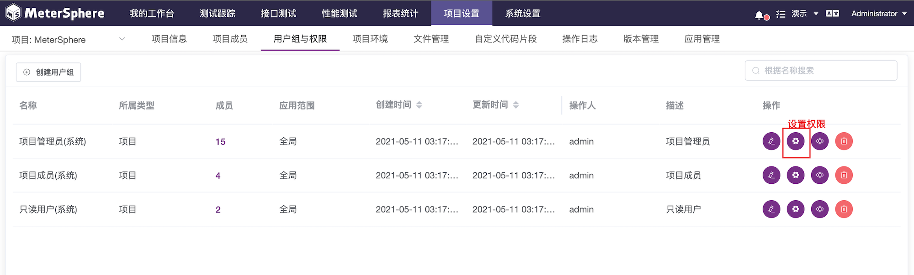
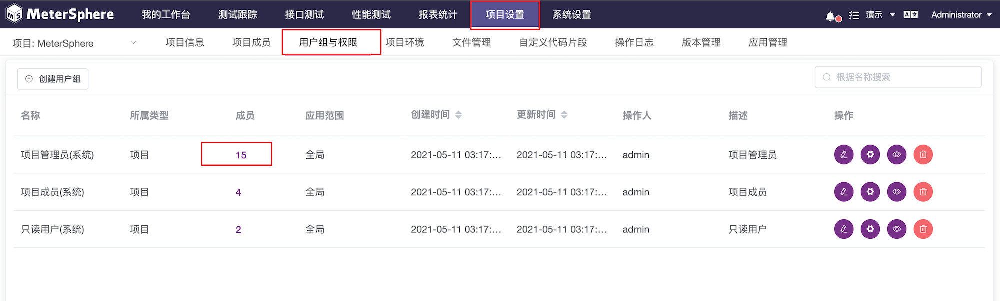

维护当前项目用户及权限。
## 1 新增用户组

点击 `创建用户组`，新增当前项目的用户组信息。详细功能操作及说明参考 [系统设置->系统->用户组与权限->创建用户组](../../system_management/system/#_8)。

## 2 设置用户组权限

点击 `设置权限` 为用户组进行权限设置。详细功能操作及说明参考 [系统设置->系统->用户组与权限->设置权限](../../system_management/system/#_8)。

## 3 设置用户组成员

在用户组列表信息成员处，点击信息列里的 `数字` 为用户组进行成员设置。详细功能操作及说明参考 [系统设置->系统->用户组与权限->成员设置](../../system_management/system/#_8)。