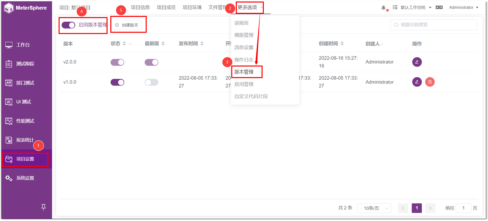
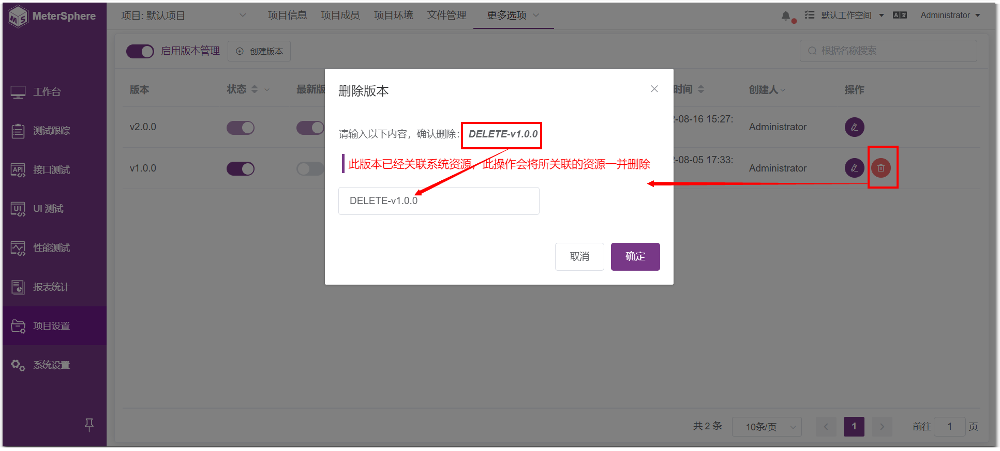

!!! ms-abstract ""
    不同版本的项目有不同版本的用例，后一个版本是在前一个版本的基础上不断更新完善

## 1 版本管理 (X-Pack)
!!! ms-abstract ""
    【项目设置】-【更多选项】-【版本管理】页面，启用版本管理，点击【创建版本】。
{ width="900px" }

!!! ms-abstract ""
    在【创建版本】页面，输入基本配置信息，点击【保存】或者【保存并创建】即可。
{ width="900px" }

!!! ms-abstract ""
    创建版本完成后，是否启用【状态】和【最新版】。
{ width="900px" }

!!! ms-abstract ""
    点击【编辑】按钮，进入编辑页面，编辑完成后点击【保存】即可。
{ width="900px" }

!!! ms-abstract ""
    点击【删除】按钮，按照提示输入【DELETE-v1.0.0】，该版本号就被删除了。
{ width="900px" }
