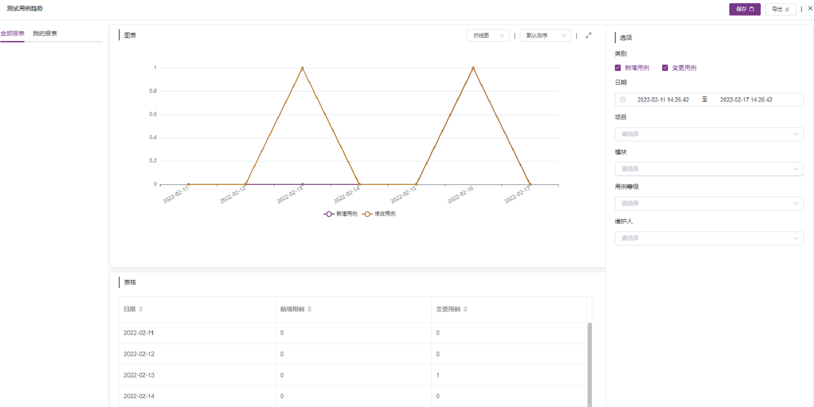
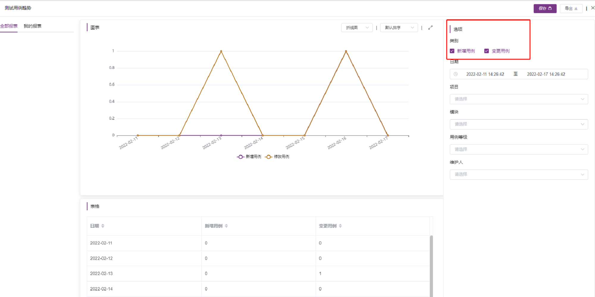
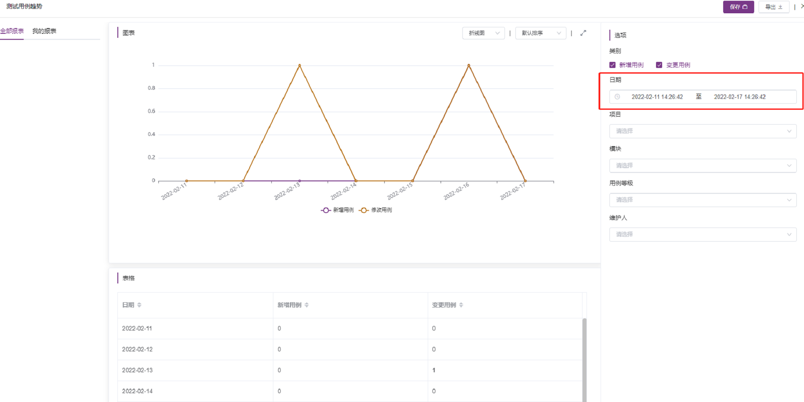
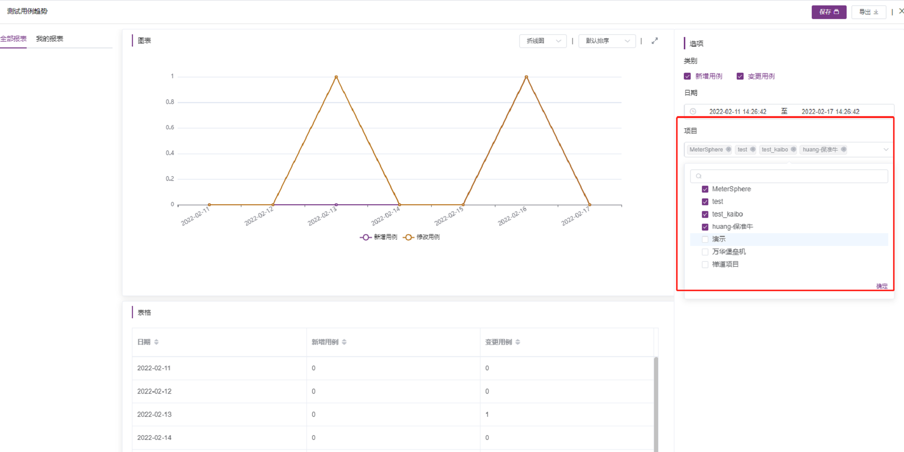
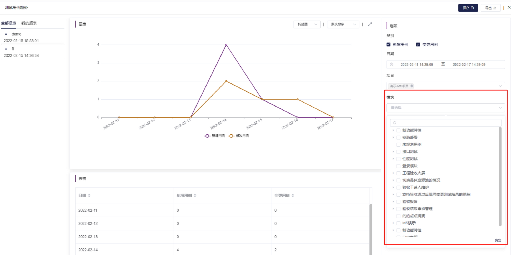
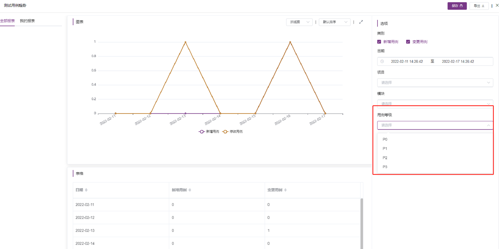
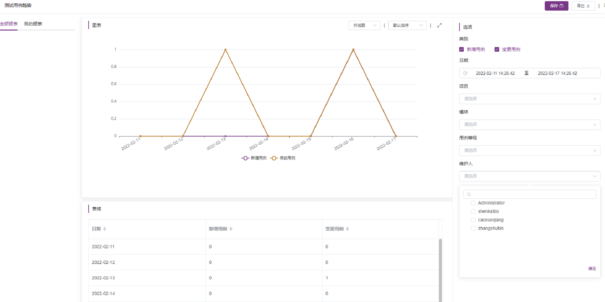
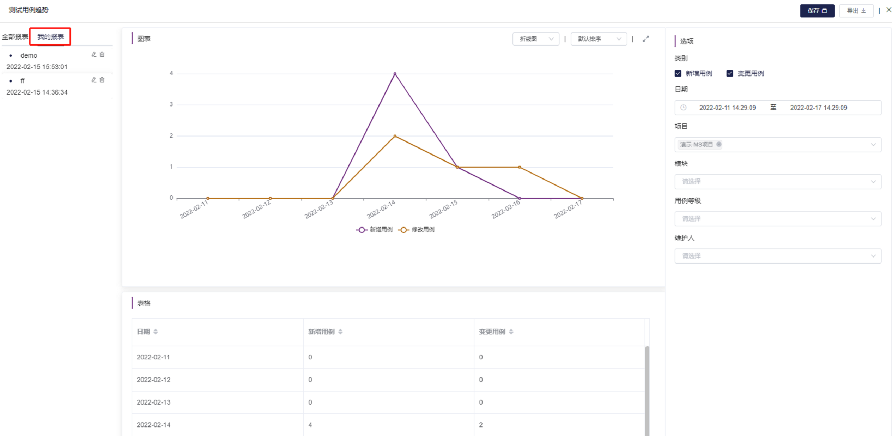

### 测试用例趋势
点击`报表统计`-`测试用例趋势`，进入测试用例趋势页面，可以看到已创建的报表

- 创建新报表

选项提供类别、日期，项目，模板，用列等级，维护人多维度生成报表

- 类别

类别可选新增用列和变更用例

- 日期

选要统计的日期

- 项目

选择要统计的项目，支持多项目统计

- 模块

选择要统计的模块，支持多模块统计

- 用例等级

选择要统计的用例等级，支持多选

- 创建人

选择要统计的创建人，支持多选

- 我的报表

点击`我的报表`可查看自己创建的报表

- 重命名报表

点击`编辑`可将自己创建的报表重命名

- 删除

点击`删除`可将自己创建的报表删除

- 导出

点击`导出`可将报表导出pdf文件

