!!! ms-abstract ""
    报表统计页面主要展示报表类型，用户可根据不同报表类型创建报表。
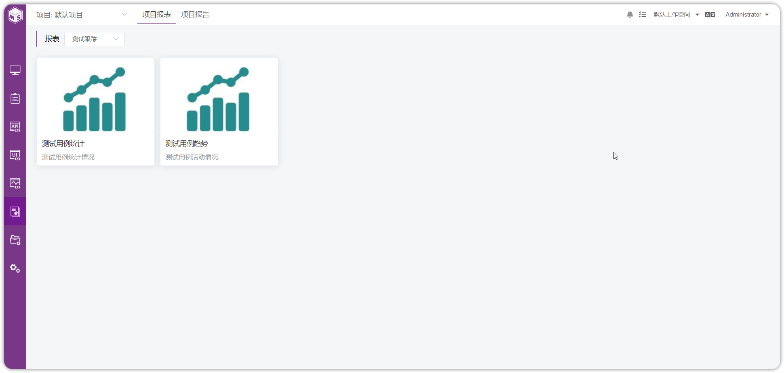{ width="900px" }

## 1 测试用例统计
!!! ms-abstract ""
    点击【测试用例统计】，进入测试用例统计页面，可以看到已创建的报表。
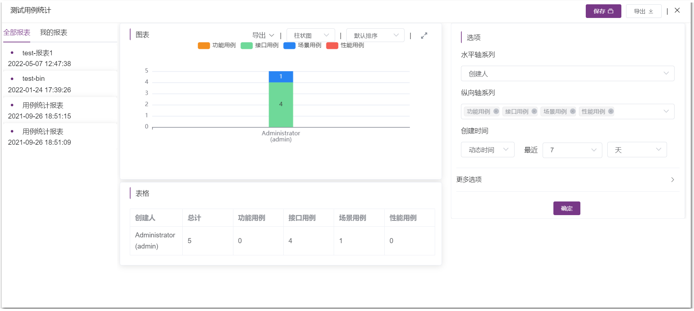{ width="900px" }

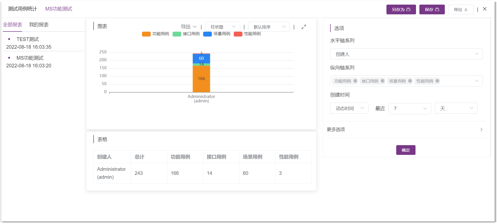{ width="900px" }

- 创建新报表
!!! ms-abstract ""
    选项提供水平轴系列、纵向轴系列，创建时间三个维度生成报告。

-  水平轴系列
!!! ms-abstract ""
    水平轴只支持单选。
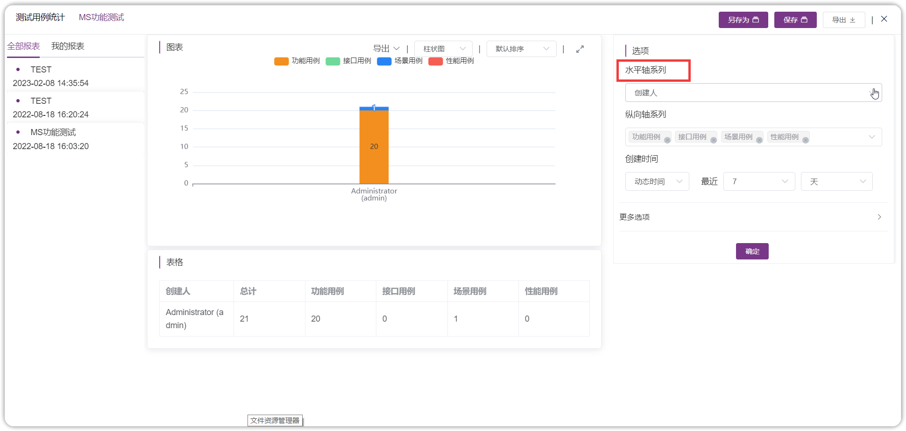{ width="900px" }

- 纵向轴系列
!!! ms-abstract ""
    纵向轴支持多选。
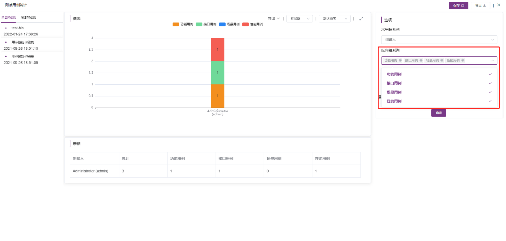{ width="900px" }

- 创建时间
!!! ms-abstract ""
    创建时间支持动态时间和固定时间生成报表。
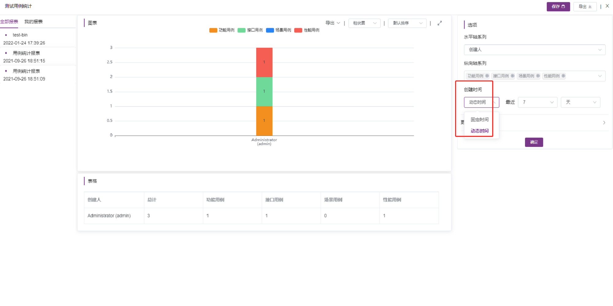{ width="900px" }

- 更多选项
!!! ms-abstract ""
    更多选项可根据创建人等条件过滤生成报表。
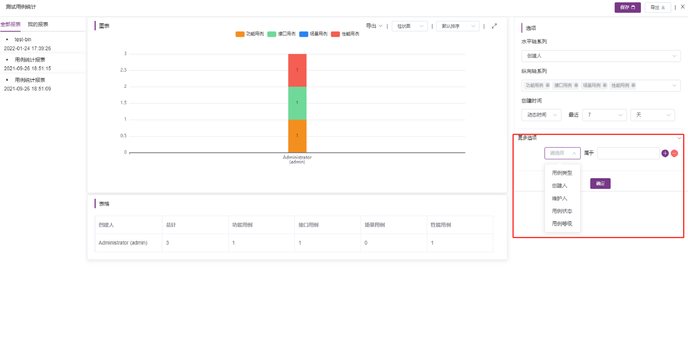{ width="900px" }

- 保存
!!! ms-abstract ""
    点击【保存】可保存报表。
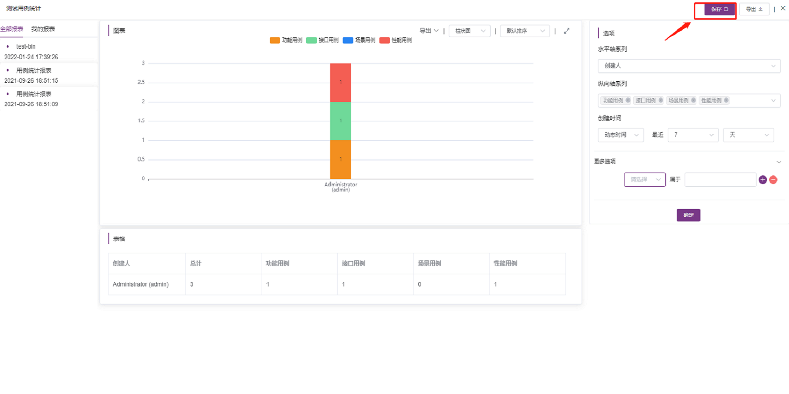{ width="900px" }

- 另存为
!!! ms-abstract ""
    点击【另存为】可将当前报表另存为其他报表。
{ width="900px" }

- 全部报表

!!! ms-abstract ""
    点击【全部报表】可查看所有报表。
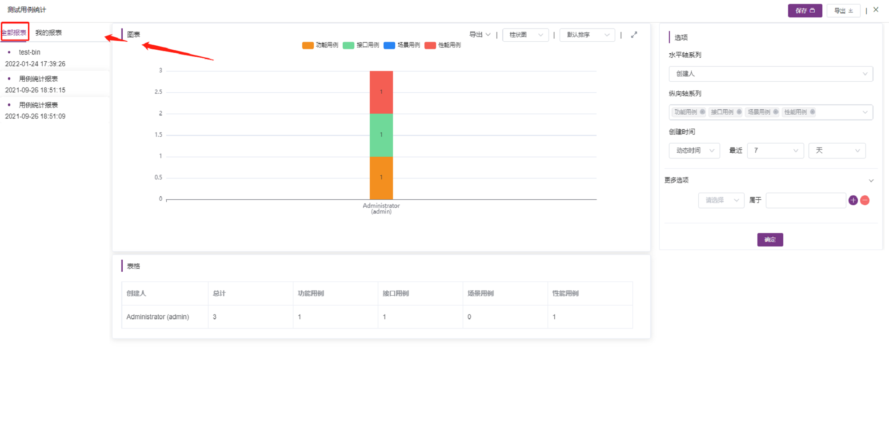{ width="900px" }

- 我的报表
!!! ms-abstract ""
    点击【我的报表】可查看自己创建的报表。
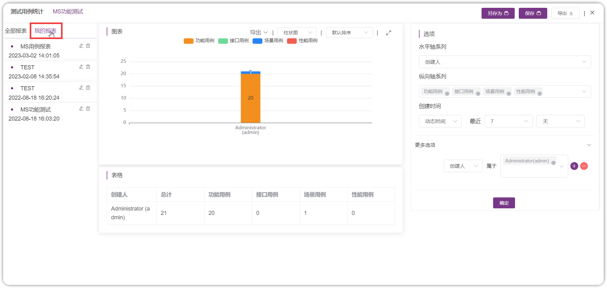{ width="900px" }

- 重命名报表
!!! ms-abstract ""
    点击【重命名】可将自己创建的报表重命名。
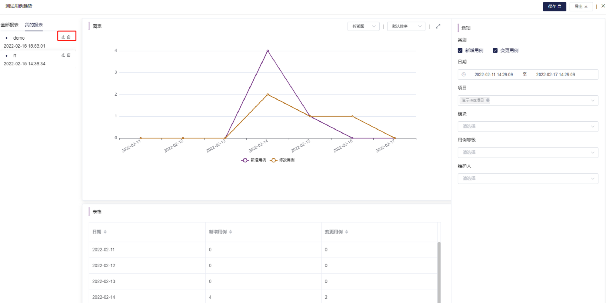{ width="900px" }

- 删除
!!! ms-abstract ""
    点击【删除】可将自己创建的报表删除。
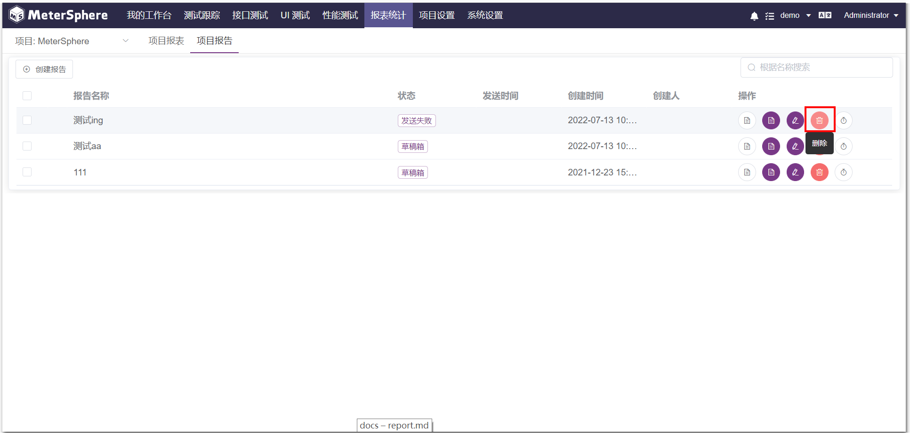{ width="900px" }

- 导出
!!! ms-abstract ""
    点击【导出】可将报表导出 PDF 文件。
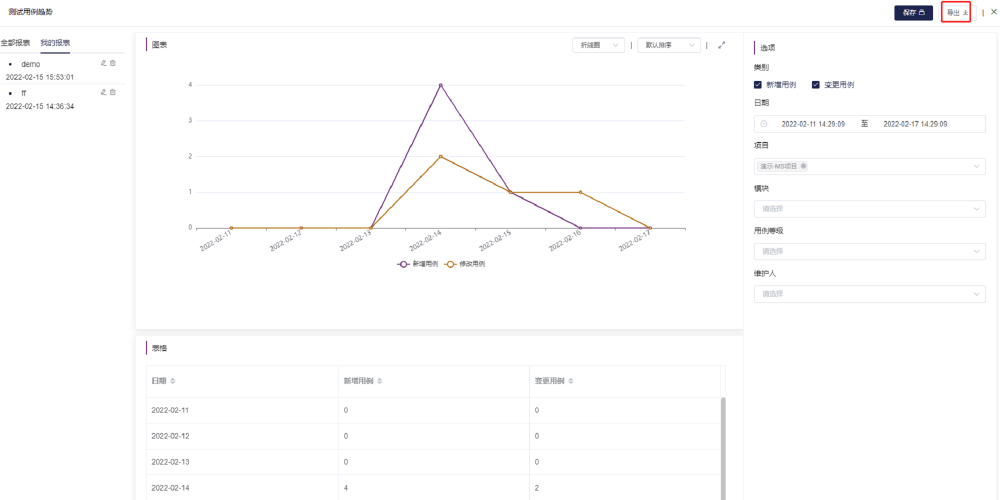{ width="900px" }

