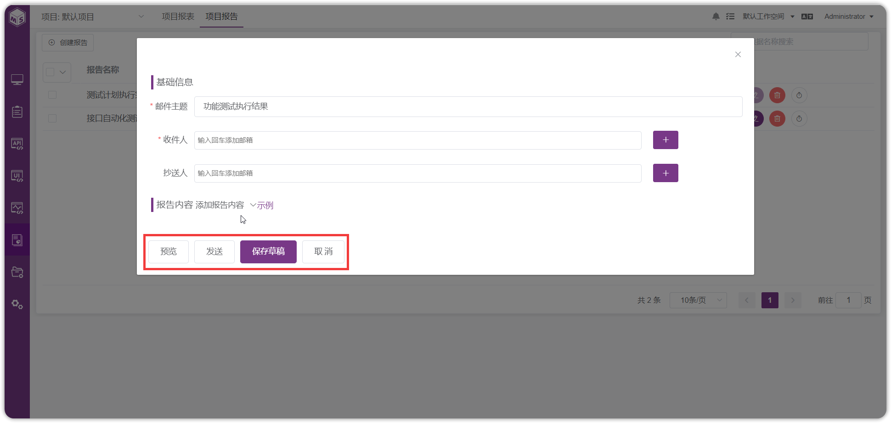
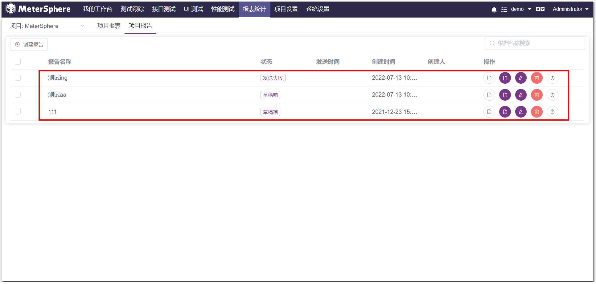
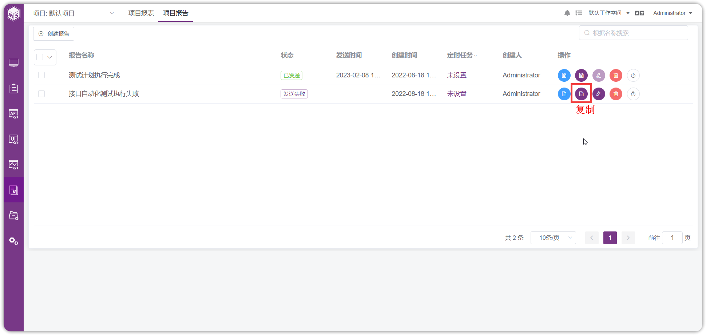
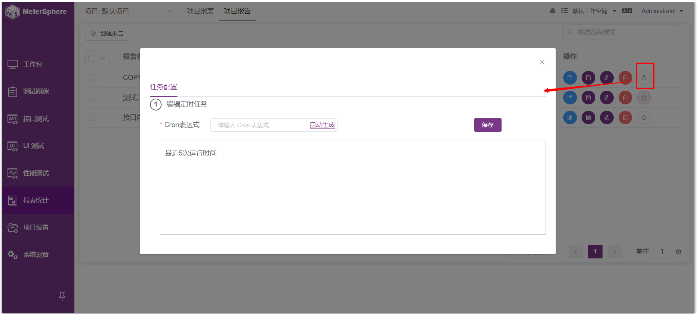
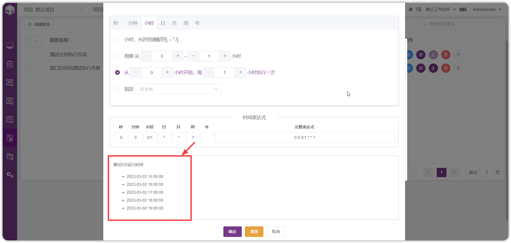

!!! ms-abstract ""
    用户创建报表进行保存后，可在测试报告内容中将报表添加进来进行发送。

## 1 项目报告 (X-Pack)
- 创建报告
!!! ms-abstract ""
    切换到【项目报告】页面，点击【创建报告】，进入报告配置页面

!!! ms-abstract ""
    填写报告的基础信息，鼠标悬浮到【示例】前面的小图标，可看到内容为【文本】和【报表】，根据需要进行配置。

!!! ms-abstract ""
    报告配置完成可点击【预览】、【发送】、【保存草稿】、【取消】按钮，点击【发送】、【保存草稿】的报告会出现在报告列表中

- 预览报告
!!! ms-abstract ""
    点击【预览】按钮，即可预览该报告的内容

- 复制报告
!!! ms-abstract ""
    点击【复制】按钮，即可复制该报告，显示在列表上方

- 编辑报告
!!! ms-abstract ""
    点击【编辑】按钮，即可修改该报告的内容，编辑完成后点击【保存草稿】或【发送】

- 删除报告
!!! ms-abstract ""
    点击【删除】按钮，即可删除该报告

- 定时发送
!!! ms-abstract ""
    点击【定时发送】按钮，即可配置定时任务发送报告

