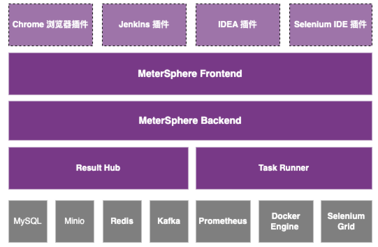
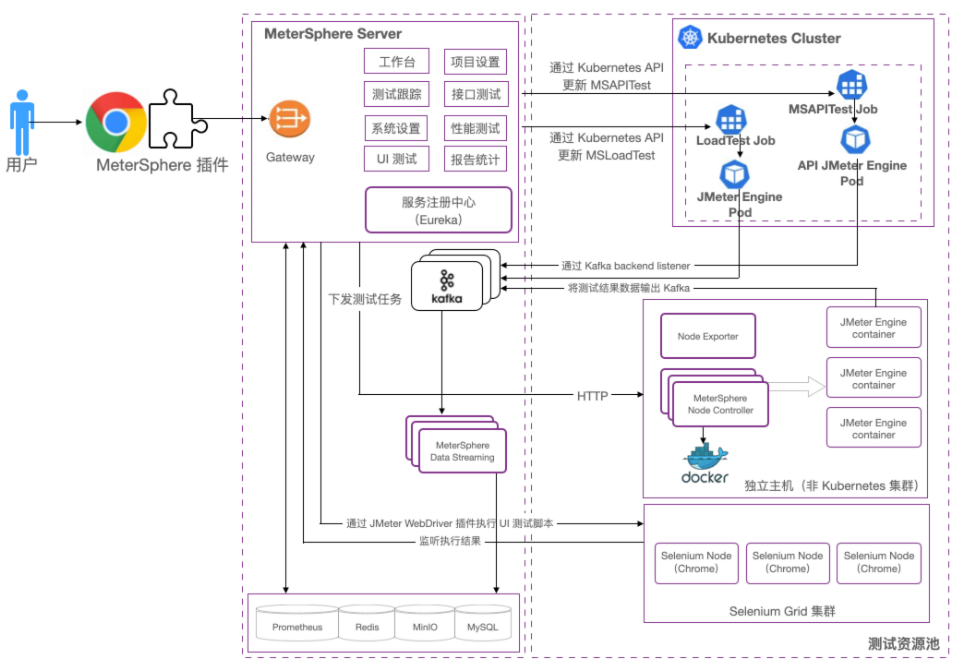

## 整体架构

!!! info "组件说明"
    - [Frontend](https://github.com/metersphere/metersphere): MeterSphere 的前端工程, 基于 vue.js 进行开发
    - [Backend](https://github.com/metersphere/metersphere): MeterSphere 的后端后称, 基于 Sprint boot 进行开发, 为 MeterSphere 的功能主体
    - [Chrome plugin](https://github.com/metersphere/chrome-exetions): 浏览器插件, 录制 web 访问请求生成 JMeter 脚本并导入到 MeterSphere 中用于接口测试及性能测试
    - [Node controller](https://github.com/metersphere/node-controller): 为性能测试提供独立节点类型的测试资源池, 接收来自系统的性能测试任务, 动态的启动 JMeter 容器完成性能测试
    - [Operator](https://github.com/metersphere/operator): 为性能测试提供 Kubernetes 集群类型的测试资源池, 接收来自系统的性能测试任务, 动态的创建 Kubernetes 集群中的性能测试 Job 完成性能测试
    - MySQL: MeterSphere 项目的主要数据均存储在 MySQL
    - Kafka: 接收 JMeter 产生的性能测试结果数据
    - [Data streaming](https://github.com/metersphere/data-streaming): 从 Kafka 中获取性能测试结果数据进行处理后存入 MySQL 数据库
    - Docker engine: 为 Node Controller 提供 JMeter 容器运行环境
    - Kubernetes: 为 Operator 提供性能测试任务的运行环境
  
    各个组件间的关系可参考下图

    

## 管理模型

!!! info "概念说明"
    MeterSphere 提供了多租户、多角色的管理模型, 用户可根据所在团队的实际情况进行灵活的租户体系映射

    - 系统: 每个独立部署的 MeterSphere 即称为一套系统
    - 系统级角色: 角色的权限范围为整个体统, 常见的角色如系统管理员, 可管理整个系统内的租户、用户即测试资源, 同时可变更修改系统级配置参数
    - 组织: MeterSphere 中的一级租户, 可映射为一个公司下的不同部门
    - 组织级角色: 角色的权限范围限定在某个组织当中, 常见的角色如组织管理员, 可管理整个组织内的成员、工作空间及成员等
    - 工作空间: MeterSphere 中的二级租户, 可映射为一个部门下的不同团队、项目组
    - 工作空间级角色: 角色的权限范围现在在某个工作空间当中, 常见的角色如工作空间管理员及普通用户, 可在工作空间中创建项目、发起测试、查看测试报告等

    点击查看完整的[「用户权限矩阵」]()