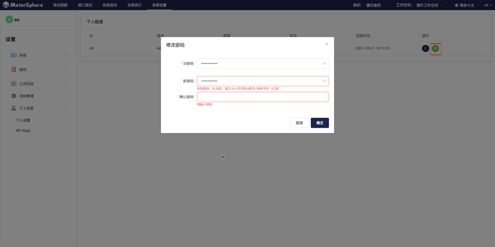
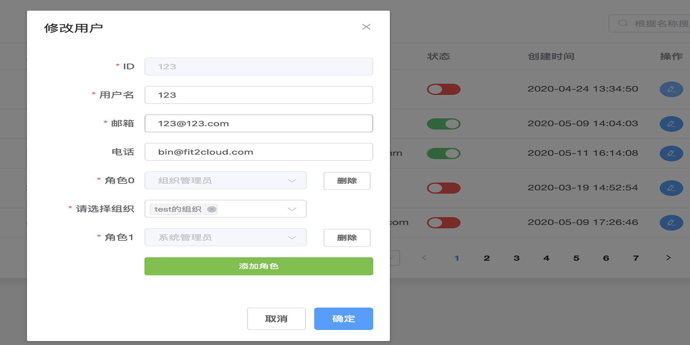
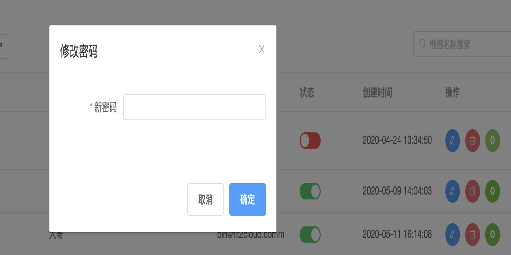
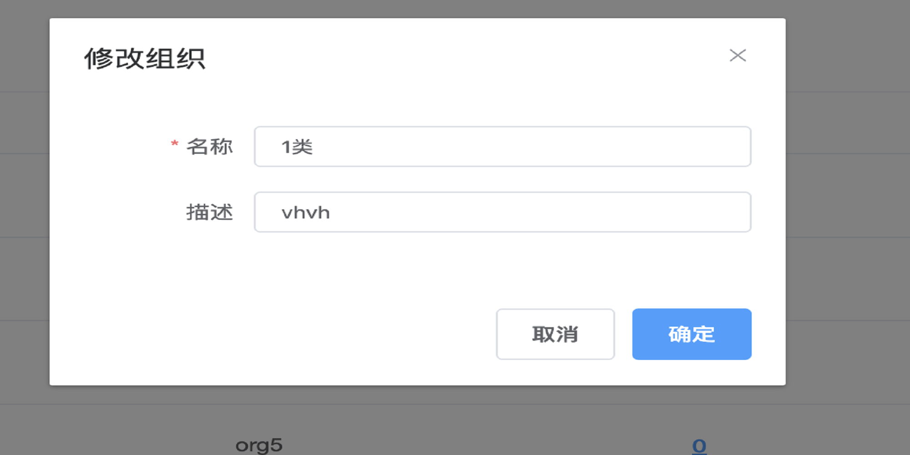
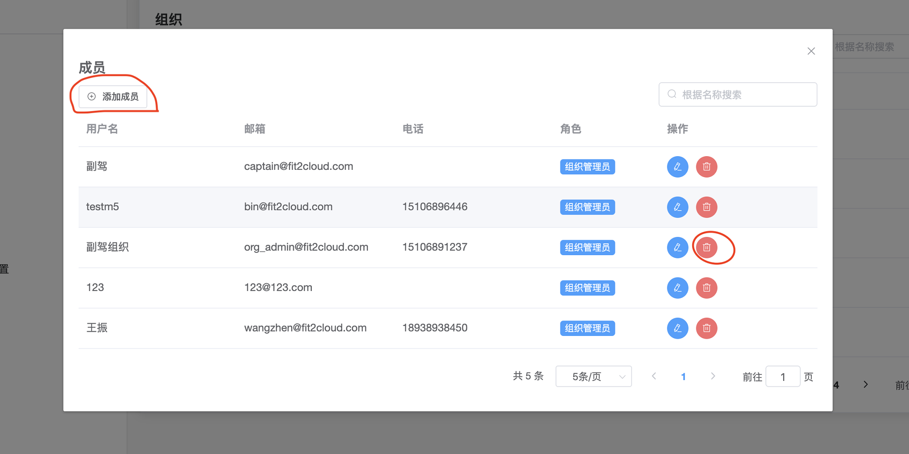
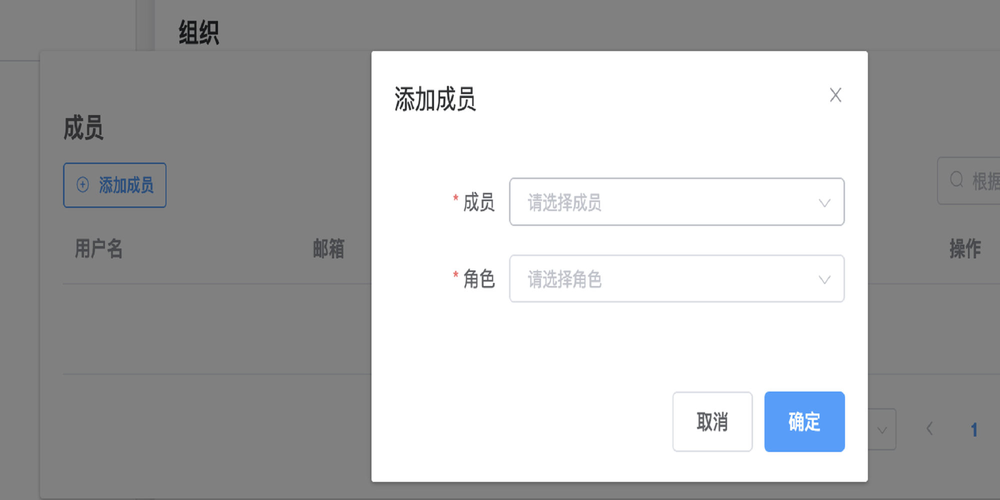
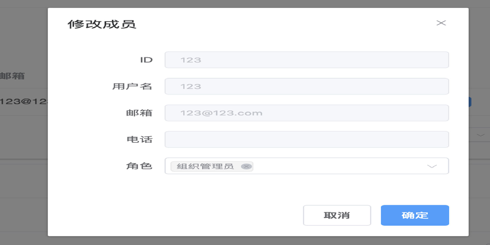
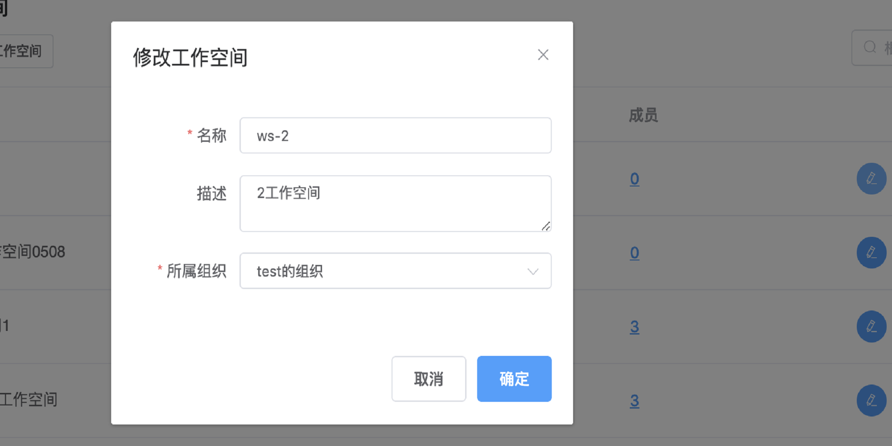
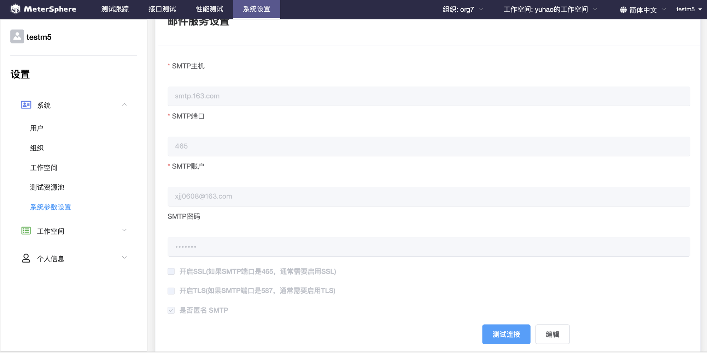

## 首页
>系统设置主要是针对租户和测试资源的管理和配置，目前对于租户的角色设置有系统级角色 ：admin； 组织级角色 ：admin；工作空间级角色：测试经理，测试人员，只读用户
## 个人信息
>用户可以修改自己的用户名、邮箱、电话、密码等信息

> 用户在点击确定之后会去匹配旧密码正确与否

## 系统

### 用户

>当前系统中所有的用户，可以对用户进行新增，修改，查询，删除，状态更改操作

-  删除用户，更改用户状态

>对用户进行状态和删除操作，可以点击Switch开关和删除按钮

- 查询用户

>可以根据名称单独查询用户

- 创建用户（最多可以给用户匹配5个角色）

- 编辑用户信息

- 修改用户密码

### 组织

>当前系统中所有的组织，可以对组织以及组织下成员进行创建，编辑，查询，删除，更改操作

- 删除组织

>选择要删除的组织，点击删除按钮

- 查询组织

>查询单个组织可以通过名称查询

- 创建组织

> 点击“创建组织”，录入组织名称和描述

- 修改组织

> 点击修改按钮，修改对应组织

- 组织下成员列表

>点击成员数量可以跳转到成员列表弹框，该页面可以实现对用户创建，移除，修改操作

- 删除成员

>选择要删除的成员，点击删除按钮

- 查询成员

>查询单个成员可以通过名称查询

- 添加成员

- 修改成员

### 工作空间

>当前系统中所有的工作空间，可以对工作空间以及工作空间下成员进行创建，编辑，删除，查询操作

- 创建工作空间
>点击“创建工作空间”，录入工作空间名称，描述和所属组织

- 修改工作空间

>点击编辑按钮，修改工作空间

- 工作空间下成员列表

>点击成员数量可以跳转到成员列表弹框，该页面可以实现对成员创建，移除，修改操作【同组织下成员操作一致】

### 测试资源池

>当前系统下所有创建的资源池，可以对资源池进行新增，修改，删除，查询，启用禁用操作

- 删除资源池
>选择要删除的资源池，点击删除按钮

- 查询资源池
>查询单个资源池，可以通过名称查询

- 创建资源池
>点击"创建资源池"，录入资源池名称，描述，类型，根据类型不同录入相应所填项

- 修改资源池
>选择要修改的资源池，点击修改按钮

###  系统参数设置

#### 邮件设置

>可以对SMTP信息进行重新配置

- 编辑SMTP信息

> 点击编辑按钮可以对SMTP信息进行修改，保存SMTP信息

#### LDAP 设置

> 配置LDAP登录

> 启用LDAP认证后，登录页会新增LDAP登录选项

## 组织

### 成员

>同系统下组织成员操作

### 工作空间

>同系统下工作空间操作

## 工作空间
### 成员

>同系统工作空间下成员操作

### 测试报告模版

>该页面可以对测试模版进行创建，修改，删除，查询操作

- 查询测试报告模版

>查询单个测试报告模版，可以通过名称查询

- 创建测试报告模版

> 点击"创建模版"进入模版编辑页面，左边是组件库，右边是测试报告内容，测试报告的模版可以通过拖拽左边的组件进行编辑

>拖拽左边自定义模块，可以自定义组件内容

- 保存测试模版

>输入测试模版名称-保存

- 编辑测试报告模版

>点击模版可以对现有模版进行编辑

