## 1 成员
!!! ms-abstract ""
    点击左侧【系统设置-组织-成员】进入成员管理界面，展示当前组织所有成员信息。
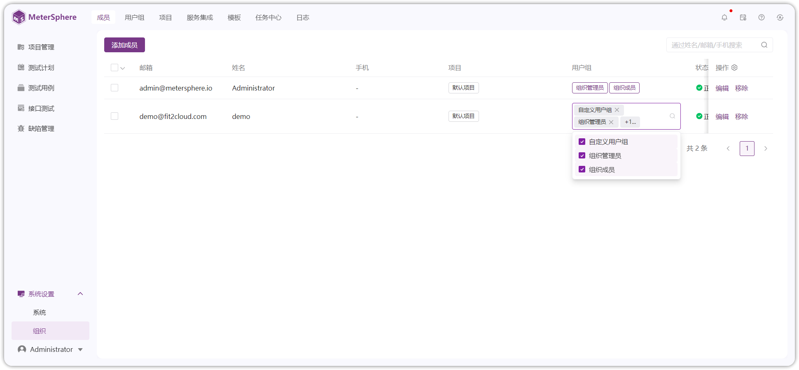{ width="900px" }

!!! ms-abstract "操作说明"

     - 【添加成员】：添加组织成员并设置用户组权限。可根据用户 ID 和用户邮箱搜，勾选添加多个成员。 
     - 【查询】：按姓名、邮箱、手机来模糊查询成员信息。 
     - 【修改用户组】：直接点击列表用户组，快速修改用户组信息。 
     - 【编辑】：对当前成员所属项目和用户组权限做修改。 
     - 【移除】：前用户失去组织的访问权限。 

## 2 用户组
!!! ms-abstract ""
    点击左侧【系统设置-组织-用户组】菜单进入组织用户组管理界面。点击【+】按钮，用户基于自身需求创建自定义用户组，赋予用户组不同的权限设置。 系统预置组织管理员、组织成员角色且不可删除。组织管理员权限默认不可编辑。
{ width="900px" }

!!! ms-abstract "操作说明"

     - 【查询】：根据名称查询用户组。 
     - 【编辑用户组权限】：选择用户组，勾选用户组可访问的菜单权限，点击【保存】生效，点击- 【恢复默认】按钮恢复为上一次保存的权限。 
     - 【添加成员】：选中用户组【+】快捷添加成员。 
     - 【删除用户组】：选中用户组点击【...】选择删除用户组。 
     - 【重命名用户组】：选中用户组点击【...】选择重命名用户组。 

!!! ms-abstract ""
    - **添加用户组成员** 
    选择用户组切换【成员】页面，批量勾选成员【快速添加成员】，可【移除】当前用户组成员。
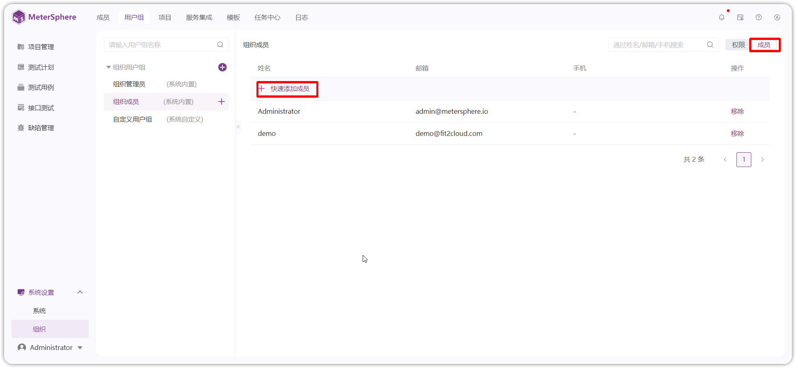{ width="900px" }

## 3 项目

!!! ms-abstract ""
    点击右侧菜单【系统设置-组织-项目】进入项目管理界面，默认展示当前组织所有项目。
    
{ width="900px" }

!!! ms-abstract "操作说明"

     - 【查询】：根据 ID、名称查询项目。 
     - 【编辑】：修改项目名称、项目管理员、开启模块、资源池、描述、启用停用状态等信息。 
     - 【添加成员】：为项目添加成员。 
     - 【结束】：结束项目不展示在项目切换列表。 
     - 【删除】：点击【...】按钮，删除项目，系统会在 30 天后执行删除项目。删除确认后，点击名称旁边【闹钟图标】撤销删除。项目删除前可正常使用。 

!!! ms-abstract ""

    - **新增项目** 
    点击【创建项目】按钮新建项目，在弹出页面中编辑项目名称、项目管理员、开启模块、资源池、描述、启用停用状态等信息。
{ width="900px" }

!!! ms-abstract "操作说明"

     - 【项目管理员】：默认为当前创建人，项目管理员自动加入当前项目。当项目管理员不在当前创建的项目所属组织时，自动将项目管理员加入到项目所属组织，赋予组织成员用户组。 
     - 【开启模块】：默认全选，可以自定义选择。若编辑项目取消模块，已产生数据保留，但是无入口进入对应模块。 
     - 【资源池】：用于接口测试执行任务，默认可用 Local 资源池。资源池配置参考[系统-资源池](./system.md#5)配置。 
    -  【状态】：默认启用，有启用，关闭两种状态。 

## 4 服务集成
!!! ms-abstract ""
    配置当前组织对接第三方的管理平台信息。服务集成列表默认展示当前组织已集成的缺陷管理平台，点击【展开】服务集成使用指引，按指引步骤下载并配置插件。 
    第三方管理平台集成步骤： 
    (1)下载需要使用的插件，并在【系统设置-系统-插件】上传。 
    (2)在【服务集成】列表配置第三方平台验证相关信息。 
    (3)在【项目设置-应用设置-缺陷管理】配置同步缺陷项目信息及同步策略。 
    (4)在【项目设置-模板管理】启用对应平台缺陷管理模板。
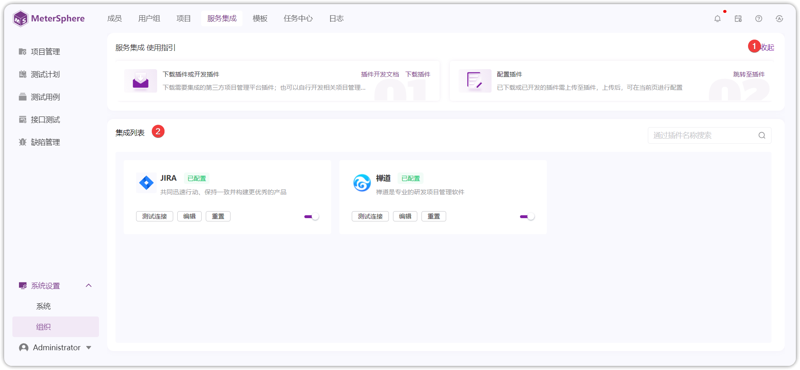{ width="900px" }

<!-- 
### 4.1 与 TAPD 集成
!!! ms-abstract ""
    第一步：服务集成配置。

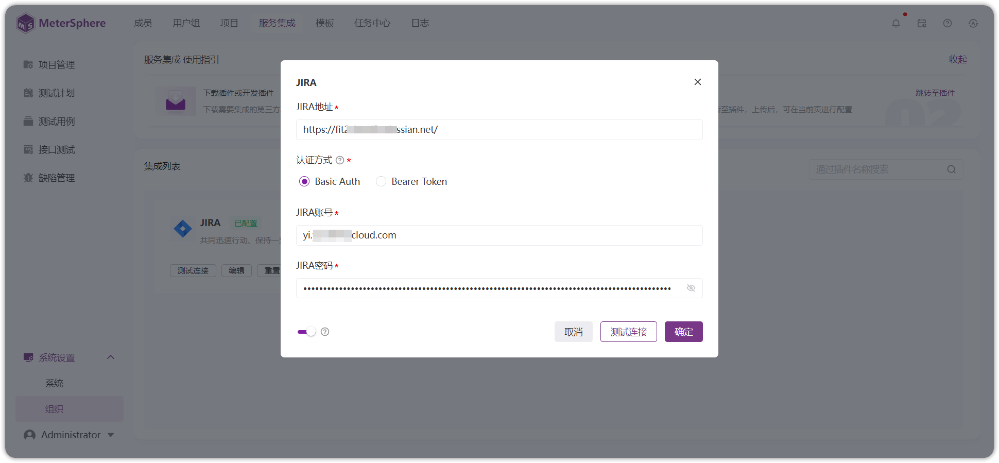{ width="900px" }

!!! ms-abstract "参数说明"
    【API 账号和口令】是 Tapd Basic Auth 账号信息在【公司管理-安全与集成-开放平台】中查询。

!!! ms-abstract ""
    第二步：关联项目配置。 
    配置完服务集成后，还需要配置项目中引用 TAPD 项目的设置，即关联项目。点击页面右下角的【马上关联项目】进行设置。
{ width="900px" }

!!! ms-abstract ""
    跳转到项目管理页面，点击项目列表中的【编辑】按钮，编辑项目里【TAPD 项目 ID】，以及缺陷模板等相关信息。
{ width="900px" }

!!! ms-abstract ""
    同时，还需要配置项目中的 TAPD 缺陷模板设置，【缺陷模板】需要选择【TAPD-默认模板】。
{ width="900px" }

!!! ms-abstract ""
    第三步：添加个人平台账号。 
    点击服务集成页面右下角的【马上添加】进行设置。
{ width="900px" }

!!! ms-abstract ""
    该信息为通过 TAPD 提交缺陷的用户认证信息，若未填写，则使用组织中配置的默认信息。 
    选择【第三方平台账号】设置【Tapd】信息，如果不设置个人平台账号，则所有使用 MeterSphere 提交缺陷的用户，此缺陷推送到配置的服务平台上账号都是服务配置中设定的账号信息。
{ width="900px" }

!!! ms-abstract ""
    参数说明：【TAPD 昵称】是 TAPD 个人设置里查看。
{ width="900px" }

!!! ms-abstract ""
    以上配置完成后，在 Metersphere 系统中测试用例里，就可以关联 TAPD 的相关需求。
{ width="900px" }

!!! ms-abstract ""
    在缺陷管理提交缺陷后，平台类型显示为 TAPD 的数据，点击【同步缺陷】按钮，会将数据同步到 TAPD 系统中。
{ width="900px" }

!!! ms-abstract ""
    在 TAPD 缺陷中可以查询到同步过来的缺陷数据。
{ width="900px" } -->

### 4.1 与 JIRA 集成 
!!! ms-abstract ""
    【系统设置-系统-插件】上传 JIRA 插件，到【系统设置-组织-服务集成】配置 JIRA 集成信息。 

     配置服务集成：填写对接 JIRA 的地址、认证信息、账号信息、启停用开关。 填写完点击【测试连接】校验是否可用。 
   
{ width="900px" }

!!! ms-abstract "注意"
     认证信息区分私有化部署选择 Basic Auth 填写账号密码, 选择 Bearer Token 填写 Token, SaaS 版本只能选择 Basic Auth, 填写(账号+令牌)(账户设置-安全-创建API令牌) 

!!! ms-abstract ""
    配置关联项目 ：在【项目设置-应用设置-缺陷管理】页面配置同步缺陷项目，填写正确的项目及缺陷类型。点击跳转[项目设置-应用设置](../project_management/project_permissions.md#21)。 【JIRA 项目 Key】：项目的关键字的需要在 JIRA 平台上进行查询。
{ width="900px" }
{ width="900px" }

!!! ms-abstract ""
    配置缺陷模板：切换到【项目管理-模板管理】，勾选使用 jira 默认模板。在缺陷创建页面即可使用到 jira 的缺陷模板。点击跳转[项目设置-模板管理](../project_management/template_management.md#22)
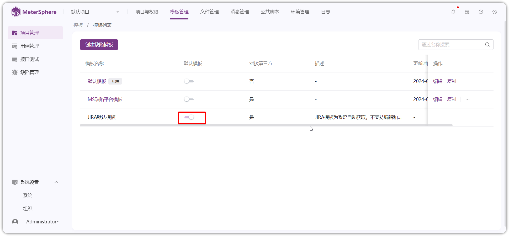{ width="900px" }

!!! ms-abstract ""
    添加个人平台账号。点击【个人信息-第三方平台账号】配置 jira 账号，创建缺陷同步可使用该账户信息。点击跳转[个人中心](../personal_center/information.md#5)。
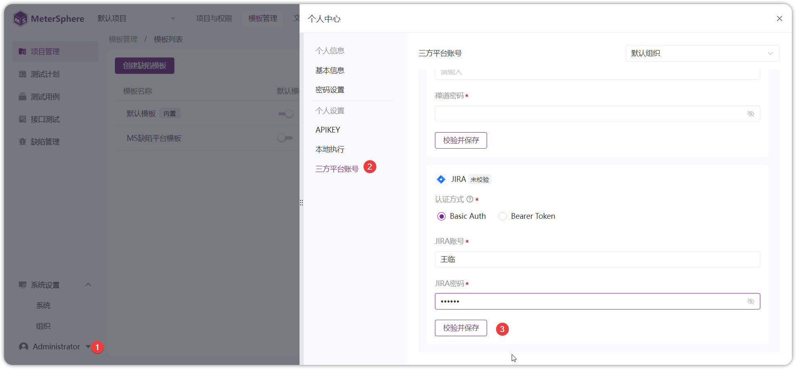{ width="900px" }

!!! ms-abstract ""
    以上配置完成后，在 Metersphere 【缺陷管理】模块，可以创建并同步 jira 平台的缺陷。

{ width="900px" } 

### 4.2 与禅道集成
!!! ms-abstract ""

!!! ms-abstract ""
    【系统设置-系统-服务集成】上传禅道插件，到【系统设置-组织-服务集成】配置禅道集成信息。 
    
     配置服务集成：填写对接 禅道 的地址、账号、请用方式、启停用开关。 填写完成后可以校验连接是否通过。 
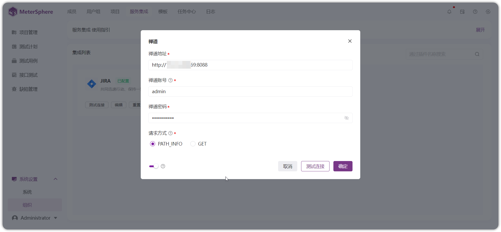{ width="900px" }

!!! ms-abstract "说明"
	1. 账号密码为具有相应权限的 Zentao 账号，账号需要具有超级 model 调用接口权限。
    2. 请求方式：在禅道里具体查看：参考禅道配置文件中$config->requestType 的值；配置文件参考路径：/opt/zbox/app/zentao/config/my.php 。
	3. 如果提示因为安全问题 api 禁用，需要修改禅道服务器配置文件/opt/zbox/app/zentao/config/my.php，加上 '$config->features->apiGetModel = true;' 这个配置。
	4. 禅道目前存在 GET 和 PATH_INFO 两种接口调用方式（即其requestType 参数）对于禅道接口的调用使用的是 PATH_INFO 方式和 GET 请求方式的支持，用户可以根据自己使用的禅道系统的配置情况自主选择请求方式。

!!! ms-abstract ""
     关联项目配置： 在【项目设置-应用设置-缺陷管理】页面配置同步缺陷项目，填写正确的禅道项目。[项目设置-应用设置](../project_management/project_permissions.md#21) 
    【Zentao（禅道）项目 ID】：如果 禅道 bug 是附属在项目上，则关联的Zentao ID 为项目 ID；如果 禅道 Bug 是附属在产品上，则关联的 ZentaoID 为产品 ID。
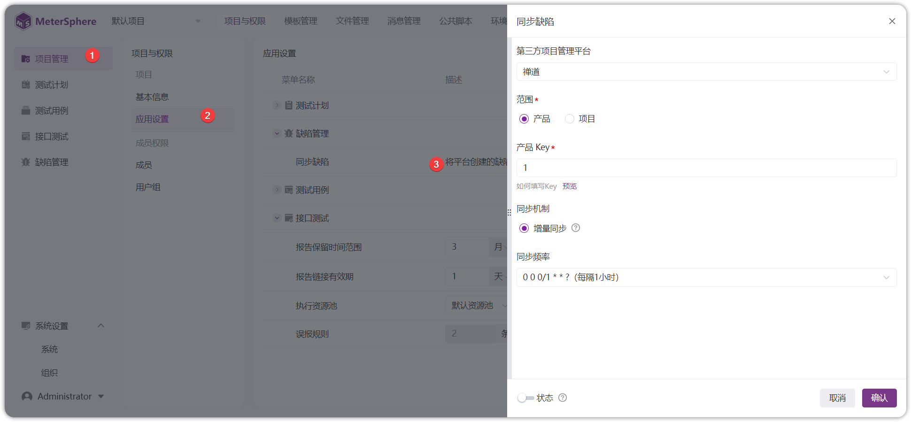{ width="900px" }

!!! ms-abstract ""
     配置缺陷模板：切换到【项目管理-模板管理】，勾选使用 禅道 默认模板。在缺陷创建页面即可使用到 禅道 的缺陷模板。点击跳转[项目设置-模板管理](../project_management/template_management.md#22)
{ width="900px" }

    

!!! ms-abstract ""
     添加个人平台账号：点击【个人信息-第三方平台账号】配置 禅道 账号，创建缺陷同步可使用该账户信息。这里配置的账号也需要 超级 Model 调用接口权限。点击跳转[个人中心](../personal_center/information.md#5)。 
  
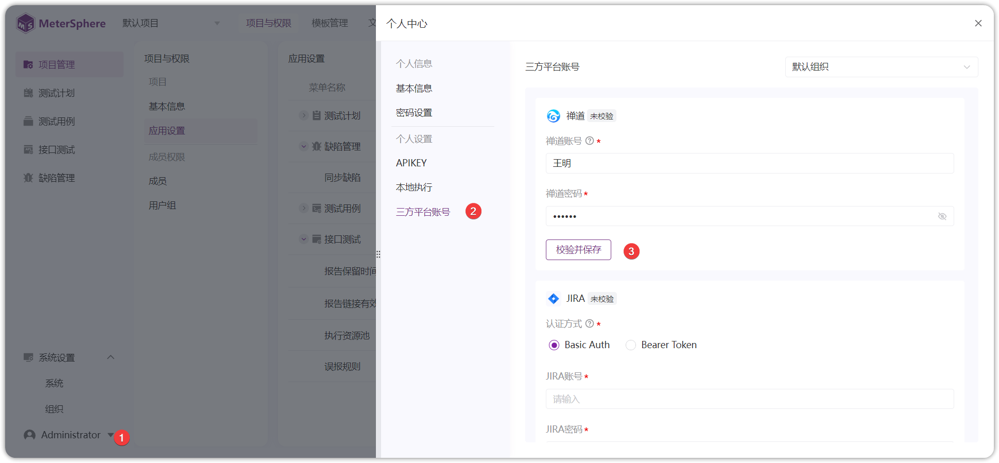{ width="900px" }

!!! ms-abstract ""
    以上配置完成后，在 MeterSphere 【缺陷管理】模块，可以创建并同步禅道平台的缺陷。
 { width="900px" }

<!--
### 2.4 与Azure Devops集成
!!! ms-abstract ""
    第一步：服务集成配置。 
    填写【Basic Auth 账号信息】后，点击【测试连接】即可 
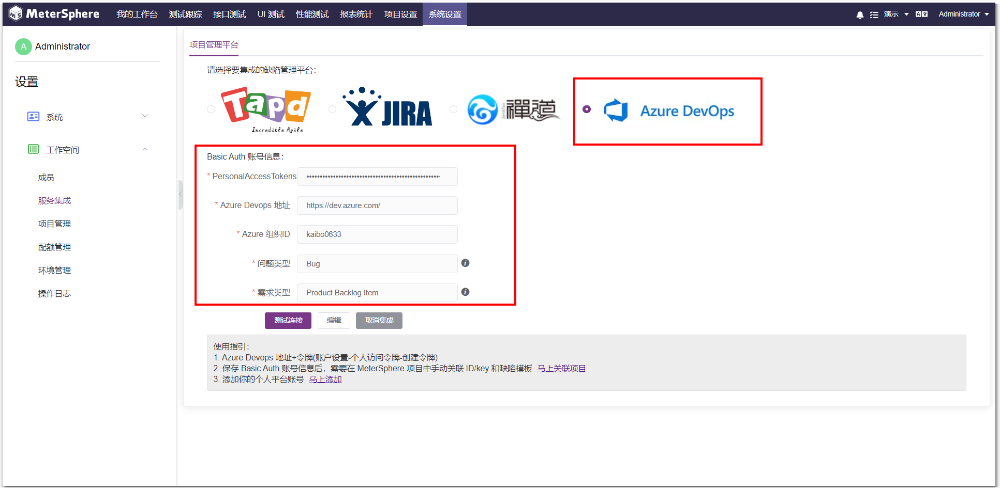{ width="900px" }

!!! ms-abstract ""
    第二步： 关联项目配置
    配置完服务集成后，还需要配置项目中引用禅道项目的设置，即关联项目。点击页面右下角的【马上关联项目】进行设置。  
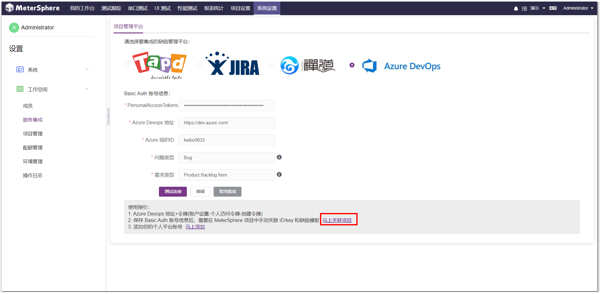{ width="900px" }

!!! ms-abstract ""
    跳转到【项目管理】，点击【编辑】，编辑项目里【集成第三方平台】、【AzureDevops项目ID】、【AzureDevops过滤ID】，以及缺陷模板等相关信息。  
{ width="900px" }

!!! ms-abstract ""
    第三步：添加个人平台账号 
    点击服务集成页面右下角的【马上添加】进行设置。
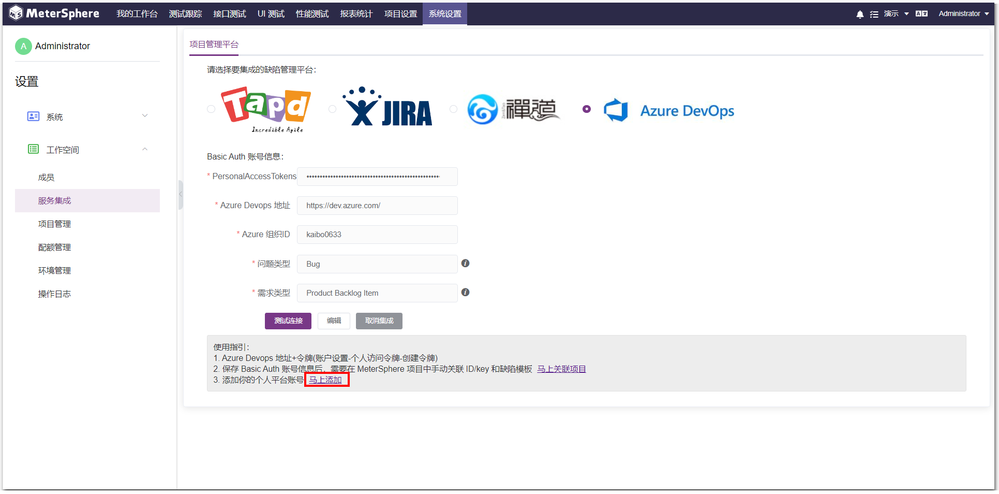{ width="900px" }

!!! ms-abstract ""
    选择【第三方平台账号】设置【AzureDevops 信息】，如果不设置个人平台账号，则使用 MeterSphere 提交缺陷的用户，此缺陷推送到配置的服务平台上账号都是服务配置中设定的账号信息。  
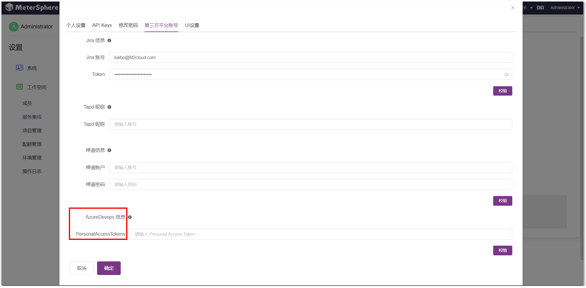{ width="900px" }

!!! ms-abstract ""
    以上配置完成后，在 Metersphere 系统中测试用例里，就可以关联 AzureDevops 的相关需求。  
{ width="900px" }

!!! ms-abstract ""
    在缺陷管理提交缺陷后，点击【同步按钮】，数据会同步到 AzureDevops 系统中。  
{ width="900px" }  -->

## 5 模板

!!! ms-abstract ""
    【系统设置-组织-模板】管理页面，支持对当前组织下使用的模板做全局配置，可配置用例模板、缺陷模板。 

!!! ms-abstract "注意"
    启用项目模板后，系统模板不可再编辑。
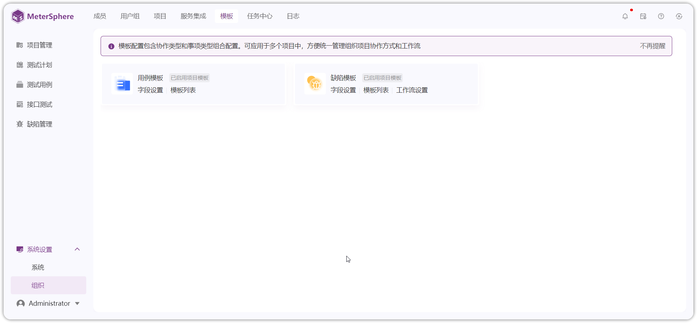{ width="900px" }

### 5.1 用例模板
!!! ms-abstract ""
    - **编辑用例模板字段** 
    用例模板可添加自定义的用例字段绑定到模板中。点击【字段设置】可以新增用例模板使用的字段。支持输入框、文本、单选、多选、复选、成员等字段。字段支持编辑、删除操作 

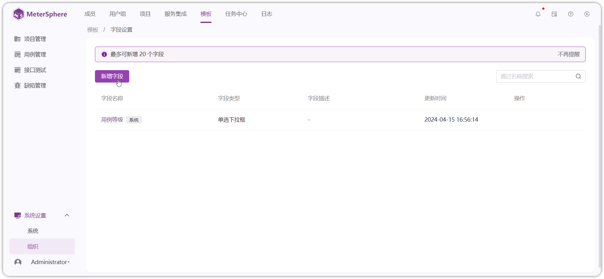{ width="900px" }
{ width="900px" }

!!! ms-abstract ""
    - **编辑用例模板** 
        点击【模板】，可以给用例模板帮绑定自定义字段。系统用例模板默认只有一个且不可更改。 支持【关联字段】、【新增字段】操作。添加自定义字段后，新建用例即可使用该字段。
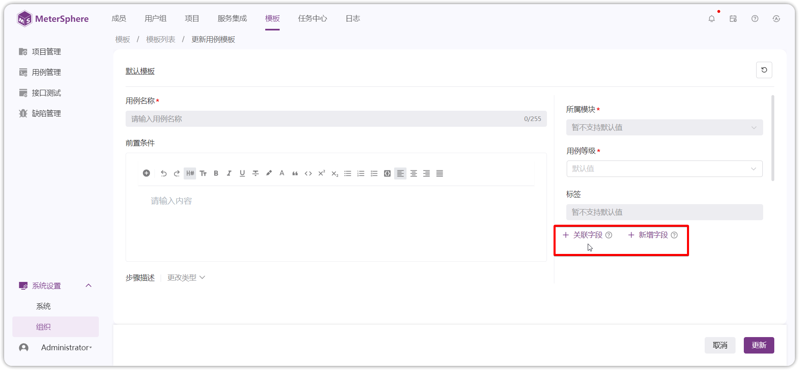{ width="900px" }

### 5.2 缺陷模板
!!! ms-abstract ""
    - **编辑缺陷模板字段** 
    缺陷模板可添加自定义的用例字段绑定到模板中。点击【字段设置】可以新增缺陷模板使用的字段。支持输入框、文本、单选、多选、复选、成员等字段。字段支持【编辑】【删除】操作 
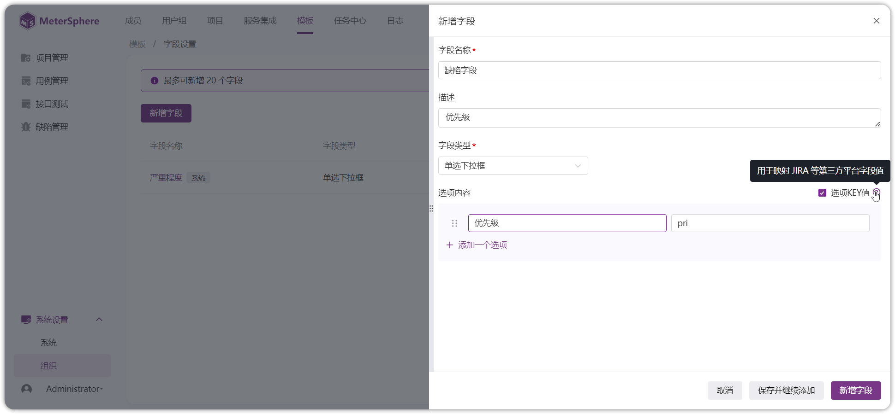{ width="900px" }

!!! ms-abstract ""
    - **新增缺陷模板** 
        点击【模板】按钮，进入缺陷管理页面，系统预置的默认模板不可删除。 
        点击【创建缺陷模板】按钮新增缺陷模板，配置用例模板绑定自定义字段。 
       
{ width="900px" }

!!! ms-abstract ""
    - **编辑缺陷模板** 
       创建第三方缺陷平台模板，需要勾选 【对接第三方平台】，并绑定对应平台的缺陷字段及 API 字段才可使用。
       支持【关联字段】【新增字段】操作。添加自定义字段后，新建缺陷使用该模板即可使用自定义字段。
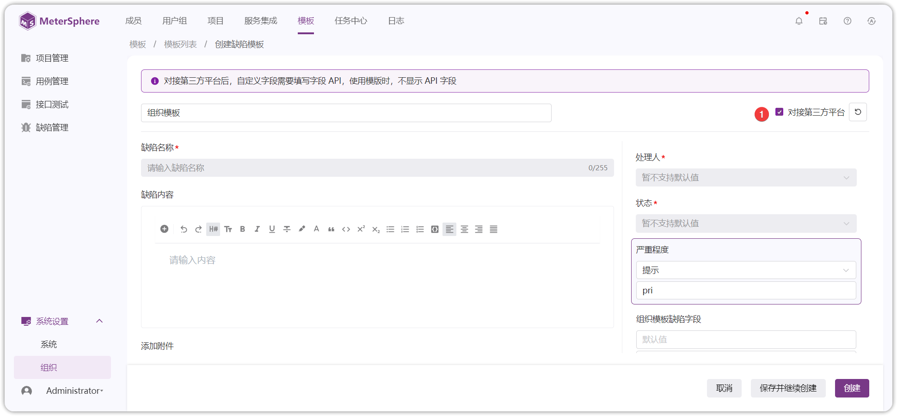{ width="900px" }

!!! ms-abstract ""
    - **缺陷工作流设置** 
       定义缺陷流转状态。系统预置了一个工作流模板，配置缺陷的开始状态和结束状态，可自定义编辑缺陷状态的流转模式。
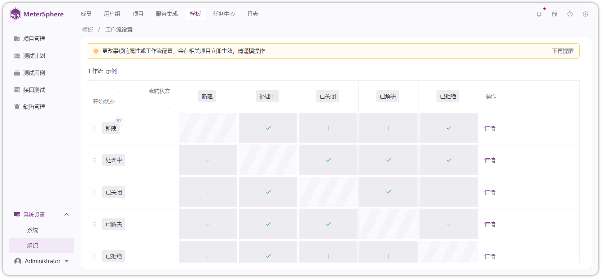{ width="900px" }

## 6 任务中心
!!! ms-abstract ""
    点击左侧【系统设置-组织-任务中心】进入任务中心管理界面。 
    实时任务：支持查看当前组织接口用例、接口场景报告。 
    定时任务：可创建测试定时执行任务、接口定时同步任务。
   { width="900px" }
   { width="900px" }

## 7  日志

!!! ms-abstract ""
    点击左侧【系统设置-组织-日志】进入日志界面，组织管理员可以查看当前组织下所有项目的日志信息，使用高级查询快速查找日志。
{ width="900px" }

