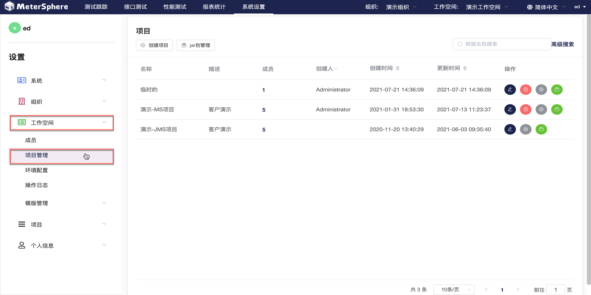

进入项目管理界面。右侧当前系统中全部项目，可以对项目进行新增，修改，查询，删除、环境配置操作。同时可以在此页面管理jar包及资源文件。

- 创建项目

点击`创建项目`按钮，在弹出页面中编辑项目信息，点击`确认`保存项目。

- 环境配置

点击某一项目的`环境配置`按钮，在弹出的页面中点击`+`按钮为此项目创建环境。填写环境名称、配置参数后点击`确认`保存环境。左侧显示为此项目配置的全部环境，可以复制、删除。

- jar包管理

点击`jar包管理`按钮，在弹出页面中编辑jar包信息，上传本地jar包，点击`添加`完成上传。

- 资源文件管理

点击某一项目的`资源文件`按钮，在弹出页面中查看本项目下全部资源文件。点击`上传文件`按钮为此项目上传新的资源文件；点击某一文件后的`编辑`按钮可以将此文件替换成其他本地文档。

