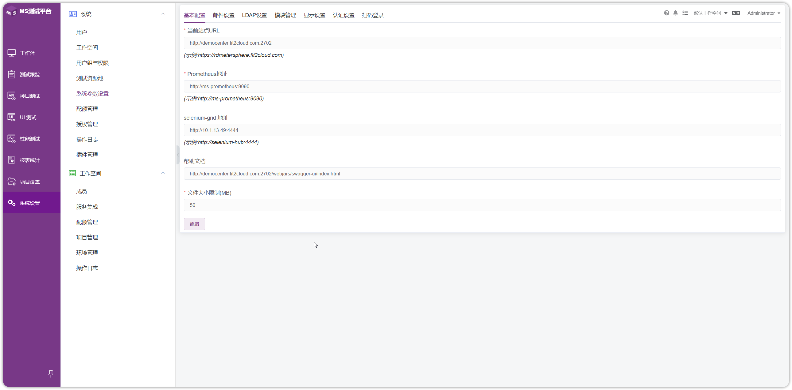
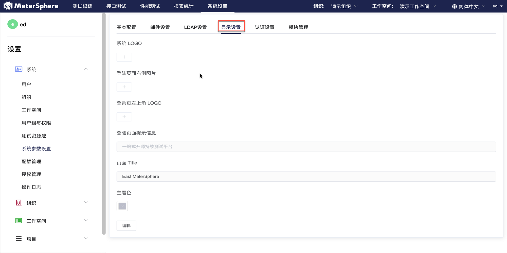
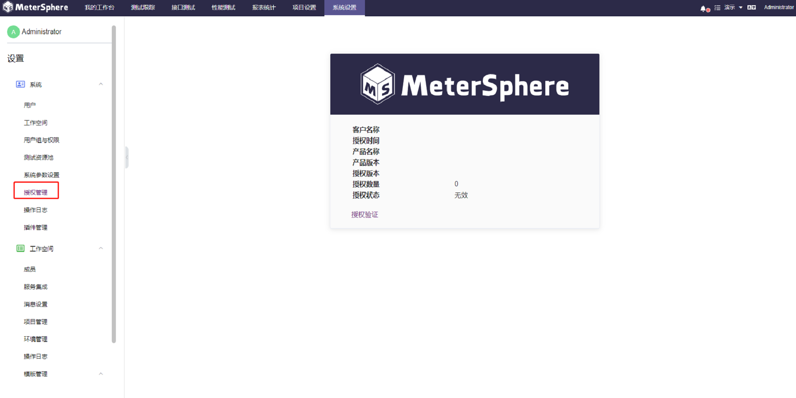

!!! ms-abstract ""
    系统主要针对系统级别的管理配置功能。目前，MeterSphere 内置三级租户体系并可设置只读用户。平台默认用户组及用户组角色划分为：<br>
    -【系统级用户组】：系统管理员。
    -【工作空间级用户组】：工作空间管理员、工作空间成员。
    -【项目级用户组】：项目管理员、项目成员、只读用户。
    平台用户组支持用户在【用户组与权限】功能页面中自定义。

## 1 用户
!!! ms-abstract ""
    点击左侧【系统】下拉菜单中的【用户】进入用户界面。右侧显示当前系统中的全部用户列表，可以对用户进行【新增】、【编辑】、【查询】、【删除】、【更改状态】、【设置密码】等操作。
{ width="900px" }

!!! ms-abstract "说明"
     MeterSphere 部署成功后会自动创建一个系统管理员账户，用户名为 admin，默认密码为 metersphere。如将平台用于生产环境，请及时更改密码。


!!! ms-abstract ""

    - **创建用户**<br>
    点击【创建用户】按钮创建用户，在弹出页面中编辑用户信息。
{ width="900px" }

!!! ms-abstract ""
    需要创建多个用户时，可点击【导入用户】按钮，下载模版并填写用户信息，通过 Excel 文件导入用户。
{ width="900px" }


!!! ms-abstract ""

    - **为用户添加用户组**<br>
    点击【添加用户组】按钮为用户添加用户组信息。新用户至少所属一个用户组，每个用户可以属于多个用户组。
{ width="900px" }


!!! ms-abstract ""

    - **查询用户**<br>
    用户列表右上方，使用搜索框，根据 ID 或名称查询用户。
{ width="900px" }


!!! ms-abstract ""

    - **针对用户的其他操作**<br>
    在用户列表右侧操作列，可以点击【Switch】开关切换选定用户启用状态，点击【编辑】按钮可修改用户信息，点击【修改密码】可修改用户的密码，点击【删除】按钮删除该用户。
{ width="900px" }

## 2 工作空间
!!! ms-abstract ""
    点击左侧【系统】下拉菜单中的【工作空间】进入工作空间界面。右侧显示当前系统中的全部工作空间列表，可以对工作空间进行【新增】、【编辑】、【查询】、【删除】等操作。
{ width="900px" }


!!! ms-abstract ""

    - **创建工作空间**<br>
    点击【创建工作空间】按钮创建工作空间，在弹出页面中填写名称和描述。
{ width="900px" }

!!! ms-abstract ""

    - **编辑工作空间**<br>
    点击【编辑】按钮编辑工作空间，在弹出页面中修改名称和描述。
{ width="900px" }


!!! ms-abstract ""

    - **删除工作空间**<br>
    点击【删除】按钮删除工作空间。
{ width="900px" }

## 3 用户组与权限
!!! ms-abstract ""
    点击左侧【系统】下拉菜单中的【用户组与权限】进入用户组界面。用户可基于自身需求创建自定义用户组，并赋予用户组不同的权限设置。其中【超级管理员】用户组拥有系统全部工作空间与项目的操作权限，用户可以为 admin 用户添加【超级管理员】权限来管理系统全部数据。
{ width="900px" }

!!! ms-abstract ""

    - **创建用户组**<br>
    点击【创建用户组】按钮新建自定义用户组。在弹出的界面中编辑用户组名称及描述，选择用户组所属类型。使用【全局用户组】开关切换用户组适用状态。新建用户组类型为系统类型时自动切换为全局用户组，此开关为默认打开状态；新建用户组类型为其他类型时，全局状态可关闭，此时须为用户组选择所属工作空间。
{ width="900px" }

!!! ms-abstract ""

    - **为用户组配置权限**<br>
    回到用户组列表中，点击【设置权限】按钮进入用户组权限设置页面，在该页面中基于用户组需求勾选操作权限，一个用户组即为一个权限集，点击【确定】按钮完成配置。
{ width="900px" }


!!! ms-abstract ""

    - **编辑用户组信息**<br>
    点击【编辑】按钮编辑选定用户组信息，在弹出页面中可以更改用户组名称及描述。
{ width="900px" }


!!! ms-abstract ""

    - **查询用户组**<br>
    用户组列表右上方，使用搜索框，根据名称查询用户组。
{ width="900px" }


!!! ms-abstract ""
    
    - **删除用户组**<br>
    用户组列表中，点击【删除】按钮删除自定义的用户组，系统用户组不支持删除。
{ width="900px" }

## 4 测试资源池管理
!!! ms-abstract ""
    点击左侧【系统】下拉菜单中的【测试资源池】进入资源池界面。测试资源池主要用于接口测试及性能等测试。右侧资源池列表中，可以通过【Switch】开关切换资源池启用状态，点击【编辑】按钮更改资源池信息，点击【删除】按钮删除选定资源池。
{ width="900px" }

### 4.1 创建 Node 资源池
!!! ms-abstract ""
    点击【创建资源池】按钮，在弹出的界面中为新建资源池编辑名称、描述等相关信息，【类型】选择【Node】，填写相应的配置信息，并支持设定资源池最大并发数量或最大线程数量。
{ width="900px" }


### 4.2 创建 Kubernetes 资源池 (X-Pack)
!!! ms-abstract ""
    点击【创建资源池】按钮，在弹出的界面中为新建资源池编辑名称、描述等相关信息，【类型】选择【Kubernetes】，填写相应的配置信息，并支持设定资源池最大并发数量或最大线程数量。
{ width="900px" }

!!! ms-abstract ""
    获取 Master URL，输入 kubectl describe svc kubernetes 可获得 Endpoints 地址<br>
    获取 Token，需要有 k8s 集群环境，之后创建好 SA 和 token，命令如下
    ```
    # 1 创建 namespaces
    kubectl create namespace metersphere
    # 2 创建 SA
    kubectl create serviceaccount ms -n metersphere
    # 3 创建 namespace 授权 SA
    kubectl create clusterrolebinding ms --clusterrole=admin --serviceaccount=metersphere:ms -n metersphere
    # 4 查询 SA token
    kubectl describe sa/ms -n metersphere
    kubectl describe secrets -n metersphere ms-token-xxxx
    ```
!!! ms-abstract ""
    Namespace 可以进行自定义，在 k8s 集群上创建自定义的 Namespace
    ```
    kubectl create ns ms-pool
    ```
!!! ms-abstract ""
    下载 deployment.yaml 上传到 k8s 集群服务器上，输入命令使其生效后，输入命令查询自定义 Namespace 下的 ms-node-controller 是否正常起来
    ```
    # 使 deployment.yaml 生效
    kubectl apply -f deployment.yaml -n ms-pool
    # 查询 ms-node-controller 服务
    kubectl get all -n ms-pool
    ```
{ width="900px" }

!!! ms-abstract ""
    Deploy Name 使用默认的 ms-node-controller 就行，不需要更改。<br>
    配置完成后，点击确定即可。在资源池列表中有该资源池，在性能测试页面-压力配置处也可以看到该资源池。
{ width="900px" }

{ width="900px" }


!!! ms-abstract ""
    
    - **查询资源池**<br>
    资源池列表右上方，使用搜索框，根据名称查询资源池。


!!! ms-abstract ""
    - **删除资源池**<br>
    资源池列表中，点击【删除】按钮删除选定资源池。

## 5 系统参数设置
!!! ms-abstract ""
    点击左侧【系统】下拉菜单中的【系统参数设置】进入参数设置界面，用于平台【基本配置】、【邮件设置】、【LDAP设置】、【显示设置】、【认证设置】、【模块管理】等参数的设置。
{ width="900px" }

### 5.1 基本配置
!!! ms-abstract ""
    性能测试执行过程中 node-controller 节点需要通过配置的【当前站点URL】下载 JMX 等测试资源文件。在执行性能测试前需要配置并检查测试资源池中的节点可以正常访问到该 URL，URL 值一般为通过浏览器访问 MeterSphere 的地址。
{ width="900px" }

!!! ms-abstract "选项"

     - 【当前站点URL】：当前 MeterSphere 站点地址，用于性能测试 JMeter 从 MeterSphere 站点获取压测脚本等数据。	 
     - 【并发数】：限制场景接口自动化中场景并行执行时的并发数量。
     - 【Prometheus 地址】：Prometheus 监控服务地址。
     - 【selenium-docker 地址】：selenium 服务地址。
     - 【接口默认本地执行】：禁用后所有执行功能只能通过测试资源池执行，为了不影响接口正常执行，选择【禁用】后，请在【 项目设置-应用管理-接口测试 】中配置接口执行的资源池。

### 5.2 邮件设置
!!! ms-abstract ""
    切换至【邮件设置】标签，点击【编辑】按钮可以对 SMTP 信息进行修改、保存。
{ width="900px" }

### 5.3 LDAP 设置
!!! ms-abstract ""
    切换至【LDAP设置】标签，点击【编辑】按钮配置 LDAP 登录相关参数。
{ width="900px" }

!!! ms-abstract "选项"
    * 【LDAP地址】：ldap://serveurl:389 或 ldaps://serveurl:636
    * 【绑定DN】：cn=administrator,cn=Users,dc=metersphere,dc=com
    * 【用户OU】：ou=metersphere,dc=metersphere,dc=com
    * 【用户过滤器】：sAMAccountName={0}
    * 【LDAP属性映射】：{"username":"sAMAccountName","name":"cn","email":"mail"}

!!! ms-abstract "选项说明"
    * 【OU】：同级多OU用｜分割
    * 【用户过滤器】：根据规则到 用户OU 里面去检索用户，可能的选项为 (uid={0}) 或 (sAMAccountName={0}) 或 (cn={0}) 
    * 【LDAP属性映射】：{"username":"sAMAccountName","name":"cn","email":"mail","phone":"phone"}，username,name,email 三项不可修改删除, phone 属性可选
    * 【启用LDAP认证】：启用后登录页显示 LDAP 登录选项

!!! ms-abstract "注意"
    用户过滤器用什么筛选, LDAP 属性映射字段要与其一致, 过滤器用 sAMAccountName, LDAP属性映射也要用 sAMAccountName

!!! ms-abstract ""    
    启用 LDAP 认证后，登录页会新增 LDAP 登录选项。
{ width="900px" }

### 5.4 显示设置 (X-Pack)
!!! ms-abstract ""
    切换至【显示设置】标签，点击【编辑】按钮配置系统的 logo 以及显示的文字和图片，填写完成后，点击【保存】即可。
{ width="900px" }

### 5.5 认证设置 (X-Pack)
!!! ms-abstract ""
    切换至【认证设置】标签，点击【添加】按钮，填写 CAS、OIDC、OAuth2 等方式的单点登录协议认证信息。<br>
{ width="900px" }

!!! ms-abstract ""
    可以点击【启用/禁用】按钮或者【删除】按钮，若启用 CAS、OIDC 认证后，登录页会新增 CAS、OIDC 登录选项。<br>
{ width="900px" }

{ width="900px" }

### 5.6 模块管理 (X-Pack)
!!! ms-abstract ""
    切换至【模块管理】标签，点击【启用/禁用】按钮，系统只显示【启用】的模块，【禁用】的模块不会在系统中出现。
{ width="900px" }

### 5.7 扫码登录 (X-Pack)
!!! ms-abstract ""
    切换至【扫码登录】标签，系统支持企业微信、钉钉、飞书等方式扫码登录。
{ width="900px" }

!!! ms-abstract "企业微信"
    打开 [企业微信管理后台](https://work.weixin.qq.com/)，用管理员权限用户登录。点击【我的企业】获取企业ID。
{ width="900px" }

!!! ms-abstract ""
    点击【工作台-应用管理-创建应用】，进入应用页面进行创建。
{ width="900px" }

!!! ms-abstract ""
    点击应用进入，获取 AgentId、Scret。
{ width="900px" }

!!! ms-abstract ""
    点击企业微信授权登录，配置回调地址。
{ width="900px" }

!!! ms-abstract ""
    配置企业可信IP。
{ width="900px" }

!!! ms-abstract ""
    点击【企业微信】添加按钮，填写企业ID、应用ID、应用密钥，测试连接通过后，开启状态，点击【确定】即可。
{ width="900px" }

!!! ms-abstract ""
    登录页面，点击扫码登录即可。
{ width="900px" }

{ width="900px" }

!!! ms-abstract "钉钉"
    打开 [钉钉开发平台](https://open.dingtalk.com/developer)，用管理员权限用户登录。点击【应用开发-钉钉应用-创建应用】。
{ width="900px" }

!!! ms-abstract ""
    点击应用进入，获取 AgentId、Client ID 和 Client Secret。
{ width="900px" }

!!! ms-abstract ""
    点击【分享设置-回调域名】，在配置页面填写回调域名(回调域名为 MeterSphere 的访问地址)，点击添加即可。
{ width="900px" }

!!! ms-abstract ""
    点击【安全设置】，填写服务器出口IP，点击保存即可。
{ width="900px" }

!!! ms-abstract ""
    进行【权限管理-成员信息读权限-勾选-批量申请】操作，搜索【User】后，开通【个人手机号信息】、【通讯录个人信息读权限】、【调用钉钉项目管理相关接口的权限】权限。
{ width="900px" }

!!! ms-abstract ""
    点击【钉钉】添加按钮，填写应用key、应用ID、应用密钥，测试连接通过后，开启状态，点击【确定】即可。
{ width="900px" }

!!! ms-abstract ""
    登录页面，点击钉钉扫码登录即可。
{ width="900px" }


!!! ms-abstract "飞书"
    打开 [飞书开放平台](https://open.feishu.cn/app/)，用管理员权限用户登录。点击【创建企业自建应用】。
{ width="900px" }

!!! ms-abstract ""
    输入应用名称和应用描述，点击【创建】即可。
{ width="900px" }

!!! ms-abstract ""
    点击【添加应用能力】，添加网页应用。
{ width="900px" }

!!! ms-abstract ""
    在【网页应用】页面，填写"桌面端主页"和"移动端主页"内容，均为 MeterSphere 访问地址。
{ width="900px" }

!!! ms-abstract ""
    点击【安全设置】，添加重定向 URL 和 H5 可信域名，均填写填写 MeterSphere 访问地址。
{ width="900px" }

!!! ms-abstract ""
    如下图，批量开通【获取用户 user ID】、【获取与发送单聊、群组消息】、【获取用户性别】、【获取单位信息】、【获取通讯录部门组织架构信息】、【获取用户组信息】、【获取用户组织架构信息】、【获取角色权限】、【获取职务列表】、【获取部门基础信息】、【通过手机号或邮箱获取用户 ID】、【获取用户基本信息】、【获取工作城市列表】、【获取用户邮箱信息】、【获取用户手机号】、【获取通讯录基本信息】、【获取成员所在部门路径】、【获取用户受雇信息】等权限。
{ width="900px" }

!!! ms-abstract ""
    点击【版本管理与发布-创建版本】，填写应用版本号和更新说明等信息，点击【保存】。
{ width="900px" }

!!! ms-abstract ""
    点击【确认发布】即可将该应用提交到线上并自动生效。
{ width="900px" }

!!! ms-abstract ""
    点击【凭证与基础信息】，获取 APP ID 和 APP Secret 等凭证信息。
{ width="900px" }

!!! ms-abstract ""
    点击【飞书】添加按钮，填写应用ID、应用密钥，测试连接通过后，开启状态，点击【确定】即可。
{ width="900px" }

!!! ms-abstract ""
    登录页面，点击飞书扫码登录即可。
{ width="900px" }

## 6 配额管理 (X-Pack)
!!! ms-abstract ""
    进入【配额管理】页面，可【编辑】上方的工作空间默认配额，编辑完成后，在配额列表中使用默认配置的，将同步更新编辑的数据。
{ width="900px" }

{ width="900px" }

!!! ms-abstract ""
    点击工作空间的【编辑】按钮，可对单个工作空间进行配额管理设置
{ width="900px" }

!!! ms-abstract ""
    点击【删除】按钮，即可删除已配置好的内容，恢复到最初状态，使用默认配额的状态也由【是】变成【否】
{ width="900px" }

## 7 授权管理
!!! ms-abstract ""
    点击左侧【系统】下拉菜单中的【授权管理】进入授权管理界面，点击【授权验证】导入企业版证书，开启 X-Pack 功能。
{ width="900px" }

## 8 操作日志
!!! ms-abstract ""
    点击左侧【系统】下拉菜单中的【操作日志】进入日志界面，显示登录用户权限范围内的全部测试资源日志信息，并支持使用高级查询来快速查找相关日志。
{ width="900px" }

## 9 插件管理 
### 9.1 WebSocket 插件 (X-Pack)
!!! ms-abstract ""
    在【系统设置】-【系统】-【插件管理】界面下，上传 WebSocket 插件
{ width="900px" }

!!! ms-abstract ""
    在【接口测试】-【接口自动化】界面下，新建一个场景，点击场景右下角【+】号，添加 WebSocket 相关请求。
{ width="900px" }

{ width="900px" }

