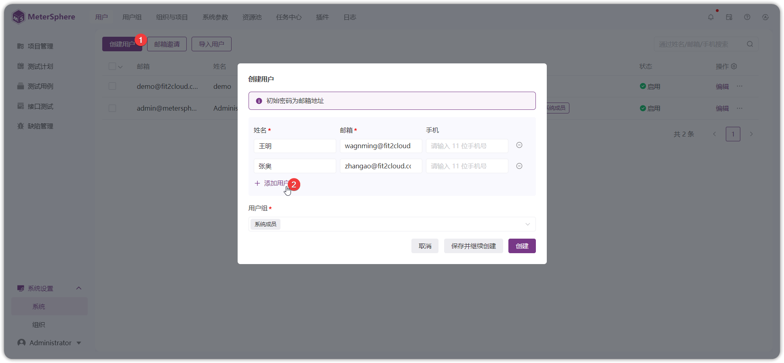
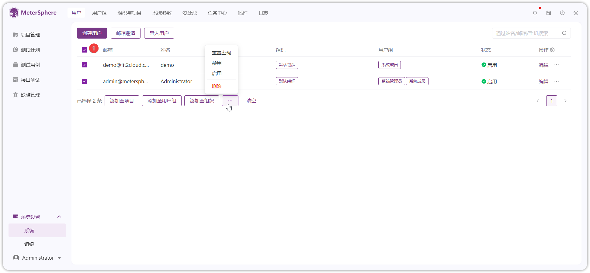
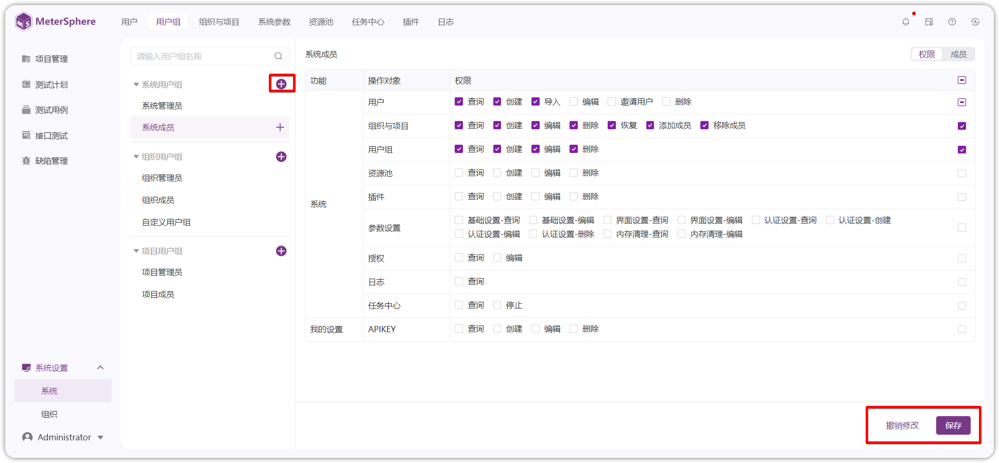
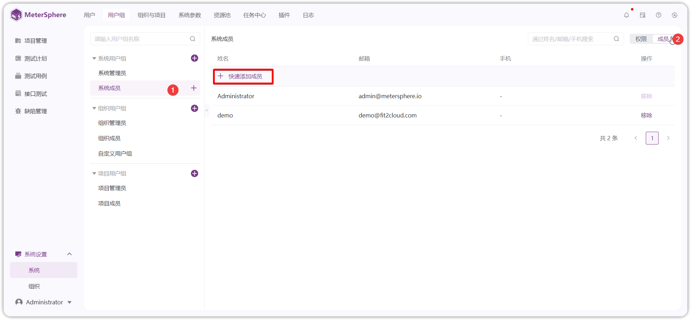
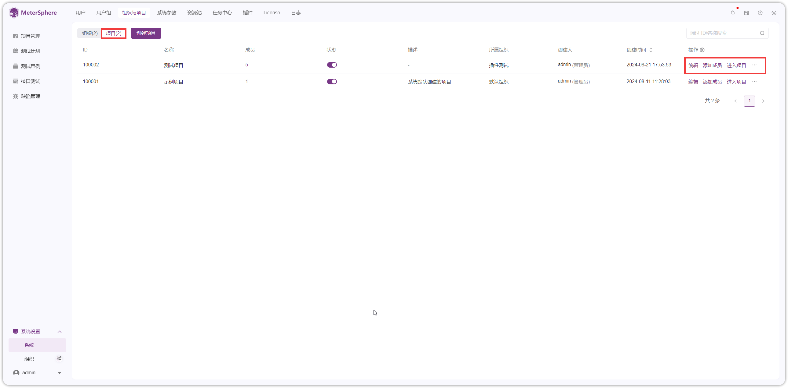
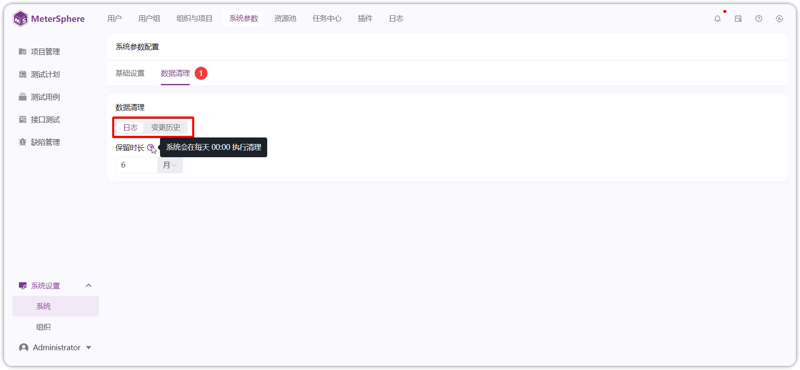
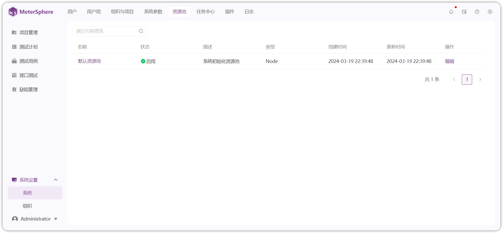
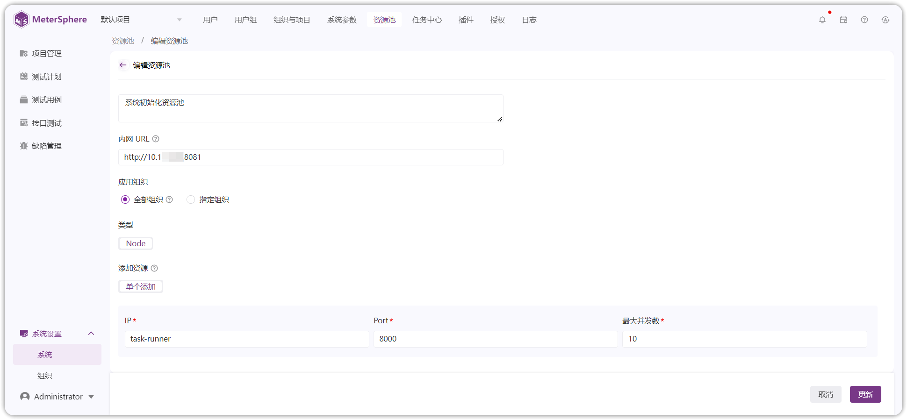
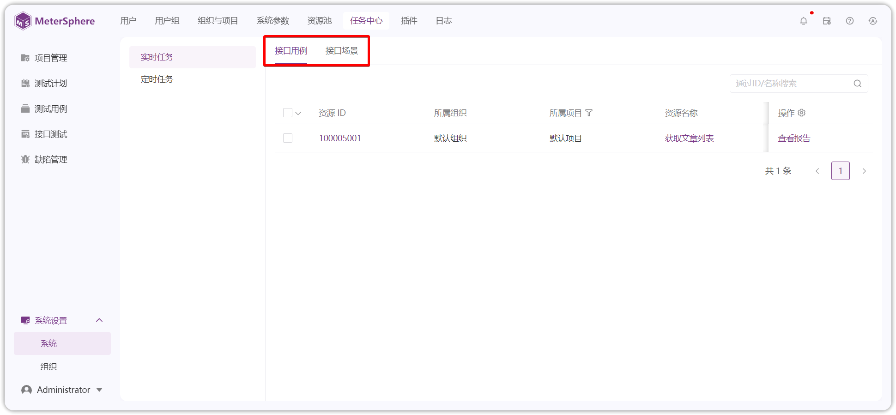
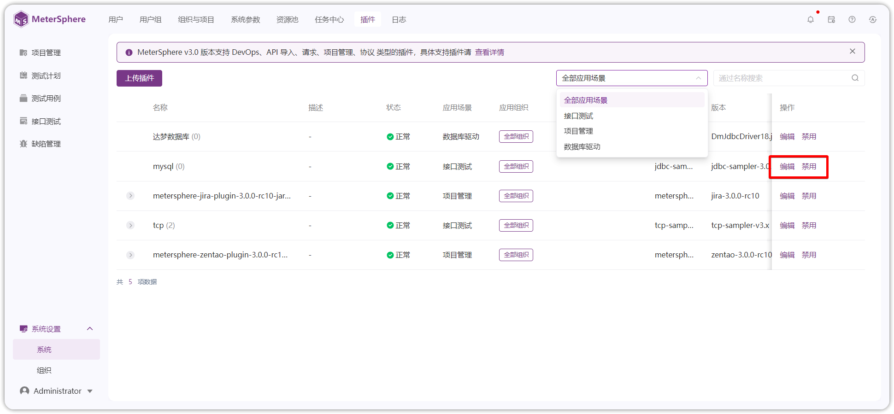

## 1 用户
!!! ms-abstract ""
    点击左侧【系统设置-系统-用户】进入用户管理界面。默认显示当前系统中的全部用户数据。 
{ width="900px" }

!!! ms-abstract "操作说明"

    - 【编辑】: 点击列表【用户组】修改用户组信息，点击列表【编辑】按钮修改用户基础信息及权限。 
    - 【重置密码】：点击【...】按钮，可以重置用户密码为邮箱。 
    - 【禁用】：点击【...】按钮，点击禁用当前用户为不可登录状态。 
    - 【删除】：点击【...】按钮，点击删除当前用户。 
    - 【查询】：用户列表右上方搜索框，根据姓名、邮箱、手机查询用户。 

!!! ms-abstract ""
    - **创建用户** 
    点击【创建用户】按钮创建用户，在弹出页面中编辑用户姓名、邮箱、手机等信息，默认为系统成员。可批量添加用户并设置用户组权限，保存后添加为平台用户。
{ width="900px" }

!!! ms-abstract ""
    - **邮箱邀请** 
    通过邮箱邀请用户。可填写多个邮箱地址，默认为系统成员，可编辑修改用户权限。 点击【发送邮件】按钮，系统将批量发送邮件，邀请用户自主注册账号、设置密码等信息并登录 MeterSphere 平台。

!!! ms-abstract "注意"

    注意：使用该功能需要提前在【系统设置-系统-系统参数-邮件设置】提前配置上可用的 SMTP 邮件服务。详情参考 [系统参数](./system.md#4)。
{ width="900px" }

!!! ms-abstract ""
    - **导入用户** 
    点击【导入用户】按钮，下载模板并填写用户信息，通过 Excel 文件批量导入用户。
{ width="900px" }

!!! ms-abstract ""

    - **用户批量操作** 
    用户列表多选数据，批量对用户进行【添加至项目】、【添加至用户组】、【添加至组织】、【重置密码】、【禁用】、【启用】 、【删除】等操作。 
{ width="900px" }

## 2 用户组
!!! ms-abstract ""
    点击左侧【系统设置-系统-用户组】菜单进入用户组界面。用户基于自身需求创建自定义用户组，赋予用户组不同的权限设置。系统预置管理员角色权限不可编辑，系统预置角色不可删除，内容如下： 

     - 【系统用户组】：系统管理员、系统成员。 
     - 【组织用户组】：组织管理员、组织成员。 
     - 【项目用户组】：项目管理员、项目成员。 
    
!!! ms-abstract ""

    - **创建用户组** 
    系统、组织、项目模块点击【+】按钮添加自定义用户组，配置勾选平台用户访问菜单权限，点击【保存】按钮保存勾选的权限配置。
    
{ width="900px" }

!!! ms-abstract "操作说明"

    - 【恢复默认】: 恢复为上一次保存的权限。 
    - 【重命名】：点击【...】按钮，重命名用户组。 
    - 【删除】：点击【...】按钮，删除用户组。 
    - 【选中用户组 +】：快捷添加用户组成员。 
    - 【查询】：列表左上方输入框搜索用户组。 

    
!!! ms-abstract ""

    - **添加成员** 
    选中用户组点切换到【成员】页签，可快速添加成员。
{ width="900px" }

## 3 组织与项目
### 3.1 组织
!!! ms-abstract ""
    点击左侧【系统设置-系统-组织与项目】菜单默认进入组织管理界面，可以切换为【项目】页签。
{ width="900px" }

!!! ms-abstract "操作说明"

    -  【编辑】：修改名称、组织管理员、描述。
    -  【添加成员】: 给当前组织添加成员用户。 
    -  【结束】：结束组织不展示在组织切换列表。 
    -  【查询】：列表右上方书输入框使用 ID 、名称查询组织。 

### 3.2 项目
!!! ms-abstract ""
    【系统设置-系统-组织与项目】界面，右侧页签切换为【项目】页签，进入项目管理界面。
    
{ width="900px" }

!!! ms-abstract "操作说明"

    - 【编辑】: 编辑项目使用模块、资源池、描述等信息。 
    - 【添加成员】: 给当项目添加成员用户。 
    - 【进入项目】：切换到项目管理页签。 
    - 【结束】：结束项目不展示在项目切换列表。 
    - 【删除】：点击【...】按钮，删除项目，系统会在 30 天后执行删除项目。删除确认后，点击名称旁边【闹钟图标】撤销删除，项目删除前可正常使用。 
    - 【查询】：列表右上方书输入框使用 ID 、名称查询项目。 

!!! ms-abstract ""

    - **新增项目** 
    点击【创建项目】按钮新建项目，在弹出页面中编辑项目名称、项目管理员、开启模块、描述、启用停用状态等信息。
{ width="900px" }

!!! ms-abstract "操作说明"

    - 【项目管理员】：默认为当前创建人，项目管理员自动加入当前项目。当项目管理员不在当前创建的项目所属组织时，自动将项目管理员加入到项目所属组织，赋予组织成员用户组。 
    - 【开启模块】：默认全选，可以自定义选择。若编辑项目取消模块，已产生数据保留，但是无入口进入对应模块。 
    - 【资源池】：用于接口测试执行任务，默认可用 Local 资源池。资源池配置在[系统-资源池](./system.md#5)配置。 
    - 【状态】：默认启用，有启用，关闭两种状态。 

## 4 系统参数
!!! ms-abstract ""
    点击左侧【系统设置-系统-系统参数】进入参数设置界面，用于平台【基本设置】、【邮件设置】、【文件大小设置】、【数据清理】等参数的设置。 

    - 【基本信息】：设置平台站点URL。URL 值一般为浏览器访问 MeterSphere 的地址。 
    - 【邮件设置】：设置SMTP邮件服务，用于用户邮箱邀请用户，测试消息推送。 
    - 【文件大小设置】：文件管理处限制上传文件的大小。 
    - 【内存清理】：可以设置系统日志保留时长，定时每天 0 点定时清理。 
    - 【变更历史】：对系统内所有的项目生效，超出设置的用例变更历史会被清除，更新后立即生效。

{ width="900px" }

{ width="900px" }

!!! ms-abstract ""
    - **邮件配置** 
    点击【邮件配置】按钮，填写SMTP邮件配置基础信息，测试连接通过后使用。
{ width="900px" }

## 5 资源池
!!! ms-abstract ""
    点击左侧【系统设置-系统-资源池】资源池界面。测试资源池主要用于接口测试。

!!! ms-abstract "注意"
    社区版限制一个资源池，
    不可删除默认资源池。

    
{ width="900px" }

!!! ms-abstract "操作说明"

    - 【查询】：左上角通用名称查询。 
    - 【编辑】：修改资源池信息。 

  

!!! ms-abstract "编辑资源池"

    - 【站点URL】： MeterSphere 服务真实 ip 地址。 如：http://ip:8081 ，站点 URL 地址和 Node 资源池服务器要求网络互通。 
    - 【最大并发数】：按服务器可以提供的资源能力填写最大并发数。 
    - 【IP、Port】：Node 资源池部署服务器的真实 ip ，默认 8000 端口。

{ width="900px" }

## 6 任务中心
!!! ms-abstract ""
    点击左侧【系统设置-系统-任务中心】进入任务中心管理界面。 

    - 实时任务：可查看当前接口用例、接口场景正在运行的任务状态。 
    - 定时任务：可创建测试定时执行任务。
  
  { width="900px" } { width="900px" }

## 7 插件
!!! ms-abstract ""
    点击左侧【系统设置-系统-插件】进入插件管理界面，MeterSphere v3.0 版本支持 DevOps、API 导入、请求、项目管理、协议 类型的插件。具体内容下载页面表格。
{ width="900px" }

!!! ms-abstract "操作说明"
    - 【编辑】：修改插件 jar 配置，更新插件使用组织范围、描述。 
    - 【禁用】：禁用当前使用插件。 
    - 【删除】：钮删除当前使用插件。 

### 7.1 数据库驱动
!!! ms-abstract ""
    默认内置 MySQL 驱动，其他数据库驱动需要在【系统设置-系统-插件】上传驱动包，以 Oracle 数据库插件为例。
{ width="900px" }

!!! ms-abstract ""
    数据库驱动上传后，在【项目管理-环境管理-数据库-添加数据库】页面，驱动选项下拉框可选择 oracle 驱动，具体参考：[数据源配置](../../project_management/environment/#23)。
{ width="900px" }

### 7.2 接口协议插件
!!! ms-abstract ""
    默认内置 HTTP 协议，其他协议需要在【系统设置-系统-插件】上传协议插件，以 TCP 协议为例。
{ width="900px" }

!!! ms-abstract ""
    协议插件上传后，在【项目管理-环境管理-TCP配置】处可进行配置。
{ width="900px" }

!!! ms-abstract ""
    点击【接口测试-调试-TCP】切换到 TCP 请求页面进行 TCP 请求的调试。
{ width="900px" }

### 7.3 服务集成插件
!!! ms-abstract ""
    上传 TAPD、禅道服务集成插件，以 禅道服务集成插件为例。[服务集成插件下载](https://github.com/metersphere/metersphere-platform-plugin)
{ width="900px" }

!!! ms-abstract ""
    服务集成插件上传后，在【系统设置-组织-服务集成】处可进行配置。具体参考：[服务集成](../organization/#42)。
{ width="900px" }

## 8 日志
!!! ms-abstract ""
    点击左侧【系统设置-系统-日志】进入日志界面，显示登录用户权限范围内的全部测试资源日志信息，使用高级查询来快速查找相关日志。
{ width="900px" }

